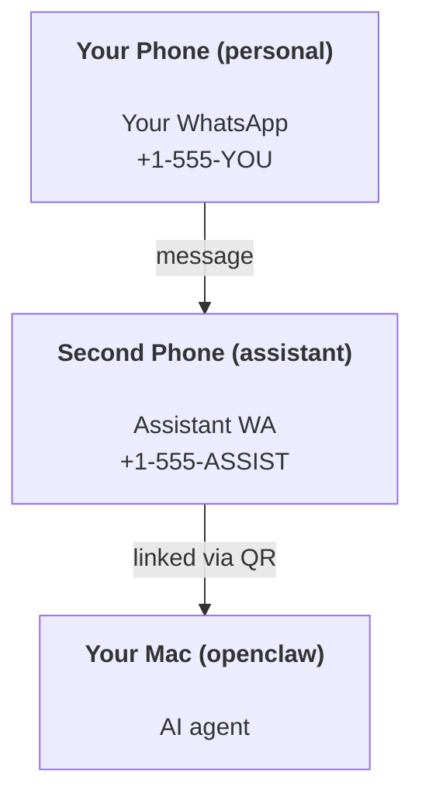

# 使用 OpenClaw 建立個人助理

OpenClaw 是一個自託管的閘道，可將 Discord、Google Chat、iMessage、Matrix、Microsoft Teams、Signal、Slack、Telegram、WhatsApp、Zalo 等連線到 AI 代理程式。本指南涵蓋「個人助理」設定：一個表現得像您隨時待命 AI 助理的專用 WhatsApp 號碼。

## ⚠️ 安全第一

您正在讓代理處於能夠：

- 在您的機器上執行指令（取決於您的工具政策）
- 讀取/寫入您工作區中的檔案
- 透過 WhatsApp/Telegram/Discord/Mattermost 和其他捆綁通道將訊息發送回去

開始時採保守策略：

- 務必設定 `channels.whatsapp.allowFrom`（切勿在您的個人 Mac 上向全世界開放執行）。
- 為助理使用專用的 WhatsApp 號碼。
- 心跳預設現在設為每 30 分鐘一次。透過設定 `agents.defaults.heartbeat.every: "0m"` 禁用，直到您信任此設定為止。

## 先決條件

- 已安裝並上線 OpenClaw — 如果您尚未完成此操作，請參閱[入門指南](/en/start/getting-started)
- 助理的第二個電話號碼（SIM/eSIM/預付卡）

## 雙手機設定（推薦）

您應該這樣做：



如果您將您的個人 WhatsApp 連結到 OpenClaw，每一則發給您的訊息都會變成「代理輸入」。這通常不是您想要的。

## 5 分鐘快速入門

1. 配對 WhatsApp Web（顯示 QR 碼；使用助理手機掃描）：

```bash
openclaw channels login
```

2. 啟動閘道（讓它保持運作）：

```bash
openclaw gateway --port 18789
```

3. 將最小配置放入 `~/.openclaw/openclaw.json`：

```json5
{
  gateway: { mode: "local" },
  channels: { whatsapp: { allowFrom: ["+15555550123"] } },
}
```

現在從您允許清單中的手機傳送訊息給助理號碼。

當上線完成時，我們會自動開啟儀表板並列印一個乾淨（非權杖化）的連結。如果提示身份驗證，請將設定的共用金鑰貼上到 Control UI 設定中。上線預設使用權杖 (`gateway.auth.token`)，但如果您將 `gateway.auth.mode` 切換為 `password`，密碼驗證也可以運作。若要稍後重新開啟：`openclaw dashboard`。

## 給代理一個工作區 (AGENTS)

OpenClaw 從其工作區目錄讀取操作指令和「記憶」。

預設情況下，OpenClaw 使用 `~/.openclaw/workspace` 作為代理程式工作區，並會在設定/首次代理程式執行時自動建立它（加上起始 `AGENTS.md`、`SOUL.md`、`TOOLS.md`、`IDENTITY.md`、`USER.md`、`HEARTBEAT.md`）。`BOOTSTRAP.md` 僅在工作區是全新的時候建立（刪除後不應該再出現）。`MEMORY.md` 是可選的（不自動建立）；當存在時，它會載入到正常工作階段中。子代理程式工作階段僅注入 `AGENTS.md` 和 `TOOLS.md`。

提示：將此資料夾視為 OpenClaw 的「記憶體」，並使其成為 git 儲存庫（最好是私有的），以便您的 `AGENTS.md` + 記憶體檔案能夠備份。如果安裝了 git，全新的工作區會自動初始化。

```bash
openclaw setup
```

完整的工作區佈局 + 備份指南：[代理程式工作區](/en/concepts/agent-workspace)
記憶體工作流程：[記憶體](/en/concepts/memory)

選用：使用 `agents.defaults.workspace` 選擇不同的工作區（支援 `~`）。

```json5
{
  agent: {
    workspace: "~/.openclaw/workspace",
  },
}
```

如果您已經從儲存庫提供自己的工作區檔案，您可以完全停用 bootstrap 檔案的建立：

```json5
{
  agent: {
    skipBootstrap: true,
  },
}
```

## 將其轉變為「助理」的配置

OpenClaw 預設為良好的助理設置，但您通常會想要調整：

- [`SOUL.md`](/en/concepts/soul) 中的 persona/instructions
- thinking 預設值（如果需要）
- heartbeats（一旦您信任它）

範例：

```json5
{
  logging: { level: "info" },
  agent: {
    model: "anthropic/claude-opus-4-6",
    workspace: "~/.openclaw/workspace",
    thinkingDefault: "high",
    timeoutSeconds: 1800,
    // Start with 0; enable later.
    heartbeat: { every: "0m" },
  },
  channels: {
    whatsapp: {
      allowFrom: ["+15555550123"],
      groups: {
        "*": { requireMention: true },
      },
    },
  },
  routing: {
    groupChat: {
      mentionPatterns: ["@openclaw", "openclaw"],
    },
  },
  session: {
    scope: "per-sender",
    resetTriggers: ["/new", "/reset"],
    reset: {
      mode: "daily",
      atHour: 4,
      idleMinutes: 10080,
    },
  },
}
```

## 工作階段與記憶

- 工作階段檔案：`~/.openclaw/agents/<agentId>/sessions/{{SessionId}}.jsonl`
- Session metadata (token usage, last route, etc): `~/.openclaw/agents/<agentId>/sessions/sessions.json` (legacy: `~/.openclaw/sessions/sessions.json`)
- `/new` 或 `/reset` 會為該對話啟動一個新的會話（可透過 `resetTriggers` 進行配置）。如果單獨發送，代理會回覆一個簡短的問候以確認重置。
- `/compact [instructions]` 會壓縮會話上下文並報告剩餘的上下文預算。

## Heartbeats（主動模式）

預設情況下，OpenClaw 每 30 分鐘使用以下提示運行一次心跳：
`Read HEARTBEAT.md if it exists (workspace context). Follow it strictly. Do not infer or repeat old tasks from prior chats. If nothing needs attention, reply HEARTBEAT_OK.`
設定 `agents.defaults.heartbeat.every: "0m"` 以停用。

- 如果 `HEARTBEAT.md` 存在但實際上為空（僅包含空行和如 `# Heading` 的 markdown 標題），OpenClaw 將跳過心跳運行以節省 API 呼叫。
- 如果檔案不存在，心跳仍會執行，由模型決定該做什麼。
- 如果代理回覆 `HEARTBEAT_OK`（可選帶有短填充；請參閱 `agents.defaults.heartbeat.ackMaxChars`），OpenClaw 將抑制該心跳的外發傳送。
- 預設情況下，允許向 DM 風格的 `user:<id>` 目標傳送心跳。設定 `agents.defaults.heartbeat.directPolicy: "block"` 以在保持心跳運行處於活動狀態的同時，抑制直接目標的傳送。
- 心跳會執行完整的代理輪次 — 較短的間隔會消耗更多的 token。

```json5
{
  agent: {
    heartbeat: { every: "30m" },
  },
}
```

## 媒體輸入與輸出

入站附件（圖片/音訊/文件）可以透過範本顯示給您的指令：

- `{{MediaPath}}` (本地暫存檔案路徑)
- `{{MediaUrl}}` (偽 URL)
- `{{Transcript}}` (如果已啟用音訊轉錄)

來自代理的外發附件：在自己的行中包含 `MEDIA:<path-or-url>` (沒有空格)。範例：

```
Here’s the screenshot.
MEDIA:https://example.com/screenshot.png
```

OpenClaw 會提取這些內容，並將其作為媒體與文字一起發送。

本機路徑行為遵循與代理程式相同的檔案讀取信任模型：

- 如果 `tools.fs.workspaceOnly` 為 `true`，外發 `MEDIA:` 本地路徑將僅限於 OpenClaw 暫存根目錄、媒體快取、代理工作區路徑和沙盒生成的檔案。
- 如果 `tools.fs.workspaceOnly` 為 `false`，外發 `MEDIA:` 可以使用代理已獲讀取權限的主機本地檔案。
- 從主機本機發送仍然僅允許媒體和安全文件類型（圖片、音訊、影片、PDF 和 Office 文件）。純文字和類似機密的檔案不被視為可發送的媒體。

這意味著當您的 fs 原則已允許讀取時，工作區外產生的圖片/檔案現在可以發送，而不會重新開放任意主機文字附件的外洩風險。

## 運作檢查清單

```bash
openclaw status          # local status (creds, sessions, queued events)
openclaw status --all    # full diagnosis (read-only, pasteable)
openclaw status --deep   # asks the gateway for a live health probe with channel probes when supported
openclaw health --json   # gateway health snapshot (WS; default can return a fresh cached snapshot)
```

日誌位於 `/tmp/openclaw/` (預設：`openclaw-YYYY-MM-DD.log`)。

## 下一步

- WebChat: [WebChat](/en/web/webchat)
- Gateway ops: [Gateway runbook](/en/gateway)
- Cron + wakeups: [Cron jobs](/en/automation/cron-jobs)
- macOS 選單列伴隨應用程式：[OpenClaw macOS app](/en/platforms/macos)
- iOS 節點應用程式：[iOS app](/en/platforms/ios)
- Android 節點應用程式：[Android app](/en/platforms/android)
- Windows 狀態：[Windows (WSL2)](/en/platforms/windows)
- Linux 狀態：[Linux app](/en/platforms/linux)
- 安全性：[Security](/en/gateway/security)
