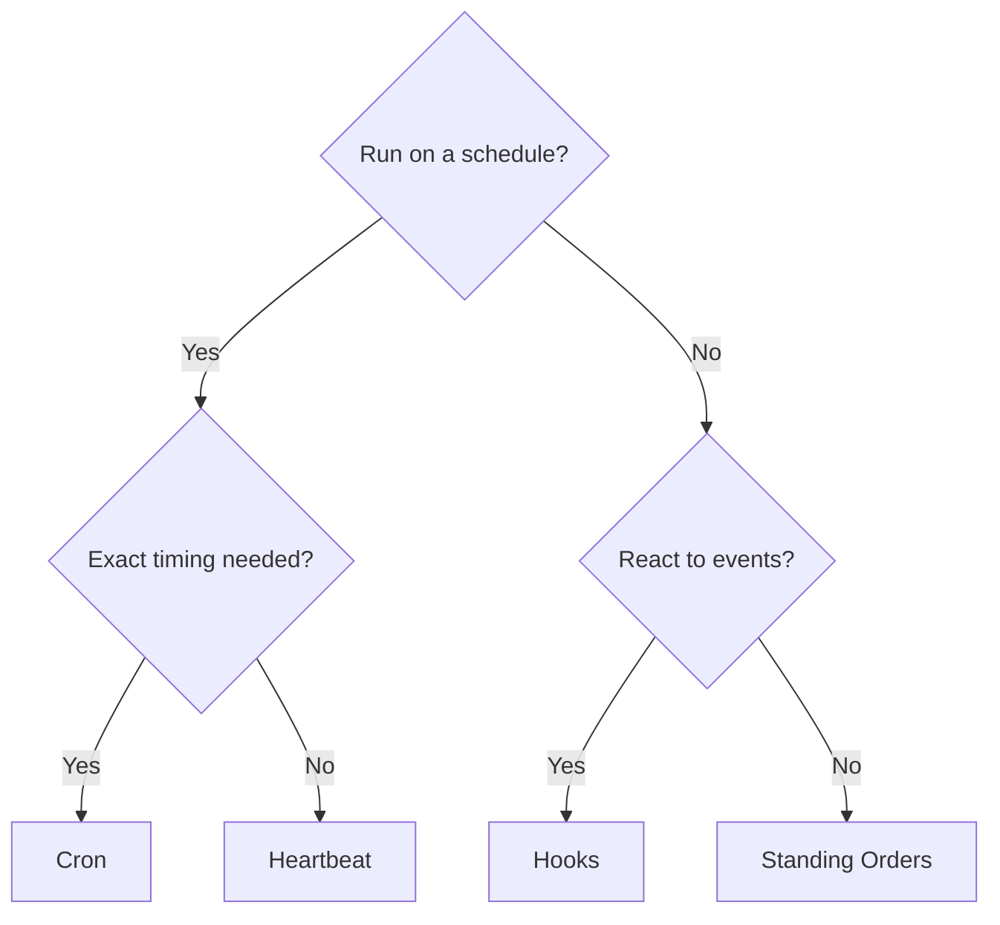

# 自动化

OpenClaw 提供了多种自动化机制，每种机制都适用于不同的用例。本页面将帮助您选择合适的一种。

## 快速决策指南

## 机制一览

| 机制                                       | 作用                                        | 运行于             | 创建任务记录   |
| ------------------------------------------ | ------------------------------------------- | ------------------ | -------------- |
| [Heartbeat](/en/gateway/heartbeat)         | 定期主会话轮转 — 批处理多次检查             | 主会话             | 否             |
| [Cron](/en/automation/cron-jobs)           | 具有精确计时计划的作业                      | 主会话或隔离会话   | 是（所有类型） |
| [后台任务](/en/automation/tasks)           | 跟踪分离的工作（cron、ACP、subagents、CLI） | N/A（账本）        | N/A            |
| [Hooks](/en/automation/hooks)              | 由代理生命周期事件触发的事件驱动脚本        | Hook 运行器        | 否             |
| [常驻指令](/en/automation/standing-orders) | 注入到系统提示词中的持久指令                | 主会话             | 否             |
| [Webhooks](/en/automation/webhook)         | 接收入站 HTTP 事件并将其路由到代理          | Gateway(网关) HTTP | 否             |

### 专用自动化

| 机制                                              | 作用                                     |
| ------------------------------------------------- | ---------------------------------------- |
| [Gmail PubSub](/en/automation/gmail-pubsub)       | 通过 Google PubSub 实现的实时 Gmail 通知 |
| [Polling](/en/automation/poll)                    | 定期数据源检查（RSS、API 等）            |
| [Auth Monitoring](/en/automation/auth-monitoring) | 凭据健康状况和到期提醒                   |

## 它们如何协同工作

最有效的设置通常结合多种机制：

1. **Heartbeat** 每 30 分钟在单次批量轮转中处理常规监控（收件箱、日历、通知）。
2. **Cron** 处理精确的计划（日报、周报）和一次性提醒。
3. **Hooks** 使用自定义脚本对特定事件（工具调用、会话重置、压缩）做出反应。
4. **Standing Orders** 为代理提供持久上下文（“回复前始终检查项目看板”）。
5. **后台任务** 自动跟踪所有分离的工作，以便您进行检查和审计。

关于这两种调度机制的详细比较，请参阅 [Cron vs Heartbeat](/en/automation/cron-vs-heartbeat)。

## 旧版 ClawFlow 参考

较早的发行说明和文档可能会提及 `ClawFlow` 或 `openclaw flows`，但此仓库中当前的 CLI 界面是 `openclaw tasks`。

请参阅 [后台任务](/en/automation/tasks) 以了解支持的任务分类账命令，以及 [ClawFlow](/en/automation/clawflow) 和 [CLI：flows](/en/cli/flows) 以获取兼容性说明。

## 相关

- [Cron 与 Heartbeat 对比](/en/automation/cron-vs-heartbeat) — 详细比较指南
- [ClawFlow](/en/automation/clawflow) — 旧版文档和发行说明的兼容性说明
- [故障排除](/en/automation/troubleshooting) — 调试自动化问题
- [配置参考](/en/gateway/configuration-reference) — 所有配置键
