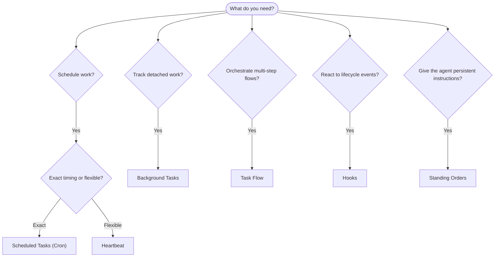

# 自动化与任务

OpenClaw 通过任务、计划作业、事件挂钩和常设指令在后台运行工作。本页面可帮助您选择正确的机制并了解它们如何协同工作。

## 快速决策指南

| 使用场景                    | 推荐方式        | 原因                                            |
| --------------------------- | --------------- | ----------------------------------------------- |
| 在上午 9 点整发送每日报告   | 计划任务 (Cron) | 时间精确，执行隔离                              |
| 20 分钟后提醒我             | 计划任务 (Cron) | 具有精确计时的一次性任务 (`--at`)               |
| 运行每周深度分析            | 计划任务 (Cron) | 独立任务，可以使用不同的模型                    |
| 每 30 分钟检查一次收件箱    | 心跳            | 与其他检查批量处理，具有上下文感知能力          |
| 监控日历中的即将发生的事件  | 心跳            | 天然适合周期性感知                              |
| 检查子代理或 ACP 运行的状态 | 后台任务        | 任务账本跟踪所有分离的工作                      |
| 审计运行的内容及时间        | 后台任务        | `openclaw tasks list` 和 `openclaw tasks audit` |
| 多步骤研究然后汇总          | 任务流          | 具有修订跟踪的持久化编排                        |
| 在会话重置时运行脚本        | 挂钩            | 事件驱动，在生命周期事件上触发                  |
| 在每次工具调用时执行代码    | 挂钩            | 挂钩可以按事件类型进行筛选                      |
| 回复前始终检查合规性        | 常设指令        | 自动注入到每个会话中                            |

### 计划任务 (Cron) 与 心跳

| 维度       | 计划任务 (Cron)            | 心跳                   |
| ---------- | -------------------------- | ---------------------- |
| 计时       | 精确 (cron 表达式，一次性) | 近似 (默认每 30 分钟)  |
| 会话上下文 | 全新 (隔离) 或共享         | 完整的主会话上下文     |
| 任务记录   | 始终创建                   | 从不创建               |
| 交付       | 频道、Webhook 或静默       | 内联于主会话           |
| 最适用于   | 报告、提醒、后台作业       | 收件箱检查、日历、通知 |

当您需要精确计时或隔离执行时，请使用计划任务 (Cron)。当工作受益于完整的会话上下文且近似计时即可接受时，请使用心跳。

## 核心概念

### 计划任务 (Cron)

Cron 是 Gateway(网关) 的内置调度器，用于精确定时。它会持久化作业，在正确的时间唤醒代理，并可以将输出发送到聊天渠道或 webhook 端点。支持一次性提醒、周期性表达式和入站 webhook 触发器。

参见 [Scheduled Tasks](/zh/automation/cron-jobs)。

### 任务

后台任务账本会跟踪所有分离的工作：ACP 运行、子代理生成、独立的 cron 执行和 CLI 操作。任务是记录，而不是调度器。使用 `openclaw tasks list` 和 `openclaw tasks audit` 来检查它们。

参见 [Background Tasks](/zh/automation/tasks)。

### 任务流

任务流是后台任务之上的流程编排基板。它管理具有托管和镜像同步模式、修订跟踪以及 `openclaw tasks flow list|show|cancel` 用于检查的持久化多步骤流程。

参见 [Task Flow](/zh/automation/taskflow)。

### 常驻指令

常驻指令授予代理对已定义程序的永久操作权限。它们驻留在工作区文件中（通常是 `AGENTS.md`），并被注入到每个会话中。可与 cron 结合使用以实现基于时间的强制执行。

参见 [Standing Orders](/zh/automation/standing-orders)。

### 钩子

钩子是由代理生命周期事件（`/new`、`/reset`、`/stop`）、会话压缩、网关启动、消息流和工具调用触发的事件驱动脚本。钩子会从目录中自动发现，并可以使用 `openclaw hooks` 进行管理。

参见 [Hooks](/zh/automation/hooks)。

### 心跳

心跳是一个周期性的主会话轮次（默认每 30 分钟一次）。它在具有完整会话上下文的一个代理轮次中批量处理多个检查（收件箱、日历、通知）。心跳轮次不会创建任务记录。使用 `HEARTBEAT.md` 作为小型检查清单，或者当您希望在心跳内部进行仅限到期（due-only）的定期检查时，使用 `tasks:` 代码块。空的心跳文件会作为 `empty-heartbeat-file` 跳过；仅限到期任务模式会作为 `no-tasks-due` 跳过。

参见 [Heartbeat](/zh/gateway/heartbeat)。

## 它们如何协同工作

- **Cron** 处理精确的调度（每日报告、每周回顾）和一次性提醒。所有 Cron 执行都会创建任务记录。
- **Heartbeat** 每 30 分钟在一个批次中处理例行监控（收件箱、日历、通知）。
- **Hooks** 使用自定义脚本对特定事件（工具调用、会话重置、压缩）做出反应。
- **Standing orders** 为代理提供持久的上下文和权限边界。
- **Task Flow** 在单个任务之上协调多步骤流程。
- **Tasks** 自动跟踪所有分离的工作，以便您进行检查和审计。

## 相关

- [Scheduled Tasks](/zh/automation/cron-jobs) — 精确调度和一次性提醒
- [Background Tasks](/zh/automation/tasks) — 所有分离工作的任务账本
- [Task Flow](/zh/automation/taskflow) — 持久的多步骤流程编排
- [Hooks](/zh/automation/hooks) — 事件驱动的生命周期脚本
- [Standing Orders](/zh/automation/standing-orders) — 持久的代理指令
- [Heartbeat](/zh/gateway/heartbeat) — 定期主会话轮次
- [Configuration Reference](/zh/gateway/configuration-reference) — 所有配置键
