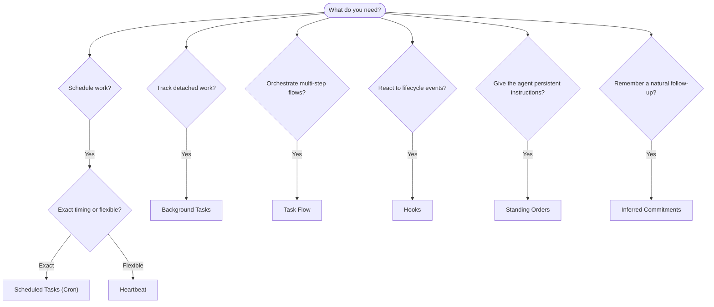

OpenClaw 通过任务、定时作业、推断承诺、事件钩子和常备指令在后台运行工作。本页面帮助您选择正确的机制，并了解它们如何协同工作。

## 快速决策指南

| 用例                          | 推荐            | 原因                                            |
| ----------------------------- | --------------- | ----------------------------------------------- |
| 在上午 9 点整发送每日报告     | 定时任务 (Cron) | 定时精确，独立执行                              |
| 20 分钟后提醒我               | 定时任务 (Cron) | 一次性精确计时 (`--at`)                         |
| 运行每周深度分析              | 定时任务 (Cron) | 独立任务，可以使用不同的模型                    |
| 每 30 分钟检查收件箱          | 心跳            | 与其他检查分批处理，具有上下文感知能力          |
| 监控日历中的即将发生的事件    | 心跳            | 自然适合定期感知                                |
| 在提到的面试后跟进            | 推断承诺        | 类似记忆的跟进，没有确切的提醒请求              |
| 用户上下文后的温和关怀跟进    | 推断承诺        | 限定于同一个智能体和渠道                        |
| 检查子智能体或 ACP 运行的状态 | 后台任务        | 任务账本跟踪所有分离的工作                      |
| 审计运行内容以及时间          | 后台任务        | `openclaw tasks list` 和 `openclaw tasks audit` |
| 多步骤研究然后总结            | 任务流          | 具有修订跟踪的持久化编排                        |
| 在会话重置时运行脚本          | 钩子            | 事件驱动，在生命周期事件上触发                  |
| 在每次工具调用时执行代码      | 插件钩子        | 进程内钩子可以拦截工具调用                      |
| 回复前始终检查合规性          | 常备指令        | 自动注入到每个会话中                            |

### 定时任务 (Cron) 与心跳对比

| 维度       | 定时任务 (Cron)            | 心跳                   |
| ---------- | -------------------------- | ---------------------- |
| 计时       | 精确 (cron 表达式，一次性) | 近似 (默认每 30 分钟)  |
| 会话上下文 | 全新 (独立) 或共享         | 完整的主会话上下文     |
| 任务记录   | 始终创建                   | 从不创建               |
| 交付       | 渠道、webhook 或静默       | 内联于主会话中         |
| 最适合     | 报告、提醒、后台作业       | 收件箱检查、日历、通知 |

当您需要精确计时或隔离执行时，请使用计划任务。当工作受益于完整会话上下文且近似计时即可时，请使用 Heartbeat。

## 核心概念

### 计划任务

Cron 是 Gateway(网关) 的内置调度器，用于精确计时。它会持久化作业，在正确的时间唤醒代理，并将输出发送到聊天渠道或 webhook 端点。支持一次性提醒、周期性表达式和传入 webhook 触发器。

参见 [计划任务](/zh/automation/cron-jobs)。

### 任务

后台任务账本会跟踪所有分离的工作：ACP 运行、子代理生成、隔离的 cron 执行和 CLI 操作。任务是记录，而不是调度器。使用 CLI`openclaw tasks list` 和 `openclaw tasks audit` 来检查它们。

参见 [后台任务](/zh/automation/tasks)。

### 推断承诺

承诺是可选的、短期后续记忆。OpenClaw 从正常对话中推断它们，将其范围限定为同一代理和渠道，并通过 heartbeat 传递到期检查。确切的用户请求提醒仍然属于 cron。

参见 [推断承诺](/zh/concepts/commitments)。

### 任务流

任务流是后台任务之上的流程编排基板。它管理具有托管和镜像同步模式、修订跟踪以及用于检查的 `openclaw tasks flow list|show|cancel` 的持久多步骤流程。

参见 [任务流](/zh/automation/taskflow)。

### 常设指令

常设指令授予代理对已定义程序的永久操作权限。它们位于工作区文件中（通常是 `AGENTS.md`）并被注入到每个会话中。与 cron 结合使用以实现基于时间的强制执行。

参见 [常设指令](/zh/automation/standing-orders)。

### 钩子

内部钩子是由代理生命周期事件（`/new`、`/reset`、`/stop`）、会话压缩、网关启动和消息流触发的事件驱动脚本。它们会自动从目录中发现，并可以使用 `openclaw hooks` 进行管理。对于进程内工具调用拦截，请使用 [Plugin hooks](/zh/plugins/hooks)。

参见 [Hooks](/zh/automation/hooks)。

### Heartbeat

Heartbeat 是一个定期的主会话轮次（默认每 30 分钟一次）。它在一个代理轮次中以完整的会话上下文批量处理多个检查（收件箱、日历、通知）。Heartbeat 轮次不会创建任务记录，也不会延长每日/空闲会话重置的新鲜度。对于小型检查清单，请使用 `HEARTBEAT.md`，或者当您希望在 heartbeat 内部进行仅当期定期检查时，请使用 `tasks:` 块。空的 heartbeat 文件将作为 `empty-heartbeat-file` 跳过；仅当期任务模式将作为 `no-tasks-due` 跳过。当 cron 工作处于活动状态或排队中时，Heartbeat 会推迟，并且 `heartbeat.skipWhenBusy` 也可以在子代理或嵌套通道忙碌时推迟它们。

参见 [Heartbeat](/zh/gateway/heartbeat)。

## 它们如何协同工作

- **Cron** 处理精确的计划（每日报告、每周审查）和一次性提醒。所有 cron 执行都会创建任务记录。
- **Heartbeat** 每 30 分钟在一个批量轮次中处理例行监控（收件箱、日历、通知）。
- **Hooks** 使用自定义脚本响应特定事件（会话重置、压缩、消息流）。插件钩子覆盖工具调用。
- **Standing orders** 为代理提供持久上下文和权限边界。
- **Task Flow** 在各个任务之上协调多步骤流程。
- **Tasks** 自动跟踪所有分离的工作，以便您进行检查和审计。

## 相关

- [Scheduled Tasks](/zh/automation/cron-jobs) — 精确调度和一次性提醒
- [Inferred Commitments](/zh/concepts/commitments) — 类似记忆的后续检查
- [Background Tasks](/zh/automation/tasks) — 所有分离工作的任务分类账
- [Task Flow](/zh/automation/taskflow) — 持久的多步骤流程编排
- [Hooks](/zh/automation/hooks) — 事件驱动的生命周期脚本
- [Plugin hooks](/zh/plugins/hooks) — 进程内工具、提示、消息和生命周期挂钩
- [Standing Orders](/zh/automation/standing-orders) — 持久化的代理指令
- [Heartbeat](/zh/gateway/heartbeat) — 定期的主会话轮次
- [Configuration Reference](/zh/gateway/configuration-reference) — 所有配置键
