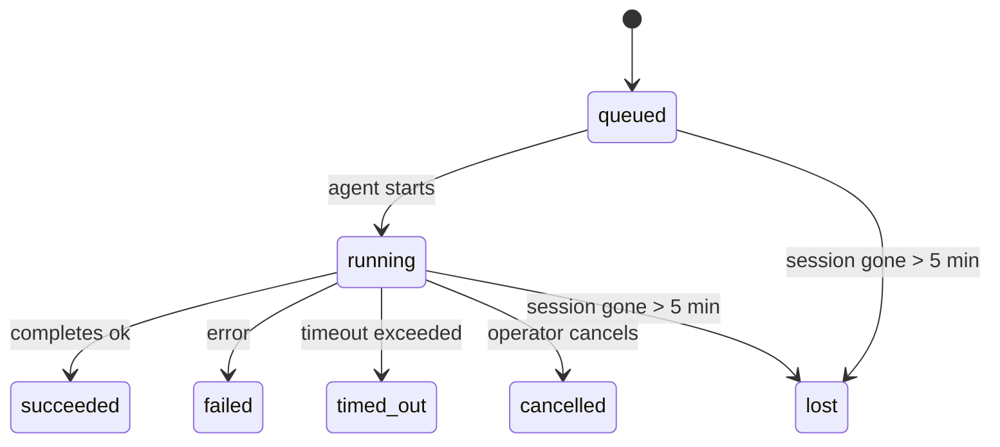

<Note>正在寻找调度？请参阅 [自动化](/zh/automation) 以选择合适的机制。本页面是后台工作的活动分类账，而非调度器。</Note>

后台任务跟踪在**主会话之外**运行的工作：ACP 运行、子代理生成、隔离的 cron 作业执行以及 CLI 发起的操作。

任务**不**替代会话、定时任务（cron jobs）或心跳 —— 它们是记录发生了什么分离工作、何时发生以及是否成功的**活动账本**。

<Note>并非每次 Agent 运行都会创建任务。Heartbeat 轮次和正常的交互式聊天不会创建。所有的 Cron 执行、ACP 生成、子 Agent 生成和 CLI Agent 命令都会创建。</Note>

## TL;DR

- 任务是**记录**，而非调度器 —— 定时任务和心跳决定工作*何时*运行，任务追踪*发生了什么*。
- ACP、子代理、所有 cron 作业和 CLI 操作都会创建任务。Heartbeat 轮次则不会。
- 每个任务都会经历 `queued → running → terminal`（成功、失败、超时、取消或丢失）。
- 只要 cron 运行时仍然拥有该作业，Cron 任务就会保持活跃；如果内存中的运行时状态消失，任务维护会在将任务标记为丢失之前先检查持久的 cron 运行历史。
- 完成是由推送驱动的：分离的工作可以在完成时直接通知或唤醒请求者的会话/心跳，因此状态轮询循环通常是错误的模式。
- 隔离的 cron 运行和子代理完成操作会尽最大努力在最终清理簿记之前，为其子会话清理受跟踪的浏览器选项卡/进程。
- 隔离的 cron 传递会在子代理工作仍在排空时抑制过时的临时父级回复，并且如果最终子级输出在传递之前到达，则优先使用该输出。
- 完成通知会直接投递到渠道或排队等待下一次心跳。
- `openclaw tasks list` 显示所有任务；`openclaw tasks audit` 显示问题。
- 终端记录会保留 7 天，然后自动修剪。

## 快速开始

<Tabs>
  <Tab title="列表和筛选">
    ```bash
    # List all tasks (newest first)
    openclaw tasks list

    # Filter by runtime or status
    openclaw tasks list --runtime acp
    openclaw tasks list --status running
    ```

  </Tab>
  <Tab title="Inspect">
    ```bash
    # Show details for a specific task (by ID, run ID, or session key)
    openclaw tasks show <lookup>
    ```
  </Tab>
  <Tab title="Cancel and notify">
    ```bash
    # Cancel a running task (kills the child session)
    openclaw tasks cancel <lookup>

    # Change notification policy for a task
    openclaw tasks notify <lookup> state_changes
    ```

  </Tab>
  <Tab title="Audit and maintenance">
    ```bash
    # Run a health audit
    openclaw tasks audit

    # Preview or apply maintenance
    openclaw tasks maintenance
    openclaw tasks maintenance --apply
    ```

  </Tab>
  <Tab title="Task flow">
    ```bash
    # Inspect TaskFlow state
    openclaw tasks flow list
    openclaw tasks flow show <lookup>
    openclaw tasks flow cancel <lookup>
    ```
  </Tab>
</Tabs>

## 什么会创建任务

| 来源                  | 运行时类型 | 何时创建任务记录                                                   | 默认通知策略 |
| --------------------- | ---------- | ------------------------------------------------------------------ | ------------ |
| ACP 后台运行          | `acp`      | 生成子 ACP 会话                                                    | `done_only`  |
| 子代理编排            | `subagent` | 通过 `sessions_spawn` 生成子代理                                   | `done_only`  |
| Cron 作业（所有类型） | `cron`     | 每次 cron 执行（主会话和隔离）                                     | `silent`     |
| CLI 操作              | `cli`      | 通过网关运行的 `openclaw agent` 命令                               | `silent`     |
| 代理媒体作业          | `cli`      | 支持会话的 `image_generate`/`music_generate`/`video_generate` 运行 | `silent`     |

<AccordionGroup>
  <Accordion title="Cron 和媒体的默认通知设置">
    主会话 cron 任务默认使用 `silent` 通知策略——它们会创建记录以供跟踪，但不会生成通知。隔离的 cron 任务也默认使用 `silent`，但由于它们在自己的会话中运行，因此更加可见。

    支持会话的 `image_generate`、`music_generate` 和 `video_generate` 运行也使用 `silent`OpenClaw 通知策略。它们仍然会创建任务记录，但完成状态会作为内部唤醒传递回原始代理会话，以便代理可以编写后续消息并自行附加完成的媒体。群组/渠道完成遵循正常的可见回复策略，因此当源交付需要时，代理会使用消息工具。如果完成代理在仅工具路线上未能生成消息工具交付证据，OpenClaw 会将完成回退直接发送到原始渠道，而不是将媒体保留为私有。

  </Accordion>
  <Accordion title="并发媒体生成防护机制">
    当支持会话的媒体生成任务仍处于活动状态时，该工具也充当防护机制：在同一会话中重复调用 `image_generate`、`music_generate` 或 `video_generate` 将返回活动任务状态，而不是启动第二次并发生成。当您需要从代理端进行显式的进度/状态查找时，请使用 `action: "status"`。
  </Accordion>
  <Accordion title="什么不会创建任务">
    - Heartbeat 轮次 - 主会话；参见 [Heartbeat](/zh/gateway/heartbeat)
    - 普通的交互式聊天轮次
    - 直接的 `/command` 响应

  </Accordion>
</AccordionGroup>

## 任务生命周期



| 状态        | 含义                                            |
| ----------- | ----------------------------------------------- |
| `queued`    | 已创建，等待代理启动                            |
| `running`   | 代理轮次正在主动执行                            |
| `succeeded` | 成功完成                                        |
| `failed`    | 完成时出现错误                                  |
| `timed_out` | 超过了配置的超时时间                            |
| `cancelled` | 由操作员通过 `openclaw tasks cancel` 停止       |
| `lost`      | 在 5 分钟的宽限期后，运行时丢失了权威的支持状态 |

转换是自动发生的——当关联的代理运行结束时，任务状态会更新以匹配。

Agent 运行完成对于活动任务记录具有决定性。成功的分离运行最终状态为 `succeeded`，普通运行错误最终状态为 `failed`，而超时或中止结果最终状态为 `timed_out`。如果操作员已经取消了任务，或者运行时已经记录了更强的终止状态，例如 `failed`、`timed_out` 或 `lost`，则随后的成功信号不会降低该终止状态。

`lost` 是运行时感知的：

- ACP 任务：支持的 ACP 子会话元数据已消失。
- 子代理任务：支持的子会话已从目标代理存储中消失。
- Cron 任务：cron 运行时不再将作业跟踪为活动和持久的，且 cron 运行历史未显示该运行的终止结果。离线 CLI 审计不会将其自己的空进程内 cron 运行时状态视为权威。
- CLI 任务：具有运行 ID/源 ID 的任务使用实时运行上下文，因此
  在网关拥有的运行消失后，残留的子会话或聊天会话行不会使其保持活动状态。
  没有运行标识的旧版 CLI 任务仍会回退到子会话。
  CLICLIGateway(网关) 支持的 `openclaw agent` 运行也会根据其运行结果最终确定，
  因此已完成的运行不会保持活动状态，直到清理器将其标记为 `lost`。

## 传递和通知

当任务达到终止状态时，OpenClaw 会通知您。有两条传递路径：

**直接传递** - 如果任务具有渠道目标（即 `requesterOrigin`），完成消息将直接发送到该渠道（Telegram、Discord、Slack 等）。群组和渠道任务完成改为通过请求方会话路由，以便父代理可以编写可见的回复。对于子代理完成，OpenClaw 还会在可用时保留绑定的线程/主题路由，并且可以在放弃直接传递之前，从请求方会话的存储路由（`lastChannel` / `lastTo` / `lastAccountId`）中填充缺失的 `to` / 账户。

**会话排队投递** - 如果直接投递失败或未设置来源，更新将作为系统事件排队在请求者的会话中，并在下一次心跳时显示。

<Tip>任务完成会触发立即的心跳唤醒，以便您快速看到结果 - 您无需等待下一次计划的心跳跳动。</Tip>

这意味着通常的工作流是基于推送的：启动一次分离的工作，然后让运行时在工作完成时唤醒或通知您。仅在需要调试、干预或显式审计时才轮询任务状态。

### 通知策略

控制您接收关于每个任务的通知频率：

| 策略                 | 传递内容                                     |
| -------------------- | -------------------------------------------- |
| `done_only` （默认） | 仅终止状态（成功、失败等）- **这是默认设置** |
| `state_changes`      | 每次状态转换和进度更新                       |
| `silent`             | 完全不通知                                   |

在任务运行时更改策略：

```bash
openclaw tasks notify <lookup> state_changes
```

## CLI 参考

<AccordionGroup>
  <Accordion title="tasks list">
    ```bash
    openclaw tasks list [--runtime <acp|subagent|cron|cli>] [--status <status>] [--json]
    ```

    输出列：Task ID、Kind、Status、Delivery、Run ID、Child Session、Summary。

  </Accordion>
  <Accordion title="tasks show">
    ```bash
    openclaw tasks show <lookup>
    ```

    查找令牌接受任务 ID、运行 ID 或会话密钥。显示完整记录，包括时间、传递状态、错误和终结摘要。

  </Accordion>
  <Accordion title="tasks cancel">
    ```bash
    openclaw tasks cancel <lookup>
    ```

    对于 ACP 和子代理任务，这将终止子会话。对于 CLI 跟踪的任务，取消记录在任务注册表中（没有单独的子运行时句柄）。状态转换为 `cancelled`，并在适用时发送传递通知。

  </Accordion>
  <Accordion title="tasks notify">
    ```bash
    openclaw tasks notify <lookup> <done_only|state_changes|silent>
    ```
  </Accordion>
  <Accordion title="tasks audit">
    ```bash
    openclaw tasks audit [--json]
    ```

    显现操作问题。当检测到问题时，发现也会出现在 `openclaw status` 中。

    | Finding                   | Severity   | Trigger                                                                                                      |
    | ------------------------- | ---------- | ------------------------------------------------------------------------------------------------------------ |
    | `stale_queued`            | warn       | 排队超过 10 分钟                                                                                              |
    | `stale_running`           | error      | 运行超过 30 分钟                                                                                               |
    | `lost`                    | warn/error | Runtime 支持的任务所有权消失；保留的丢失任务在 `cleanupAfter` 之前发出警告，之后变为错误                     |
    | `delivery_failed`         | warn       | 投递失败且通知策略不是 `silent`                                                            |
    | `missing_cleanup`         | warn       | 没有清理时间戳的终端任务                                                                                            |
    | `inconsistent_timestamps` | warn       | 时间线违规（例如在开始之前结束）                                                                                      |

  </Accordion>
  <Accordion title="tasks maintenance">
    ```bash
    openclaw tasks maintenance [--json]
    openclaw tasks maintenance --apply [--json]
    ```

    使用此功能来预览或应用对任务、Task Flow 状态以及过时的 cron 运行会话注册表行的协调、清理标记和修剪。

    协调是运行时感知的：

    - ACP/subagent 任务会检查其后备子会话。
    - 如果子会话具有重启恢复标记，则 Subagent 任务将被标记为丢失，而不是被视为可恢复的后备会话。
    - Cron 任务会检查 cron 运行时是否仍拥有该作业，然后从持久化的 cron 运行日志/作业状态中恢复终端状态，最后才回退到 `lost`。只有 Gateway(网关) 进程才是内存中 cron 活动作业集的权威；离线 CLI 审计使用持久化历史记录，但不会仅仅因为本地 Set 为空就将 cron 任务标记为丢失。
    - 具有运行标识的 CLI 任务会检查拥有它的实时运行上下文，而不仅仅是子会话或聊天会话行。

    完成清理也是运行时感知的：

    - Subagent 完成时会尽力在继续宣布清理之前，为子会话关闭受跟踪的浏览器选项卡/进程。
    - 隔离的 cron 完成时会尽力在运行完全拆除之前，为 cron 会话关闭受跟踪的浏览器选项卡/进程。
    - 隔离的 cron 投递会在需要时等待后代 subagent 的跟进，并抑制过时的父级确认文本，而不是宣布它。
    - Subagent 完成投递首选最新的可见助手文本；如果为空，则回退到经过清理的最新 工具/toolResult 文本，并且仅超时的工具调用运行可以折叠为简短的部分进度摘要。终端失败的运行会宣布失败状态，而不会重播捕获的回复文本。
    - 清理失败不会掩盖真正的任务结果。

    应用维护时，OpenClaw 还会删除超过 7 天的过时 `cron:<jobId>:run:<uuid>` 会话注册表行，同时保留当前正在运行的 cron 作业的行，并保持非 cron 会话行不变。

  </Accordion>
  <Accordion title="tasks flow list | show | cancel">
    ```bash
    openclaw tasks flow list [--status <status>] [--json]
    openclaw tasks flow show <lookup> [--json]
    openclaw tasks flow cancel <lookup>
    ```

    当您关注的是编排任务流而不是单个后台任务记录时，请使用这些命令。

  </Accordion>
</AccordionGroup>

## 聊天任务板 (`/tasks`)

在任何聊天会话中使用 `/tasks` 查看与该会话关联的后台任务。面板显示活动任务和最近完成的任务，包含运行时、状态、时间以及进度或错误详细信息。

当当前会话没有可见的关联任务时，`/tasks` 会回退到代理本地的任务计数，以便您仍然可以在不泄露其他会话详细信息的情况下获得概览。

要查看完整的操作员记录，请使用 CLI：CLI`openclaw tasks list`。

## 状态集成（任务压力）

`openclaw status` 包含一目了然的任务摘要：

```
Tasks: 3 queued · 2 running · 1 issues
```

摘要报告：

- **active** - `queued` + `running` 的数量
- **failures** - `failed` + `timed_out` + `lost` 的数量
- **byRuntime** - 按 `acp`、`subagent`、`cron`、`cli` 的分类明细

`/status` 和 `session_status` 工具都使用具有清理感知的任务快照：优先显示活动任务，隐藏过时的已完成行，并且仅当没有剩余活动工作时才显示最近的失败情况。这使状态卡专注于当前重要的内容。

## 存储与维护

### 任务的存储位置

任务记录持久保存在 SQLite 的以下位置：

```
$OPENCLAW_STATE_DIR/tasks/runs.sqlite
```

注册表在网关启动时加载到内存中，并将写入同步到 SQLite 以确保重启后的持久性。
Gateway 通过使用 SQLite 的默认自动检查点阈值以及定期和关机 Gateway(网关)`TRUNCATE` 检查点，使 SQLite 预写日志保持有界。

### 自动维护

清理器每 **60 秒** 运行一次并处理四件事：

<Steps>
  <Step title="Reconciliation" CLI>
    检查活动任务是否仍具有权威的运行时支持。ACP/子代理任务使用子会话状态，cron 任务使用活动作业所有权，而具有运行身份的 CLI 任务使用拥有运行上下文。如果该支持状态消失超过 5 分钟，则任务将被标记为 `lost`。
  </Step>
  <Step title="ACP 会话 repair">关闭终端或孤立的父级拥有的一次性 ACP 会话，并仅在不存在活跃对话绑定时关闭过时的终端或孤立的持久化 ACP 会话。</Step>
  <Step title="清理标记">在终端任务（endedAt + 7 天）上设置一个 `cleanupAfter` 时间戳。在保留期间，丢失的任务仍会在审核中作为警告显示；在 `cleanupAfter` 过期或缺少清理元数据后，它们将变为错误。</Step>
  <Step title="清理">删除超过其 `cleanupAfter` 日期的记录。</Step>
</Steps>

<Note>**保留：** 终端任务记录将保留 **7 天**，然后自动修剪。无需配置。</Note>

## 任务与其他系统的关系

<AccordionGroup>
  <Accordion title="任务与任务流">
    [Task Flow](/zh/automation/taskflow) 是后台任务之上的流程编排层。在其生命周期内，单个流程可以使用托管或镜像同步模式来协调多个任务。使用 `openclaw tasks` 检查单个任务记录，并使用 `openclaw tasks flow` 检查协调流程。

    有关详细信息，请参阅 [Task Flow](/zh/automation/taskflow)。

  </Accordion>
  <Accordion title="任务与 Cron">
    Cron 作业**定义**存在于 `~/.openclaw/cron/jobs.json` 中；运行时执行状态存在于其旁边的 `~/.openclaw/cron/jobs-state.json` 中。**每次** Cron 执行都会创建一个任务记录——包括主会话和隔离的。主会话 Cron 任务默认为 `silent` 通知策略，以便它们在不生成通知的情况下进行跟踪。

    请参阅 [Cron Jobs](/zh/automation/cron-jobs)。

  </Accordion>
  <Accordion title="任务与 Heartbeat">
    Heartbeat 运行是主会话轮次——它们不创建任务记录。当任务完成时，它可以触发 Heartbeat 唤醒，以便您立即看到结果。

    请参阅 [Heartbeat](/zh/gateway/heartbeat)。

  </Accordion>
  <Accordion title="任务与会话">
    任务可以引用一个 `childSessionKey`（工作运行的位置）和一个 `requesterSessionKey`（谁启动了它）。会话是对话上下文；任务是在此基础上进行的活动跟踪。
  </Accordion>
  <Accordion title="任务和代理运行">
    任务的 `runId` 链接到执行工作的代理运行。代理生命周期事件（开始、结束、错误）会自动更新任务状态——您无需手动管理生命周期。
  </Accordion>
</AccordionGroup>

## 相关

- [自动化](/zh/automation) - 所有自动化机制概览
- [CLI：任务](/zh/cli/tasks) - CLI 命令参考
- [心跳](/zh/gateway/heartbeat) - 定期主会话轮次
- [计划任务](/zh/automation/cron-jobs) - 调度后台工作
- [任务流](/zh/automation/taskflow) - 任务之上的流程编排
