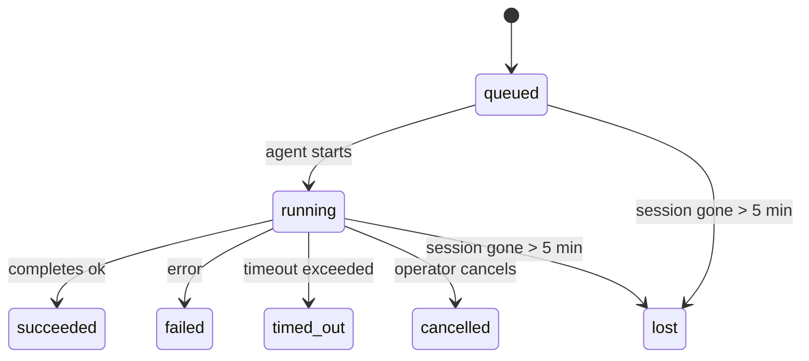

# 后台任务

> **Cron vs Heartbeat vs 任务？** 请参阅 [Cron vs Heartbeat](/en/automation/cron-vs-heartbeat) 以选择合适的调度机制。本页面涵盖**追踪**后台工作，而非进行调度。

后台任务跟踪在**主会话之外**运行的工作：
ACP 运行、子代理生成、隔离的 cron 作业执行以及 CLI 启动的操作。

任务**不**取代会话、定时任务（cron jobs）或心跳——它们是记录分离工作发生时间、发生内容以及是否成功的**活动账本**。

<Note>并非每次 Agent 运行都会创建任务。Heartbeat 轮次和正常的交互式聊天不会创建。所有的 Cron 执行、ACP 生成、子 Agent 生成和 CLI Agent 命令都会创建。</Note>

## TL;DR

- 任务（Task）是**记录**，而非调度器 —— cron 和 heartbeat 决定工作*何时*运行，任务则追踪*发生了什么*。
- ACP、子代理、所有 cron 作业和 CLI 操作都会创建任务。Heartbeat 轮次则不会。
- 每个任务都会经历 `queued → running → terminal`（成功、失败、超时、取消或丢失）。
- 完成通知会直接发送到渠道，或排队等待下一次心跳。
- `openclaw tasks list` 显示所有任务；`openclaw tasks audit` 暴露问题。
- 终端记录会保留 7 天，之后会被自动清理。

## 快速开始

```bash
# List all tasks (newest first)
openclaw tasks list

# Filter by runtime or status
openclaw tasks list --runtime acp
openclaw tasks list --status running

# Show details for a specific task (by ID, run ID, or session key)
openclaw tasks show <lookup>

# Cancel a running task (kills the child session)
openclaw tasks cancel <lookup>

# Change notification policy for a task
openclaw tasks notify <lookup> state_changes

# Run a health audit
openclaw tasks audit
```

## 什么创建任务

| 来源                  | 运行时类型 | 创建任务记录时                       | 默认通知策略 |
| --------------------- | ---------- | ------------------------------------ | ------------ |
| ACP 后台运行          | `acp`      | 生成子 ACP 会话                      | `done_only`  |
| 子代理编排            | `subagent` | 通过 `sessions_spawn` 生成子代理     | `done_only`  |
| Cron 作业（所有类型） | `cron`     | 每次 cron 执行（主会话和独立执行）   | `silent`     |
| CLI 操作              | `cli`      | 通过网关运行的 `openclaw agent` 命令 | `done_only`  |

主会话 cron 任务默认使用 `silent` 通知策略——它们会创建记录以供跟踪，但不会生成通知。隔离的 cron 任务也默认使用 `silent`，但由于它们在自己的会话中运行，因此更加可见。

**什么不会创建任务：**

- Heartbeat 轮次 — 主会话；参见 [Heartbeat](/en/gateway/heartbeat)
- 普通的交互式聊天轮次
- 直接的 `/command` 响应

## 任务生命周期



| 状态        | 含义                                        |
| ----------- | ------------------------------------------- |
| `queued`    | 已创建，正在等待代理启动                    |
| `running`   | 代理轮次正在积极执行                        |
| `succeeded` | 成功完成                                    |
| `failed`    | 完成时出错                                  |
| `timed_out` | 超过配置的超时时间                          |
| `cancelled` | 由操作员通过 `openclaw tasks cancel` 停止   |
| `lost`      | 后备子会话已消失（在 5 分钟宽限期后检测到） |

转换会自动进行 —— 当关联的代理运行结束时，任务状态会随之更新。

## 投递和通知

当任务达到终止状态时，OpenClaw 会通知您。有两种投递途径：

**直接投递** — 如果任务有渠道目标（即 `requesterOrigin`），完成消息将直接发送到该渠道（Telegram、Discord、Slack 等）。

**会话队列传递** — 如果直接传递失败或未设置来源，则更新将作为系统事件排队到请求者的会话中，并在下一次心跳时显示。

<Tip>任务完成会触发立即的心跳唤醒，以便您快速看到结果 — 您无需等待下一次计划的心跳跳动。</Tip>

### 通知策略

控制您接收每个任务通知的频率：

| 策略                | 交付内容                                       |
| ------------------- | ---------------------------------------------- |
| `done_only`（默认） | 仅限最终状态（成功、失败等）——**这是默认设置** |
| `state_changes`     | 每次状态转换和进度更新                         |
| `silent`            | 完全没有                                       |

在任务运行时更改策略：

```bash
openclaw tasks notify <lookup> state_changes
```

## CLI 参考

### `tasks list`

```bash
openclaw tasks list [--runtime <acp|subagent|cron|cli>] [--status <status>] [--json]
```

输出列：任务 ID、类型、状态、交付、运行 ID、子会话、摘要。

### `tasks show`

```bash
openclaw tasks show <lookup>
```

查找令牌接受任务 ID、运行 ID 或会话密钥。显示包括时间、交付状态、错误和最终摘要在内的完整记录。

### `tasks cancel`

```bash
openclaw tasks cancel <lookup>
```

对于 ACP 和子代理任务，这会终止子会话。状态转换为 `cancelled` 并发送传送通知。

### `tasks notify`

```bash
openclaw tasks notify <lookup> <done_only|state_changes|silent>
```

### `tasks audit`

```bash
openclaw tasks audit [--json]
```

呈现操作问题。当检测到问题时，发现结果也会出现在 `openclaw status` 中。

| 发现                      | 严重程度 | 触发器                             |
| ------------------------- | -------- | ---------------------------------- |
| `stale_queued`            | 警告     | 已排队超过 10 分钟                 |
| `stale_running`           | 错误     | 运行时间超过 30 分钟               |
| `lost`                    | 错误     | 后备会话已消失                     |
| `delivery_failed`         | 警告     | 传送失败且通知策略不是 `silent`    |
| `missing_cleanup`         | warn     | 没有清理时间戳的终端任务           |
| `inconsistent_timestamps` | warn     | 时间线冲突（例如在开始前就结束了） |

## 聊天任务板 (`/tasks`)

在任何聊天会话中使用 `/tasks` 即可查看与该会话关联的后台任务。该面板会显示
活动的以及最近完成的任务，包含运行时、状态、时间安排以及进度或错误详情。

当当前会话没有可见的关联任务时，`/tasks` 会回退到代理本地的任务计数，以便您仍然可以在不泄露其他会话详情的情况下获得概览。

如需完整的操作员账本，请使用 CLI：`openclaw tasks list`。

## 状态集成（任务压力）

`openclaw status` 包括一目了然的任务摘要：

```
Tasks: 3 queued · 2 running · 1 issues
```

摘要报告显示：

- **active** — `queued` + `running` 的计数
- **failures** — `failed` + `timed_out` + `lost` 的计数
- **byRuntime** — 按 `acp`、`subagent`、`cron`、`cli` 细分

`/status` 和 `session_status` 工具都使用具有清理感知的任务快照：优先显示活动任务，隐藏过时的已完成行，并且仅在不存在活动工作时才显示最近的失败。这使状态卡专注于当前重要的事项。

## 存储与维护

### 任务的存储位置

任务记录持久化存储在 SQLite 中，位置为：

```
$OPENCLAW_STATE_DIR/tasks/runs.sqlite
```

注册表在网关启动时加载到内存中，并将写入同步到 SQLite 以确保重启后的持久性。

### 自动维护

清理程序每 **60 秒** 运行一次并处理三件事：

1. **协调** — 检查活动任务的支持会话是否仍然存在。如果子会话已消失超过 5 分钟，则该任务将被标记为 `lost`。
2. **清理标记** — 在终端任务（endedAt + 7 天）上设置 `cleanupAfter` 时间戳。
3. **修剪** — 删除超过其 `cleanupAfter` 日期的记录。

**保留期限**：终端任务记录将保留 **7 天**，然后自动修剪。无需配置。

## 任务与其他系统的关系

### 任务与旧的流程引用

一些较旧的 OpenClaw 发行说明和文档将任务管理称为 `ClawFlow`，并记录了 `openclaw flows` 命令界面。

在当前的代码库中，支持的操作员界面是 `openclaw tasks`。请参阅 [ClawFlow](/en/automation/clawflow) 和 [CLI: flows](/en/cli/flows) 了解兼容性说明，这些说明将这些旧引用映射到当前的任务命令。

### 任务与 Cron

Cron 作业**定义**位于 `~/.openclaw/cron/jobs.json` 中。**每次** cron 执行都会创建一个任务记录 —— 包括主会话和隔离的。主会话 cron 任务默认使用 `silent` 通知策略，以便它们在跟踪时不会生成通知。

请参阅 [Cron Jobs](/en/automation/cron-jobs)。

### 任务与 Heartbeat

Heartbeat 运行是主会话轮次 —— 它们不创建任务记录。当任务完成时，它可以触发 heartbeat 唤醒，以便您及时看到结果。

请参阅 [Heartbeat](/en/gateway/heartbeat)。

### 任务与会话

任务可能会引用一个 `childSessionKey`（工作在哪里运行）和一个 `requesterSessionKey`（谁启动了它）。会话是对话上下文；任务是在其之上进行的活动跟踪。

### 任务与代理运行

任务的 `runId` 链接到执行工作的代理运行。代理生命周期事件（开始、结束、错误）会自动更新任务状态——您无需手动管理生命周期。

## 相关

- [自动化概述](/en/automation) — 快速浏览所有自动化机制
- [ClawFlow](/en/automation/clawflow) — 针对旧文档和发行说明的兼容性说明
- [Cron 作业](/en/automation/cron-jobs) — 调度后台工作
- [Cron 与 Heartbeat](/en/automation/cron-vs-heartbeat) — 选择正确的机制
- [Heartbeat](/en/gateway/heartbeat) — 周期性的主会话轮次
- [CLI: flows](/en/cli/flows) — 针对错误命令名称的兼容性说明
- [CLI: Tasks](/en/cli/index#tasks) — CLI 命令参考
