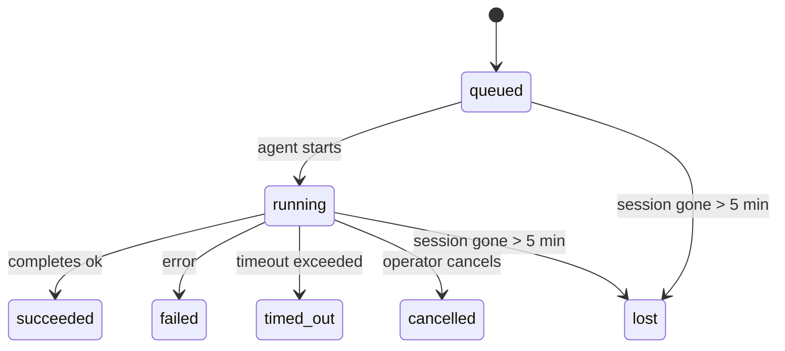

# 后台任务

> **正在寻找调度功能？** 请参阅 [自动化与任务](/en/automation) 以选择正确的机制。本页面涵盖**跟踪**后台工作，而非对其进行调度。

后台任务跟踪在**主会话之外**运行的工作：
ACP 运行、子代理生成、隔离的 cron 作业执行以及 CLI 启动的操作。

任务**不**取代会话、定时任务（cron jobs）或心跳——它们是记录分离工作发生时间、发生内容以及是否成功的**活动账本**。

<Note>并非每次 Agent 运行都会创建任务。Heartbeat 轮次和正常的交互式聊天不会创建。所有的 Cron 执行、ACP 生成、子 Agent 生成和 CLI Agent 命令都会创建。</Note>

## TL;DR

- 任务（Task）是**记录**，而非调度器 —— cron 和 heartbeat 决定工作*何时*运行，任务则追踪*发生了什么*。
- ACP、子代理、所有 cron 作业和 CLI 操作都会创建任务。Heartbeat 轮次则不会。
- 每个任务都会经历 `queued → running → terminal`（成功、失败、超时、已取消或丢失）。
- 只要 cron 运行时仍拥有该作业，Cron 任务就会保持活跃；由聊天支持的 CLI 任务仅在其所属运行上下文仍处于活动状态时才保持活跃。
- 完成是由推送驱动的：分离的工作可以在完成时直接通知或唤醒请求者的会话/心跳，因此状态轮询循环通常是错误的模式。
- 隔离的 cron 运行和子代理完成操作会尽最大努力在最终清理簿记之前，为其子会话清理受跟踪的浏览器选项卡/进程。
- 当后代子代理工作仍在排出时，隔离的 cron 投递会抑制过时的中间父级回复，并且如果后代最终输出在投递前到达，则优先选择该输出。
- 完成通知会直接投递到渠道或排队等待下一次心跳。
- `openclaw tasks list` 显示所有任务；`openclaw tasks audit` 显示问题。
- 终端记录会保留 7 天，然后自动修剪。

## 快速开始

```bash
# List all tasks (newest first)
openclaw tasks list

# Filter by runtime or status
openclaw tasks list --runtime acp
openclaw tasks list --status running

# Show details for a specific task (by ID, run ID, or session key)
openclaw tasks show <lookup>

# Cancel a running task (kills the child session)
openclaw tasks cancel <lookup>

# Change notification policy for a task
openclaw tasks notify <lookup> state_changes

# Run a health audit
openclaw tasks audit

# Preview or apply maintenance
openclaw tasks maintenance
openclaw tasks maintenance --apply

# Inspect TaskFlow state
openclaw tasks flow list
openclaw tasks flow show <lookup>
openclaw tasks flow cancel <lookup>
```

## 什么会创建任务

| 来源                  | 运行时类型 | 创建任务记录时                       | 默认通知策略 |
| --------------------- | ---------- | ------------------------------------ | ------------ |
| ACP 后台运行          | `acp`      | 生成子 ACP 会话                      | `done_only`  |
| 子代理编排            | `subagent` | 通过 `sessions_spawn` 生成子代理     | `done_only`  |
| Cron 作业（所有类型） | `cron`     | 每次 cron 执行（主会话和隔离）       | `silent`     |
| CLI 操作              | `cli`      | 通过网关运行的 `openclaw agent` 命令 | `silent`     |
| 代理媒体作业          | `cli`      | 由会话支持的 `video_generate` 运行   | `silent`     |

主会话 cron 任务默认使用 `silent` 通知策略——它们会创建记录以供跟踪，但不会生成通知。隔离的 cron 任务也默认使用 `silent`，但因为它们在自己的会话中运行，所以更可见。

会话支持的 `video_generate` 运行也使用 `silent` 通知策略。它们仍然会创建任务记录，但完成状态会作为内部唤醒返回给原始代理会话，以便代理可以编写后续消息并自行附加完成的视频。如果您选择加入 `tools.media.asyncCompletion.directSend`，异步 `music_generate` 和 `video_generate` 完成会首先尝试直接渠道交付，然后再回退到请求者会话唤醒路径。

当会话支持的 `video_generate` 任务仍处于活动状态时，该工具还充当护栏：同一会话中重复的 `video_generate` 调用将返回活动任务状态，而不是启动第二次并发生成。当您需要从代理端进行显式的进度/状态查找时，请使用 `action: "status"`。

**什么不会创建任务：**

- Heartbeat 轮次——主会话；参见 [Heartbeat](/en/gateway/heartbeat)
- 普通的交互式聊天轮次
- 直接的 `/command` 响应

## 任务生命周期



| 状态        | 含义                                        |
| ----------- | ------------------------------------------- |
| `queued`    | 已创建，等待代理启动                        |
| `running`   | 代理轮次正在积极执行                        |
| `succeeded` | 成功完成                                    |
| `failed`    | 完成但有错误                                |
| `timed_out` | 超过了配置的超时时间                        |
| `cancelled` | 由操作员通过 `openclaw tasks cancel` 停止   |
| `lost`      | 运行时在 5 分钟宽限期后丢失了权威的后备状态 |

转换会自动发生——当关联的代理运行结束时，任务状态会随之更新。

`lost` 是运行时感知的：

- ACP 任务：后备 ACP 子会话元数据已消失。
- 子代理任务：支持的子会话已从目标代理存储中消失。
- Cron 任务：Cron 运行时不再将该作业跟踪为活动状态。
- CLI 任务：隔离的子会话任务使用子会话；聊天支持的 CLI 任务改为使用实时运行上下文，因此残留的渠道/群组/直接会话记录不会使它们保持活动状态。

## 投递和通知

当任务达到终止状态时，OpenClaw 会通知您。有两种投递路径：

**直接投递** — 如果任务有渠道目标（即 `requesterOrigin`），完成消息将直接发送到该渠道（Telegram、Discord、Slack 等）。对于子代理完成，OpenClaw 还会在可用时保留绑定的主题/话题路由，并且可以在放弃直接投递之前，从请求者会话的存储路由（`lastChannel` / `lastTo` / `lastAccountId`）中填充缺失的 `to` / 账户。

**会话排队投递** — 如果直接投递失败或未设置来源，更新将作为系统事件在请求者的会话中排队，并在下一次心跳时显示。

<Tip>任务完成会触发立即的心跳唤醒，以便您快速看到结果 — 您无需等待下一次计划的心跳跳动。</Tip>

这意味着通常的工作流程是基于推送的：启动一次独立工作，然后让运行时在完成时唤醒或通知您。仅在您需要调试、干预或显式审计时才轮询任务状态。

### 通知策略

控制您收到的关于每个任务的信息量：

| 策略                | 投递内容                                      |
| ------------------- | --------------------------------------------- |
| `done_only`（默认） | 仅终止状态（成功、失败等）—— **这是默认设置** |
| `state_changes`     | 每次状态转换和进度更新                        |
| `silent`            | 完全不通知                                    |

在任务运行时更改策略：

```bash
openclaw tasks notify <lookup> state_changes
```

## CLI 参考

### `tasks list`

```bash
openclaw tasks list [--runtime <acp|subagent|cron|cli>] [--status <status>] [--json]
```

输出列：任务 ID、类型、状态、投递、运行 ID、子会话、摘要。

### `tasks show`

```bash
openclaw tasks show <lookup>
```

查找令牌接受任务 ID、运行 ID 或会话密钥。显示完整记录，包括计时、投递状态、错误和终止摘要。

### `tasks cancel`

```bash
openclaw tasks cancel <lookup>
```

对于 ACP 和子代理任务，这会终止子会话。状态转换为 `cancelled` 并发送交付通知。

### `tasks notify`

```bash
openclaw tasks notify <lookup> <done_only|state_changes|silent>
```

### `tasks audit`

```bash
openclaw tasks audit [--json]
```

呈现操作问题。检测到问题时，发现结果也会出现在 `openclaw status` 中。

| 发现                      | 严重性 | 触发器                           |
| ------------------------- | ------ | -------------------------------- |
| `stale_queued`            | 警告   | 排队超过 10 分钟                 |
| `stale_running`           | 错误   | 运行超过 30 分钟                 |
| `lost`                    | 错误   | 运行时支持的任务所有权已消失     |
| `delivery_failed`         | 警告   | 交付失败且通知策略不是 `silent`  |
| `missing_cleanup`         | 警告   | 没有清理时间戳的终端任务         |
| `inconsistent_timestamps` | 警告   | 时间线违规（例如在开始之前结束） |

### `tasks maintenance`

```bash
openclaw tasks maintenance [--json]
openclaw tasks maintenance --apply [--json]
```

使用此选项预览或应用针对任务和任务流状态的协调、清理标记和修剪。

协调是运行时感知的：

- ACP/子代理任务检查其支持子会话。
- Cron 任务检查 cron 运行时是否仍拥有该作业。
- 聊天支持的 CLI 任务检查拥有的实时运行上下文，而不仅仅是聊天会话行。

完成清理也是运行时感知的：

- 子代理完成清理会尽最大努力在继续公告清理之前关闭子会话的已跟踪浏览器标签页/进程。
- 隔离的 cron 完成清理会尽最大努力在运行完全拆除之前关闭 cron 会话的已跟踪浏览器标签页/进程。
- 隔离的 cron 交付在需要时会等待后代子代理的跟进，并抑制过时的父级确认文本，而不是宣布它。
- 子代理完成交付优先使用最新的可见助手文本；如果为空，则回退到清理过的最新工具/toolResult 文本，且仅超时的工具调用运行可以折叠为简短的部分进度摘要。
- 清理失败不会掩盖真实的任务结果。

### `tasks flow list|show|cancel`

```bash
openclaw tasks flow list [--status <status>] [--json]
openclaw tasks flow show <lookup> [--json]
openclaw tasks flow cancel <lookup>
```

当您关注的是编排任务流而不是单个后台任务记录时，请使用这些。

## 聊天任务板 (`/tasks`)

在任何聊天会话中使用 `/tasks` 以查看链接到该会话的后台任务。该面板显示
活动及最近完成的任务，包含运行时、状态、时间以及进度或错误详细信息。

当当前会话没有可见的关联任务时，`/tasks` 会回退到代理本地的任务计数，
以便您仍能获取概览而不会泄露其他会话的详细信息。

如需查看完整的操作员账本，请使用 CLI：`openclaw tasks list`。

## 状态集成（任务压力）

`openclaw status` 包含一个一目了然的任务摘要：

```
Tasks: 3 queued · 2 running · 1 issues
```

该摘要报告：

- **活动** — `queued` + `running` 的计数
- **失败** — `failed` + `timed_out` + `lost` 的计数
- **按运行时** — 按 `acp`、`subagent`、`cron`、`cli` 细分

`/status` 和 `session_status` 工具均使用具备清理感知的任务快照：优先显示活动任务，隐藏已过期的完成行，且仅在没有剩余活动工作时才显示最近的失败。这使状态卡能专注于当前重要的事项。

## 存储与维护

### 任务的存储位置

任务记录持久化保存在 SQLite 的以下位置：

```
$OPENCLAW_STATE_DIR/tasks/runs.sqlite
```

注册表在网关启动时加载到内存中，并将写入同步到 SQLite 以确保重启后的持久性。

### 自动维护

清理程序每 **60 秒** 运行一次并处理三件事：

1. **协调** — 检查活动任务是否仍具有权威的运行时支持。ACP/子代理任务使用子会话状态，cron 任务使用活动作业所有权，而聊天支持的 CLI 任务使用所属运行上下文。如果该支持状态丢失超过 5 分钟，任务将被标记为 `lost`。
2. **清理标记** — 在终端任务上设置 `cleanupAfter` 时间戳（endedAt + 7 天）。
3. **修剪** — 删除超过其 `cleanupAfter` 日期的记录。

**保留**：终端任务记录将保留 **7 天**，然后自动修剪。无需配置。

## 任务与其他系统的关系

### 任务与任务流

[Task Flow](/en/automation/taskflow) 是位于后台任务之上的流程编排层。单个流程在其生命周期内可以使用托管或镜像同步模式协调多个任务。使用 `openclaw tasks` 检查单个任务记录，使用 `openclaw tasks flow` 检查编排流程。

有关详细信息，请参阅 [Task Flow](/en/automation/taskflow)。

### Tasks and cron

Cron 作业**定义**位于 `~/.openclaw/cron/jobs.json` 中。**每次** Cron 执行都会创建一个任务记录——包括主会话和隔离模式。主会话 Cron 任务默认为 `silent` 通知策略，以便它们在不生成通知的情况下进行跟踪。

请参阅 [Cron Jobs](/en/automation/cron-jobs)。

### Tasks and heartbeat

Heartbeat 运行是主会话回合——它们不创建任务记录。当任务完成时，它可以触发 heartbeat 唤醒，以便您立即看到结果。

请参阅 [Heartbeat](/en/gateway/heartbeat)。

### Tasks and sessions

任务可以引用 `childSessionKey`（工作运行的位置）和 `requesterSessionKey`（启动它的人）。会话是对话上下文；任务是基于该上下文的活动跟踪。

### Tasks and agent runs

任务的 `runId` 链接到执行工作的代理运行。代理生命周期事件（开始、结束、错误）会自动更新任务状态——您无需手动管理生命周期。

## Related

- [Automation & Tasks](/en/automation) —— 快速了解所有自动化机制
- [Task Flow](/en/automation/taskflow) —— 任务之上的流程编排
- [Scheduled Tasks](/en/automation/cron-jobs) —— 调度后台工作
- [Heartbeat](/en/gateway/heartbeat) —— 定期主会话回合
- [CLI: Tasks](/en/cli/index#tasks) —— CLI 命令参考
