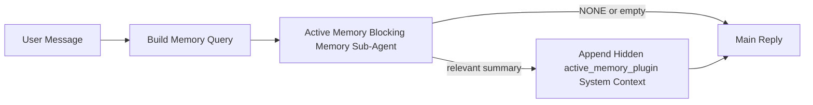

# 活动记忆

活动记忆是一个可选的由插件拥有的阻塞式记忆子代理，在符合资格的对话会话的主回复之前运行。

它的存在是因为大多数记忆系统虽然强大但是被动的。它们依赖主代理来决定何时搜索记忆，或者依赖用户说出“记住这个”或“搜索记忆”之类的话。到那时，记忆本可以让回复显得自然的时机已经过去了。

活动记忆为系统提供了一个在生成主回复之前展示相关记忆的唯一有限机会。

## 将其粘贴到您的代理中

如果您希望使用自包含、安全默认的设置来启用活动记忆，请将其粘贴到您的代理中：

```json5
{
  plugins: {
    entries: {
      "active-memory": {
        enabled: true,
        config: {
          enabled: true,
          agents: ["main"],
          allowedChatTypes: ["direct"],
          modelFallbackPolicy: "default-remote",
          queryMode: "recent",
          promptStyle: "balanced",
          timeoutMs: 15000,
          maxSummaryChars: 220,
          persistTranscripts: false,
          logging: true,
        },
      },
    },
  },
}
```

这将为 `main` 代理启用插件，默认将其限制为直接消息样式的会话，让它首先继承当前会话模型，并且在没有显式或继承的模型可用时仍然允许内置的远程回退。

之后，重启网关：

```bash
node scripts/run-node.mjs gateway --profile dev
```

要在对话中实时检查它：

```text
/verbose on
```

## 启用活动记忆

最安全的设置是：

1. 启用插件
2. 指定一个对话代理
3. 仅在调整时开启日志记录

在 `openclaw.json` 中从以下内容开始：

```json5
{
  plugins: {
    entries: {
      "active-memory": {
        enabled: true,
        config: {
          agents: ["main"],
          allowedChatTypes: ["direct"],
          modelFallbackPolicy: "default-remote",
          queryMode: "recent",
          promptStyle: "balanced",
          timeoutMs: 15000,
          maxSummaryChars: 220,
          persistTranscripts: false,
          logging: true,
        },
      },
    },
  },
}
```

然后重启网关：

```bash
node scripts/run-node.mjs gateway --profile dev
```

这意味着：

- `plugins.entries.active-memory.enabled: true` 启用插件
- `config.agents: ["main"]` 仅选择 `main` 代理加入活动记忆
- `config.allowedChatTypes: ["direct"]` 默认仅对直接消息样式的会话保持活动记忆开启
- 如果未设置 `config.model`，活动记忆将首先继承当前会话模型
- `config.modelFallbackPolicy: "default-remote"` 在没有显式或继承的模型可用时，将内置的远程回退保持为默认设置
- `config.promptStyle: "balanced"` 使用默认的通用提示样式用于 `recent` 模式
- 活动记忆仍然仅在符合条件的交互式持久聊天会话上运行

## 如何查看它

Active memory 会为模型注入隐藏的系统上下文。它不会向客户端
公开原始 `<active_memory_plugin>...</active_memory_plugin>` 标签。

## 会话切换

当您想要暂停或恢复当前聊天会话的活动记忆而无需编辑配置时，请使用插件命令：

```text
/active-memory status
/active-memory off
/active-memory on
```

这是会话范围的。它不会更改
`plugins.entries.active-memory.enabled`、代理定位或其他全局
配置。

如果您希望该命令写入配置并为所有会话暂停或恢复活动记忆，请使用显式的全局形式：

```text
/active-memory status --global
/active-memory off --global
/active-memory on --global
```

全局形式会写入 `plugins.entries.active-memory.config.enabled`。它会保留
`plugins.entries.active-memory.enabled` 开启，以便该命令稍后可用于
重新开启活动记忆。

如果您想查看活动记忆在实时会话中的运行情况，请为该会话开启详细模式：

```text
/verbose on
```

启用详细模式后，OpenClaw 可以显示：

- 一条活动记忆状态行，例如 `Active Memory: ok 842ms recent 34 chars`
- 可读的调试摘要，例如 `Active Memory Debug: Lemon pepper wings with blue cheese.`

这些行源自输入隐藏系统上下文的同一次活动记忆传递，但它们是为人类格式化的，而不是公开原始提示标记。

默认情况下，阻塞性记忆子代理的临时脚本是临时的，并在运行完成后被删除。

示例流程：

```text
/verbose on
what wings should i order?
```

预期的可见回复形式：

```text
...normal assistant reply...

🧩 Active Memory: ok 842ms recent 34 chars
🔎 Active Memory Debug: Lemon pepper wings with blue cheese.
```

## 运行时间

活动记忆使用两个门控：

1. **配置选择加入**
   必须启用插件，并且当前的代理 ID 必须出现在
   `plugins.entries.active-memory.config.agents` 中。
2. **严格的运行时资格**
   即使已启用并已定位，活动记忆也仅针对符合条件的
   交互式持久聊天会话运行。

实际规则是：

```text
plugin enabled
+
agent id targeted
+
allowed chat type
+
eligible interactive persistent chat session
=
active memory runs
```

如果其中任何一项失败，活动记忆将不会运行。

## 会话类型

`config.allowedChatTypes` 控制哪些类型的会话可以运行活动
记忆。

默认值为：

```json5
allowedChatTypes: ["direct"]
```

这意味着活动记忆默认在直接消息样式的会话中运行，但
除非您明确选择加入，否则不会在群组或渠道会话中运行。

示例：

```json5
allowedChatTypes: ["direct"]
```

```json5
allowedChatTypes: ["direct", "group"]
```

```json5
allowedChatTypes: ["direct", "group", "channel"]
```

## 运行位置

活动记忆是一项对话丰富功能，而不是平台范围的推理功能。

| 界面                                   | 运行活动记忆？                 |
| -------------------------------------- | ------------------------------ |
| 控制 UI / 网页聊天持久会话             | 是，如果插件已启用且代理已定位 |
| 同一持久聊天路径上的其他交互式渠道会话 | 是，如果插件已启用且代理已定位 |
| Headless one-shot 运行                 | 否                             |
| Heartbeat/后台运行                     | 否                             |
| 通用内部 `agent-command` 路径          | 否                             |
| Sub-agent/内部 helper 执行             | 否                             |

## 为什么使用它

在以下情况下使用活动内存：

- 会话是持久的且面向用户的
- Agent 拥有有意义的长期记忆可供搜索
- 连续性和个性化比原始提示词的确定性更重要

它特别适用于：

- 稳定的偏好
- 周期性习惯
- 应自然呈现的长期用户上下文

它非常不适用于：

- 自动化
- 内部 worker
- 一次性 API 任务
- 隐藏个性化可能会令人感到意外的场景

## 工作原理

运行时形态为：



阻塞型内存子 Agent 仅能使用：

- `memory_search`
- `memory_get`

如果连接较弱，它应返回 `NONE`。

## 查询模式

`config.queryMode` 控制阻塞型内存子 Agent 能看到多少对话内容。

## 提示词样式

`config.promptStyle` 控制阻塞型内存子 Agent 在决定是否返回记忆时的
积极或严格程度。

可用样式：

- `balanced`：适用于 `recent` 模式的通用默认值
- `strict`：最不积极；当您希望几乎不受邻近上下文影响时最佳
- `contextual`：最有利于连续性；当对话历史更重要时最佳
- `recall-heavy`：更愿意在较弱但仍合理的匹配上呈现记忆
- `precision-heavy`：除非匹配明显，否则激进地偏好 `NONE`
- `preference-only`：针对喜好、习惯、日常、品味和周期性个人事实进行了优化

当未设置 `config.promptStyle` 时的默认映射：

```text
message -> strict
recent -> balanced
full -> contextual
```

如果您显式设置了 `config.promptStyle`，则该覆盖设置优先。

示例：

```json5
promptStyle: "preference-only"
```

## 模型回退策略

如果未设置 `config.model`，Active Memory 将尝试按以下顺序解析模型：

```text
explicit plugin model
-> current session model
-> agent primary model
-> optional built-in remote fallback
```

`config.modelFallbackPolicy` 控制最后一步。

默认值：

```json5
modelFallbackPolicy: "default-remote"
```

其他选项：

```json5
modelFallbackPolicy: "resolved-only"
```

如果没有可用的显式或继承模型，并且您希望 Active Memory 跳过召回而不是回退到内置的远程默认值，请使用 `resolved-only`。

## 高级逃生舱

这些选项有意不作为推荐设置的一部分。

`config.thinking` 可以覆盖阻塞内存子代理的思考级别：

```json5
thinking: "medium"
```

默认值：

```json5
thinking: "off"
```

默认情况下不要启用此功能。Active Memory 运行在回复路径中，因此额外的思考时间会直接增加用户可见的延迟。

`config.promptAppend` 在默认 Active Memory 提示之后、对话上下文之前添加额外的操作员指令：

```json5
promptAppend: "Prefer stable long-term preferences over one-off events."
```

`config.promptOverride` 替换默认的 Active Memory 提示。OpenClaw 仍然会在其后附加对话上下文：

```json5
promptOverride: "You are a memory search agent. Return NONE or one compact user fact."
```

除非您有意测试不同的召回协议，否则不建议自定义提示。默认提示经过调整，用于返回 `NONE` 或用于主模型的紧凑用户事实上下文。

### `message`

仅发送最新的用户消息。

```text
Latest user message only
```

在以下情况使用：

- 您需要最快的行为
- 您需要最强的稳定偏好召回偏向
- 后续轮次不需要对话上下文

建议超时：

- 从 `3000` 到 `5000` 毫秒左右开始

### `recent`

发送最新的用户消息加上一小部分最近的对话尾部。

```text
Recent conversation tail:
user: ...
assistant: ...
user: ...

Latest user message:
...
```

在以下情况使用：

- 您希望在速度和对话基础之间取得更好的平衡
- 后续问题通常依赖于前几轮对话

建议超时：

- 从 `15000` 毫秒左右开始

### `full`

完整的对话会发送到阻塞内存子代理。

```text
Full conversation context:
user: ...
assistant: ...
user: ...
...
```

在以下情况使用：

- 最强的召回质量比延迟更重要
- 对话包含位于线程深处的重要设置

建议超时：

- 与 `message` 或 `recent` 相比，应大幅增加超时时间
- 从 `15000` 毫秒或更高开始，具体取决于线程大小

通常，超时时间应随上下文大小增加：

```text
message < recent < full
```

## 脚本持久化

Active memory 阻塞型内存子代理的运行会在阻塞型内存子代理调用期间创建一个真实的 `session.jsonl`
transcript。

默认情况下，该 transcript 是临时的：

- 它会被写入一个临时目录
- 它仅用于阻塞型内存子代理的运行
- 它会在运行完成后立即被删除

如果您希望将这些阻塞型内存子代理的 transcript 保留在磁盘上以便进行调试或
检查，请显式开启持久化：

```json5
{
  plugins: {
    entries: {
      "active-memory": {
        enabled: true,
        config: {
          agents: ["main"],
          persistTranscripts: true,
          transcriptDir: "active-memory",
        },
      },
    },
  },
}
```

启用后，active memory 会将 transcript 存储在目标
代理的 sessions 文件夹下的单独目录中，而不是在主用户对话 transcript
路径中。

默认布局概念上是：

```text
agents/<agent>/sessions/active-memory/<blocking-memory-sub-agent-session-id>.jsonl
```

您可以使用 `config.transcriptDir` 更改相对子目录。

请谨慎使用：

- 在繁忙的会话中，阻塞型内存子代理的 transcript 可能会迅速累积
- `full` 查询模式可能会复制大量对话上下文
- 这些 transcript 包含隐藏的提示上下文和检索到的记忆

## 配置

所有 active memory 配置均位于以下位置：

```text
plugins.entries.active-memory
```

最重要的字段包括：

| 键                          | 类型                                                                                                 | 含义                                                                     |
| --------------------------- | ---------------------------------------------------------------------------------------------------- | ------------------------------------------------------------------------ |
| `enabled`                   | `boolean`                                                                                            | 启用插件本身                                                             |
| `config.agents`             | `string[]`                                                                                           | 可以使用 active memory 的代理 ID                                         |
| `config.model`              | `string`                                                                                             | 可选的阻塞型内存子代理模型引用；未设置时，active memory 使用当前会话模型 |
| `config.queryMode`          | `"message" \| "recent" \| "full"`                                                                    | 控制阻塞型内存子代理能看到多少对话内容                                   |
| `config.promptStyle`        | `"balanced" \| "strict" \| "contextual" \| "recall-heavy" \| "precision-heavy" \| "preference-only"` | 控制阻塞型内存子代理在决定是否返回记忆时的积极或严格程度                 |
| `config.thinking`           | `"off" \| "minimal" \| "low" \| "medium" \| "high" \| "xhigh" \| "adaptive"`                         | 针对阻塞型内存子代理的高级思考覆盖；为了速度，默认为 `off`               |
| `config.promptOverride`     | `string`                                                                                             | 高级完整提示词替换；不建议正常使用                                       |
| `config.promptAppend`       | `string`                                                                                             | 附加到默认或覆盖提示词的高级额外指令                                     |
| `config.timeoutMs`          | `number`                                                                                             | 阻塞型记忆子代理的硬超时时间                                             |
| `config.maxSummaryChars`    | `number`                                                                                             | 主动记忆摘要中允许的最大总字符数                                         |
| `config.logging`            | `boolean`                                                                                            | 在调整时输出主动记忆日志                                                 |
| `config.persistTranscripts` | `boolean`                                                                                            | 将阻塞型记忆子代理的记录保留在磁盘上，而不是删除临时文件                 |
| `config.transcriptDir`      | `string`                                                                                             | 代理会话文件夹下的相对阻塞型记忆子代理记录目录                           |

有用的调整字段：

| 键                            | 类型     | 含义                                            |
| ----------------------------- | -------- | ----------------------------------------------- |
| `config.maxSummaryChars`      | `number` | 主动记忆摘要中允许的最大总字符数                |
| `config.recentUserTurns`      | `number` | 当 `queryMode` 为 `recent` 时包含的先前用户轮次 |
| `config.recentAssistantTurns` | `number` | 当 `queryMode` 为 `recent` 时包含的先前助手轮次 |
| `config.recentUserChars`      | `number` | 每个最近用户轮次的最大字符数                    |
| `config.recentAssistantChars` | `number` | 每个最近助手轮次的最大字符数                    |
| `config.cacheTtlMs`           | `number` | 重复相同查询的缓存复用                          |

## 推荐设置

从 `recent` 开始。

```json5
{
  plugins: {
    entries: {
      "active-memory": {
        enabled: true,
        config: {
          agents: ["main"],
          queryMode: "recent",
          promptStyle: "balanced",
          timeoutMs: 15000,
          maxSummaryChars: 220,
          logging: true,
        },
      },
    },
  },
}
```

如果您想在调整时检查实时行为，请在会话中使用 `/verbose on`，而
不是寻找单独的主动记忆调试命令。

然后转移到：

- 如果您想要更低的延迟，请使用 `message`
- 如果您认为额外的上下文值得较慢的阻塞型记忆子代理，请使用 `full`

## 调试

如果主动记忆未在您预期的位置显示：

1. 确认插件已在 `plugins.entries.active-memory.enabled` 下启用。
2. 确认当前代理 ID 列在 `config.agents` 中。
3. 确认您正在通过交互式持久聊天会话进行测试。
4. 打开 `config.logging: true` 并观察网关日志。
5. 使用 `openclaw memory status --deep` 验证内存搜索本身是否正常工作。

如果内存命中结果噪音较大，请收紧以下设置：

- `maxSummaryChars`

如果主动内存太慢：

- 降低 `queryMode`
- 降低 `timeoutMs`
- 减少最近的轮次计数
- 减少每轮字符上限

## 相关页面

- [内存搜索](/en/concepts/memory-search)
- [内存配置参考](/en/reference/memory-config)
- [插件 SDK 设置](/en/plugins/sdk-setup)
