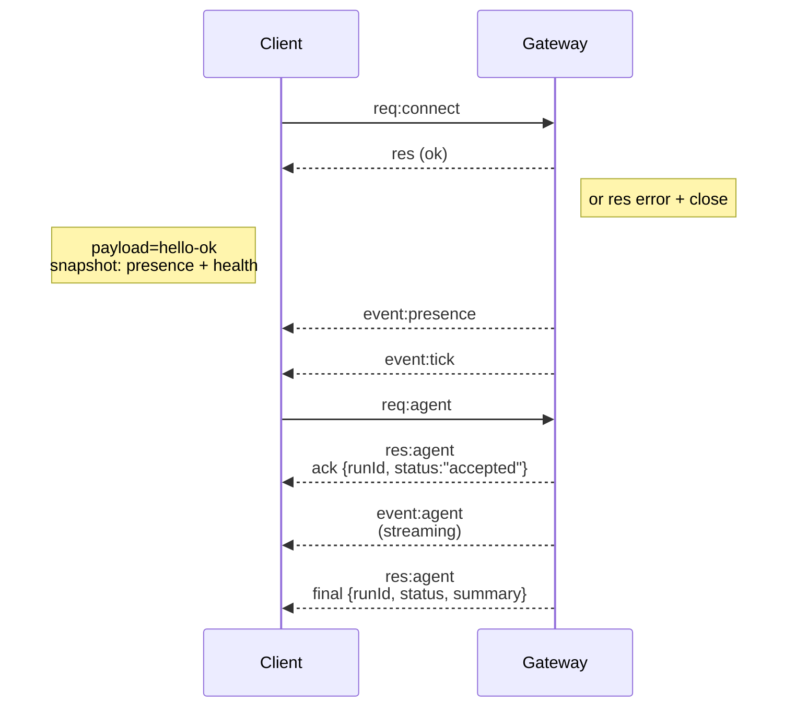

## 概述

- 一个单一的长生命周期 **Gateway(网关)** 拥有所有消息传递表面（通过 Baileys 的 WhatsApp、通过 grammY 的 Telegram、Slack、Discord、Signal、iMessage、WebChat）。
- 控制平面客户端（macOS 应用、CLI、Web UI、自动化）通过 **WebSocket** 连接到配置的绑定主机（默认为 `127.0.0.1:18789`）上的 Gateway(网关)。
- **节点**（macOS/iOS/Android/headless）也通过 **WebSocket** 连接，但使用显式的 caps/commands 声明 `role: node`。
- 每台主机一个 Gateway(网关)；它是唯一打开 WhatsApp 会话的地方。
- **画布主机** 由 Gateway(网关) HTTP 服务器提供服务，位于：
  - `/__openclaw__/canvas/` (agent-editable HTML/CSS/JS)
  - `/__openclaw__/a2ui/` (A2UI host)
    它使用与 Gateway(网关) 相同的端口（默认为 `18789`）。

## 组件和流程

### Gateway(网关) (daemon)

- 维护提供商连接。
- 公开类型化的 WS API（请求、响应、服务器推送事件）。
- 根据 JSON Schema 验证入站帧。
- 发出事件，如 `agent`、`chat`、`presence`、`health`、`heartbeat`、`cron`。

### 客户端 (mac app / CLI / web admin)

- 每个客户端一个 WS 连接。
- 发送请求（`health`、`status`、`send`、`agent`、`system-presence`）。
- 订阅事件（`tick`、`agent`、`presence`、`shutdown`）。

### 节点 (macOS / iOS / Android / headless)

- 使用 `role: node` 连接到 **同一 WS 服务器**。
- 在 `connect` 中提供设备标识；配对是 **基于设备的**（角色 `node`），批准存储在设备配对存储中。
- 公开命令，如 `canvas.*`、`camera.*`、`screen.record`、`location.get`。

协议详情：

- [Gateway(网关) 协议](/zh/gateway/protocol)

### WebChat

- 使用 Gateway(网关) WS API 获取聊天记录并发送消息的静态 UI。
- 在远程设置中，通过与其他客户端相同的 SSH/Tailscale 隧道进行连接。

## 连接生命周期（单个客户端）



## 线路协议（摘要）

- 传输：WebSocket，带有 JSON 负载的文本帧。
- 第一帧 **必须** 是 `connect`。
- 握手后：
  - 请求：`{type:"req", id, method, params}` → `{type:"res", id, ok, payload|error}`
  - 事件：`{type:"event", event, payload, seq?, stateVersion?}`
- `hello-ok.features.methods` / `events` 是发现元数据，而非每个可调用辅助路由的生成转储。
- 共享密钥认证使用 `connect.params.auth.token` 或
  `connect.params.auth.password`，具体取决于配置的网关认证模式。
- 承载身份的模式（如 Tailscale Serve
  (`gateway.auth.allowTailscale: true`) 或非环回
  `gateway.auth.mode: "trusted-proxy"`）通过请求头满足认证，
  而非使用 `connect.params.auth.*`。
- 私有入口 `gateway.auth.mode: "none"` 完全禁用共享密钥认证；
  请勿将该模式用于公共/不受信任的入口。
- 副作用方法（`send`, `agent`）需要幂等性密钥
  以便安全重试；服务器会保留短期去重缓存。
- 节点必须在 `connect` 中包含 `role: "node"` 以及 caps/commands/permissions。

## 配对 + 本地信任

- 所有 WS 客户端（操作员 + 节点）都必须在 `connect` 上包含 **设备标识**。
- 新的设备 ID 需要配对批准；Gateway(网关) 会为后续连接签发 **设备令牌**。
- 直接本地环回连接可以自动批准，以保持同主机用户体验流畅。
- OpenClaw 还有一个狭窄的后端/容器本地自连接路径，
  用于受信任的共享密钥辅助流程。
- Tailnet 和 LAN 连接（包括同主机 tailnet 绑定）仍然需要
  显式的配对批准。
- 所有连接必须对 `connect.challenge` nonce 进行签名。
- 签名负载 `v3` 还绑定了 `platform` + `deviceFamily`；网关
  会在重新连接时锁定已配对的元数据，并要求进行修复配对以更改元数据。
- **非本地** 连接仍然需要明确的批准。
- Gateway(网关) 认证 (`gateway.auth.*`) 仍然适用于 **所有** 连接，无论是本地还是远程。

详情：[Gateway(网关) protocol](/zh/gateway/protocol)、[Pairing](/zh/channels/pairing)、
[Security](/zh/gateway/security)。

## Protocol typing and codegen

- TypeBox schemas 定义协议。
- JSON Schema 是从这些 schemas 生成的。
- Swift 模型是从 JSON Schema 生成的。

## Remote access

- 首选：Tailscale 或 VPN。
- 备选：SSH 隧道

  ```bash
  ssh -N -L 18789:127.0.0.1:18789 user@host
  ```

- 相同的握手 + auth token 适用于隧道连接。
- 在远程设置中，可以为 WS 启用 TLS + 可选的证书固定。

## Operations snapshot

- 启动：`openclaw gateway`（前台运行，日志输出到 stdout）。
- 健康检查：通过 WS 发送 `health`（也包含在 `hello-ok` 中）。
- 监控：使用 launchd/systemd 进行自动重启。

## Invariants

- 每个主机上只有一个 Gateway(网关) 控制一个 Baileys 会话。
- 握手是强制性的；任何非 JSON 或非 connect 的第一帧都会导致强制关闭连接。
- Events 不会重放；客户端必须在出现间隙时进行刷新。

## Related

- [Agent Loop](/zh/concepts/agent-loop) — 详细的 agent 执行循环
- [Gateway(网关) Protocol](/zh/gateway/protocol) — WebSocket 协议契约
- [Queue](/zh/concepts/queue) — 命令队列和并发
- [Security](/zh/gateway/security) — 信任模型和加固
