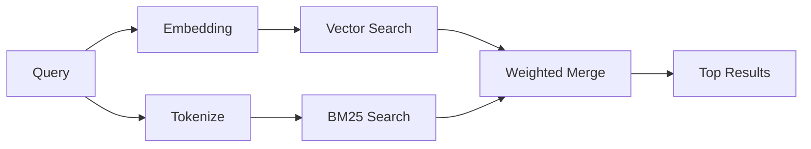

# Memory Search

`memory_search` 从您的记忆文件中查找相关笔记，即使措辞与原文不同。它的工作原理是将记忆索引成小块，然后使用嵌入、关键词或两者兼有的方式进行搜索。

## 快速开始

如果您配置了 OpenAI、Gemini、Voyage 或 Mistral API 密钥，记忆搜索将自动工作。要显式设置提供商：

```json5
{
  agents: {
    defaults: {
      memorySearch: {
        provider: "openai", // or "gemini", "local", "ollama", etc.
      },
    },
  },
}
```

对于没有 API 密钥的本地嵌入，请使用 `provider: "local"`（需要 node-llama-cpp）。

## Supported providers

| 提供商  | ID        | 需要 API 密钥 | 备注                            |
| ------- | --------- | ------------- | ------------------------------- |
| OpenAI  | `openai`  | 是            | 自动检测，快速                  |
| Gemini  | `gemini`  | 是            | 支持图像/音频索引               |
| Voyage  | `voyage`  | 是            | 自动检测                        |
| Mistral | `mistral` | 是            | 自动检测                        |
| Bedrock | `bedrock` | 否            | 当 AWS 凭证链解析成功时自动检测 |
| Ollama  | `ollama`  | 否            | 本地，必须显式设置              |
| 本地    | `local`   | 否            | GGUF 模型，约需下载 0.6 GB      |

## 搜索如何工作

OpenClaw 并行运行两条检索路径并合并结果：



- **向量搜索**查找含义相似的笔记（"gateway host" 匹配
  "运行 OpenClaw 的机器"）。
- **BM25 关键词搜索**查找精确匹配项（ID、错误字符串、配置
  键）。

如果仅有一条路径可用（没有嵌入或没有 FTS），则另一条单独运行。

## 提高搜索质量

两个可选功能可在您拥有大量笔记历史记录时提供帮助：

### 时间衰减

旧笔记会逐渐降低排名权重，以便最新信息优先显示。
默认半衰期为 30 天，上个月的笔记得分为其原始权重的 50%。
像 `MEMORY.md` 这样的常青文件永远不会衰减。

<Tip>如果您的智能体拥有数月的每日笔记，并且陈旧信息一直压倒近期上下文， 请启用时间衰减。</Tip>

### MMR（多样性）

减少冗余结果。如果五条笔记都提及相同的路由器配置，MMR
会确保热门结果涵盖不同主题，而不是重复。

<Tip>如果 `memory_search` 不断从不同的每日笔记中返回 近似重复的片段，请启用 MMR。</Tip>

### 同时启用

```json5
{
  agents: {
    defaults: {
      memorySearch: {
        query: {
          hybrid: {
            mmr: { enabled: true },
            temporalDecay: { enabled: true },
          },
        },
      },
    },
  },
}
```

## 多模态记忆

使用 Gemini Embedding 2，您可以连同 Markdown 一起索引图像和音频文件。
搜索查询仍为文本，但它们会匹配视觉和音频内容。
有关设置，请参阅 [Memory configuration reference](/en/reference/memory-config)。

## 会话记忆搜索

您可以选择索引会话记录，以便 `memory_search` 能够
回想之前的对话。这通过 `memorySearch.experimental.sessionMemory`
选择加入。有关详细信息，请参阅
[configuration reference](/en/reference/memory-config)。

## 故障排除

**没有结果？** 运行 `openclaw memory status` 检查索引。如果为空，请运行
`openclaw memory index --force`。

**仅关键词匹配？** 您的嵌入提供商可能未配置。请检查
`openclaw memory status --deep`。

**未找到 CJK 文本？** 使用
`openclaw memory index --force` 重建 FTS 索引。

## 延伸阅读

- [Memory](/en/concepts/memory) -- 文件布局、后端、工具
- [Memory configuration reference](/en/reference/memory-config) -- 所有配置选项
