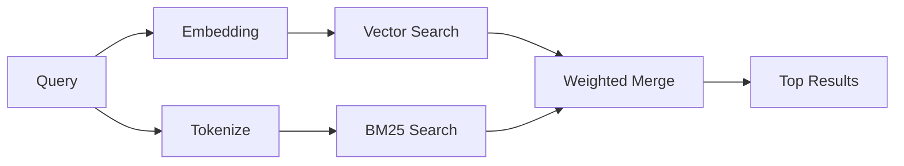

`memory_search` 从您的记忆文件中查找相关笔记，即使措辞与原文不同。它的工作原理是将记忆索引为小块，并使用嵌入、关键词或两者结合进行搜索。

## 快速开始

Memory search 默认使用 OpenAI embeddings。若要使用其他 embedding
后端，请显式设置一个提供商：

```json5
{
  agents: {
    defaults: {
      memorySearch: {
        provider: "openai", // or "gemini", "local", "ollama", "openai-compatible", etc.
      },
    },
  },
}
```

对于具有特定内存提供商的多端点设置，`provider` 也可以
是一个自定义 `models.providers.<id>` 条目，例如 `ollama-5080`，当该
提供商设置了 `api: "ollama"` 或其他内存 embedding 适配器所有者时。

对于没有 API 密钥的本地嵌入，请设置 `provider: "local"`。源码检出可能仍需要原生构建批准：`pnpm approve-builds` 然后 `pnpm rebuild node-llama-cpp`。

某些与 OpenAI 兼容的 embedding 端点需要非对称标签，例如
`input_type: "query"` 用于搜索，而 `input_type: "document"` 或 `"passage"`
用于索引块。请使用 `memorySearch.queryInputType` 和
`memorySearch.documentInputType` 配置这些标签；参见 [Memory configuration reference](/zh/reference/memory-config#provider-specific-config)。

## 支持的提供商

| 提供商            | ID                  | 需要 API 密钥 | 备注                      |
| ----------------- | ------------------- | ------------- | ------------------------- |
| Bedrock           | `bedrock`           | 否            | 使用 AWS 凭证链           |
| DeepInfra         | `deepinfra`         | 是            | 默认值：`BAAI/bge-m3`     |
| Gemini            | `gemini`            | 是            | 支持图像/音频索引         |
| GitHub Copilot    | `github-copilot`    | 否            | 使用 Copilot 订阅         |
| 本地              | `local`             | 否            | GGUF 模型，约 0.6 GB 下载 |
| Mistral           | `mistral`           | 是            |                           |
| Ollama            | `ollama`            | 否            | 本地/自托管               |
| OpenAI            | `openai`            | 是            | 默认                      |
| OpenAI-compatible | `openai-compatible` | 通常          | 通用 `/v1/embeddings`     |
| Voyage            | `voyage`            | 是            |                           |

## 搜索如何工作

OpenClaw 并行运行两条检索路径并合并结果：



- **向量搜索** 查找含义相似的笔记（"gateway host" 匹配
  "运行 OpenClaw 的机器"）。
- **BM25 关键词搜索** 查找精确匹配（ID、错误字符串、配置
  键）。

如果仅有一条路径可用（无 embeddings 或无 FTS），则另一条单独运行。

当嵌入不可用时，OpenClaw 仍会对 FTS 结果使用词法排序，而不是仅回退到原始的精确匹配排序。这种降级模式会提升具有更强查询词覆盖率和相关文件路径的块，即使没有 OpenClaw`sqlite-vec` 或嵌入提供商，也能保持召回率的实用性。

## 提高搜索质量

当您有大量笔记历史记录时，两个可选功能会有所帮助：

### 时间衰减

旧笔记逐渐失去排序权重，以便最新信息优先显示。
默认半衰期为 30 天，上个月的笔记得分为其原始权重的 50%。
像 `MEMORY.md` 这样的常青文件永远不会衰减。

<Tip>如果您的智能体有数月的每日笔记，并且过时信息一直排在最近上下文之前，请启用时间衰减。</Tip>

### MMR（多样性）

减少冗余结果。如果五个笔记都提到同一个路由器配置，MMR
会确保排名靠前的结果涵盖不同的主题，而不是重复。

<Tip>如果 `memory_search` 不断从不同的每日笔记中返回近乎重复的片段，请启用 MMR。</Tip>

### 同时启用两者

```json5
{
  agents: {
    defaults: {
      memorySearch: {
        query: {
          hybrid: {
            mmr: { enabled: true },
            temporalDecay: { enabled: true },
          },
        },
      },
    },
  },
}
```

## 多模态记忆

使用 Gemini Embedding 2，您可以与 Markdown 一起索引图像和音频文件。
搜索查询仍然是文本，但它们与视觉和音频内容匹配。有关设置，请参阅[内存配置参考](/zh/reference/memory-config)。

## 会话记忆搜索

您可以选择索引会话记录，以便 `memory_search` 能够回忆起
之前的对话。这是通过 `memorySearch.experimental.sessionMemory` 选择启用的。
有关详细信息，请参阅[配置参考](/zh/reference/memory-config)。

## 故障排除

**没有结果？** 运行 `openclaw memory status` 检查索引。如果为空，请运行
`openclaw memory index --force`。

**仅关键词匹配？** 您的嵌入提供商可能未配置。请检查
`openclaw memory status --deep`。

**本地嵌入超时？** `ollama`、`lmstudio` 和 `local` 默认使用更长的
内联批处理超时时间。如果主机只是慢，请设置
`agents.defaults.memorySearch.sync.embeddingBatchTimeoutSeconds` 并重新运行
`openclaw memory index --force`。

**找不到中日韩文本？** 使用 `openclaw memory index --force` 重建 FTS 索引。

## 延伸阅读

- [Active Memory](/zh/concepts/active-memory) -- 用于交互式聊天会话的子代理记忆
- [Memory](/zh/concepts/memory) -- 文件布局、后端、工具
- [Memory configuration reference](/zh/reference/memory-config) -- 所有配置选项

## 相关

- [Memory overview](/zh/concepts/memory)
- [Active memory](/zh/concepts/active-memory)
- [Builtin memory engine](/zh/concepts/memory-builtin)
