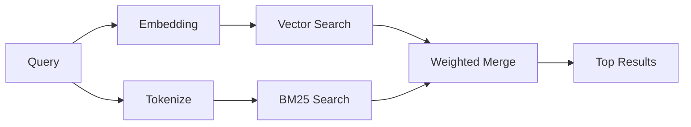

`memory_search` 从您的记忆文件中查找相关笔记，即使措辞与原文不同。它的工作原理是将记忆索引为小块，并使用嵌入、关键词或两者结合进行搜索。

## 快速开始

如果您配置了 GitHub Copilot 订阅、OpenAI、Gemini、Voyage 或 Mistral API 密钥，memory search 将自动工作。要显式设置提供商：

```json5
{
  agents: {
    defaults: {
      memorySearch: {
        provider: "openai", // or "gemini", "local", "ollama", etc.
      },
    },
  },
}
```

对于没有 API 密钥的本地嵌入，请在 OpenClaw 旁边安装可选的 `node-llama-cpp` 运行时包并使用 `provider: "local"`。

一些与 OpenAI 兼容的嵌入端点需要不对称标签，例如用于搜索的 `input_type: "query"` 和用于索引块的 `input_type: "document"` 或 `"passage"`。使用 `memorySearch.queryInputType` 和 `memorySearch.documentInputType` 配置这些标签；请参阅 [Memory configuration reference](/zh/reference/memory-config#provider-specific-config)。

## Supported providers

| 提供商         | ID               | 需要 API 密钥 | 备注                        |
| -------------- | ---------------- | ------------- | --------------------------- |
| Bedrock        | `bedrock`        | 否            | 当 AWS 凭证链解析时自动检测 |
| Gemini         | `gemini`         | 是            | 支持图像/音频索引           |
| GitHub Copilot | `github-copilot` | 否            | 自动检测，使用 Copilot 订阅 |
| 本地           | `local`          | 否            | GGUF 模型，约 0.6 GB 下载量 |
| Mistral        | `mistral`        | 是            | 自动检测                    |
| Ollama         | `ollama`         | 否            | 本地，必须显式设置          |
| OpenAI         | `openai`         | 是            | 自动检测，快速              |
| Voyage         | `voyage`         | 是            | 自动检测                    |

## 搜索如何工作

OpenClaw 并行运行两条检索路径并合并结果：



- **向量搜索** 查找含义相似的笔记（"gateway host" 匹配 "运行 OpenClaw 的机器"）。
- **BM25 关键词搜索** 查找完全匹配项（ID、错误字符串、配置键）。

如果只有一条路径可用（没有嵌入或没有 FTS），则另一条单独运行。

当嵌入不可用时，OpenClaw 仍然对 FTS 结果使用词法排序，而不是仅回退到原始的精确匹配排序。这种降级模式会提升具有更强查询词覆盖率和相关文件路径的块，这使得即使没有 `sqlite-vec` 或嵌入提供商，召回仍然有用。

## 提高搜索质量

当您有大量笔记历史记录时，两个可选功能会有所帮助：

### 时间衰减

旧笔记逐渐失去排名权重，以便最新信息排在前面。使用默认的 30 天半衰期，上个月的笔记得分为其原始权重的 50%。像 `MEMORY.md` 这样的常青文件永远不会衰减。

<Tip>如果您的智能体有数月的每日笔记，并且过时信息的排名一直高于最近的上下文，请启用时间衰减。</Tip>

### MMR（多样性）

减少冗余结果。如果五条笔记都提到相同的路由器配置，MMR 确保顶部结果涵盖不同的主题，而不是重复。

<Tip>如果 `memory_search` 持续从不同的每日笔记中返回近乎重复的片段，请启用 MMR。</Tip>

### 两者都启用

```json5
{
  agents: {
    defaults: {
      memorySearch: {
        query: {
          hybrid: {
            mmr: { enabled: true },
            temporalDecay: { enabled: true },
          },
        },
      },
    },
  },
}
```

## 多模态内存

使用 Gemini Embedding 2，您可以与 Markdown 一起索引图像和音频文件。
搜索查询保持为文本，但它们会与视觉和音频内容匹配。请参阅[内存配置参考](/zh/reference/memory-config)了解
设置方法。

## 会话记忆搜索

您可以选择性地索引会话记录，以便 `memory_search` 能够回忆
之前的对话。这是通过
`memorySearch.experimental.sessionMemory` 开启的。请参阅
[配置参考](/zh/reference/memory-config) 了解详情。

## 故障排除

**没有结果？** 运行 `openclaw memory status` 检查索引。如果为空，请运行
`openclaw memory index --force`。

**仅有关键词匹配？** 您的嵌入提供商可能未配置。请检查
`openclaw memory status --deep`。

**本地嵌入超时？** 默认情况下，`ollama`、`lmstudio` 和 `local` 使用更长的
内联批处理超时时间。如果主机仅仅是慢，请设置
`agents.defaults.memorySearch.sync.embeddingBatchTimeoutSeconds` 并重新运行
`openclaw memory index --force`。

**找不到 CJK 文本？** 使用
`openclaw memory index --force` 重建 FTS 索引。

## 延伸阅读

- [Active Memory](/zh/concepts/active-memory) -- 用于交互式聊天会话的子代理内存
- [Memory](/zh/concepts/memory) -- 文件布局、后端、工具
- [Memory configuration reference](/zh/reference/memory-config) -- 所有配置选项

## 相关

- [Memory overview](/zh/concepts/memory)
- [Active memory](/zh/concepts/active-memory)
- [Builtin memory engine](/zh/concepts/memory-builtin)
