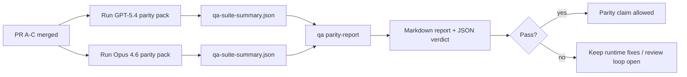

本文档说明了如何将 GPT-5.4 / Codex 对等程序作为四个合并单元进行审查，同时保留原有的六合约架构。

## 合并单元

### PR A：严格的代理执行

负责：

- `executionContract`
- GPT-5 优先的同轮次跟进执行
- 将 `update_plan` 作为非终端进度跟踪
- 显式阻止状态，而非仅计划的静默停止

不负责：

- 身份验证/运行时故障分类
- 权限真实性
- 重放/继续执行重新设计
- 对等基准测试

### PR B：运行时真实性

负责：

- Codex OAuth 范围正确性
- 类型化的提供商/运行时故障分类
- 真实的 `/elevated full` 可用性及阻止原因

不负责：

- 工具架构规范化
- 重放/存活性状态
- 基准测试门控

### PR C：执行正确性

负责：

- 提供商拥有的 OpenAI/Codex 工具兼容性
- 无参数的严格架构处理
- 重试无效的呈现
- 已暂停、已阻止和已放弃的长任务状态可见性

不负责：

- 自选继续执行
- 提供商钩子之外的通用 Codex 方言行为
- 基准测试门控

### PR D：对等工具套件

负责：

- 第一波 GPT-5.4 对比 Opus 4.6 场景包
- 对等文档
- 对等报告和发布门控机制

不负责：

- QA 实验室之外的运行时行为更改
- 工具套件内部的 auth/proxy/DNS 模拟

## 映射回原有的六合约

| 原有合约                   | 合并单元 |
| -------------------------- | -------- |
| 提供商传输/身份验证正确性  | PR B     |
| 工具合约/架构兼容性        | PR C     |
| 同轮次执行                 | PR A     |
| 权限真实性                 | PR B     |
| 重放/继续执行/存活性正确性 | PR C     |
| 基准/发布门控              | PR D     |

## 审查顺序

1. PR A
2. PR B
3. PR C
4. PR D

PR D 是验证层。它不应成为延迟运行时正确性 PR 的原因。

## 注意事项

### PR A

- GPT-5 运行时执行操作或失败关闭，而不是停止于评论
- `update_plan` 本身不再看起来像进度
- 行为保持 GPT-5 优先且限于嵌入式 Pi

### PR B

- auth/proxy/runtime failures stop collapsing into generic “模型 failed” handling
- `/elevated full` is only described as available when it is actually available
- blocked reasons are visible to both the 模型 and the user-facing runtime

### PR C

- strict OpenAI/Codex 工具 registration behaves predictably
- parameter-free tools do not fail strict schema checks
- replay and compaction outcomes preserve truthful liveness state

### PR D

- the scenario pack is understandable and reproducible
- the pack includes a mutating replay-safety lane, not only read-only flows
- reports are readable by humans and automation
- parity claims are evidence-backed, not anecdotal

Expected artifacts from PR D:

- `qa-suite-report.md` / `qa-suite-summary.json` for each 模型 run
- `qa-agentic-parity-report.md` with aggregate and scenario-level comparison
- `qa-agentic-parity-summary.json` with a machine-readable verdict

## Release gate

Do not claim GPT-5.4 parity or superiority over Opus 4.6 until:

- PR A, PR B, and PR C are merged
- PR D runs the first-wave parity pack cleanly
- runtime-truthfulness regression suites remain green
- the parity report shows no fake-success cases and no regression in stop behavior

The parity harness is not the only evidence source. Keep this split explicit in review:

- PR D owns the scenario-based GPT-5.4 vs Opus 4.6 comparison
- PR B deterministic suites still own auth/proxy/DNS and full-access truthfulness evidence

## Goal-to-evidence map

| Completion gate item                     | Primary owner | Review artifact                                                     |
| ---------------------------------------- | ------------- | ------------------------------------------------------------------- |
| No plan-only stalls                      | PR A          | strict-agentic runtime tests and `approval-turn-tool-followthrough` |
| No fake progress or fake 工具 completion | PR A + PR D   | parity fake-success count plus scenario-level report details        |
| No false `/elevated full` guidance       | PR B          | deterministic runtime-truthfulness suites                           |
| Replay/liveness failures remain explicit | PR C + PR D   | lifecycle/replay suites plus `compaction-retry-mutating-tool`       |
| GPT-5.4 matches or beats Opus 4.6        | PR D          | `qa-agentic-parity-report.md` and `qa-agentic-parity-summary.json`  |

## Reviewer shorthand: before vs after

| User-visible problem before                              | Review signal after                                                    |
| -------------------------------------------------------- | ---------------------------------------------------------------------- |
| GPT-5.4 stopped after planning                           | PR A shows act-or-block behavior instead of commentary-only completion |
| 在使用严格的 OpenAI/Codex 模式时，工具的使用感觉比较脆弱 | PR C 保证了工具注册和无参数调用的可预测性                              |
| `/elevated full` 提示有时会产生误导                      | PR B 将指导与实际的运行时能力及被阻塞原因联系起来                      |
| 长任务可能会消失在重放/压缩的歧义中                      | PR C 发出明确的暂停、阻塞、放弃和重播无效状态                          |
| 对等性声明过去只是轶事证据                               | PR D 生成一份报告以及 JSON 判定，在两个模型上具有相同的场景覆盖范围    |

## 相关

- [GPT-5.4 / Codex agentic parity](/zh/help/gpt54-codex-agentic-parity)
