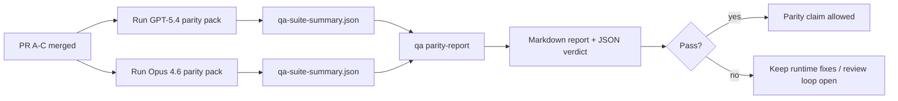

# GPT-5.4 / Codex Parity 维护者笔记

本说明解释了如何将 GPT-5.4 / Codex parity 程序作为四个合并单元进行审查，而不丢失原始的六协议架构。

## 合并单元

### PR A：严格的代理执行

拥有：

- `executionContract`
- GPT-5 优先的同轮跟进执行
- `update_plan` 作为非终端进度跟踪
- 显式的受阻状态，而非仅计划的静默停止

不拥有：

- auth/运行时失败分类
- 权限真实性
- 重放/继续重新设计
- parity 基准测试

### PR B：运行时真实性

拥有：

- Codex OAuth 范围正确性
- 类型化提供商/运行时失败分类
- 真实的 `/elevated full` 可用性及受阻原因

不拥有：

- 工具架构规范化
- 重放/活跃状态
- 基准测试门控

### PR C：执行正确性

拥有：

- 提供商拥有的 OpenAI/Codex 工具兼容性
- 无参数严格架构处理
- 重放无效的呈现
- 已暂停、已受阻和已放弃的长任务状态可见性

不拥有：

- 自选继续
- 提供商挂钩之外的通用 Codex 方言行为
- 基准测试门控

### PR D：parity 测试线束

拥有：

- 第一波 GPT-5.4 vs Opus 4.6 场景包
- parity 文档
- parity 报告和发布门控机制

不拥有：

- QA 实验室之外的运行时行为更改
- 测试线束内部的 auth/proxy/DNS 模拟

## 映射回原始的六协议

| 原始协议                  | 合并单元 |
| ------------------------- | -------- |
| Provider 传输/auth 正确性 | PR B     |
| 工具协议/架构兼容性       | PR C     |
| 同轮执行                  | PR A     |
| 权限真实性                | PR B     |
| 重放/继续/活跃性正确性    | PR C     |
| 基准/发布门控             | PR D     |

## 审查顺序

1. PR A
2. PR B
3. PR C
4. PR D

PR D 是验证层。它不应成为推迟运行时正确性 PR 的原因。

## 检查要点

### PR A

- GPT-5 运行采取行动或失败关闭，而不是停在评论处
- `update_plan` 不再仅凭其自身看起来像进度
- 行为保持 GPT-5 优先且范围限定于嵌入式 Pi

### PR B

- auth/proxy/运行时失败不再归入通用的“模型失败”处理
- `/elevated full` 仅在实际可用时才被描述为可用
- 模型和面向用户的运行时都能看到被阻止的原因

### PR C

- 严格的 OpenAI/Codex 工具注册行为可预测
- 无参数工具不会在严格架构检查中失败
- 重放和压缩结果保留真实的活跃状态

### PR D

- 场景包易于理解且可复现
- 该包包含可变重放安全通道，而不仅仅是只读流
- 报告可由人工和自动化工具读取
- 同等性声明有证据支持，而非轶事

PR D 的预期产物：

- 每次模型运行的 `qa-suite-report.md` / `qa-suite-summary.json`
- 包含汇总和场景级别比较的 `qa-agentic-parity-report.md`
- 包含机器可读结果的 `qa-agentic-parity-summary.json`

## 发布关卡

在满足以下条件之前，不得宣称 GPT-5.4 与 Opus 4.6 持平或更优：

- PR A、PR B 和 PR C 已合并
- PR D 干净地运行了第一波同等性包
- 运行时真实性回归套件保持通过
- 同等性报告显示没有虚假成功案例，且停止行为没有回归

同等性工具不是唯一的证据来源。在审查中请明确保持这种区分：

- PR D 负责基于场景的 GPT-5.4 与 Opus 4.6 的比较
- PR B 确定性套件仍然拥有 auth/proxy/DNS 和完全访问权真实性证据

## 目标与证据映射

| 完成关卡项                     | 主要负责人  | 审查产物                                                          |
| ------------------------------ | ----------- | ----------------------------------------------------------------- |
| 无仅限计划的停顿               | PR A        | strict-agentic 运行时测试和 `approval-turn-tool-followthrough`    |
| 无虚假进度或虚假工具完成       | PR A + PR D | 同等性虚假成功计数加上场景级报告详细信息                          |
| 无虚假 `/elevated full` 指导   | PR B        | 确定性运行时真实性套件                                            |
| 重放/活跃性故障保持显式        | PR C + PR D | 生命周期/重放套件加上 `compaction-retry-mutating-tool`            |
| GPT-5.4 与 Opus 4.6 持平或更优 | PR D        | `qa-agentic-parity-report.md` 和 `qa-agentic-parity-summary.json` |

## 审查者速记：之前与之后

| 之前用户可见的问题                               | 之后的审查信号                                                  |
| ------------------------------------------------ | --------------------------------------------------------------- |
| GPT-5.4 在规划后停止                             | PR A 显示操作或阻止行为，而非仅评语的完成                       |
| 在严格的 OpenAI/Codex 架构下，工具使用感觉很脆弱 | PR C 确保工具注册和无参数调用可预测                             |
| `/elevated full` 提示有时会产生误导              | PR B 将指导与实际的运行时能力及阻塞原因联系起来                 |
| 长任务可能会消失在重放/压缩的歧义中              | PR C 发出明确的暂停、阻塞、放弃和重放无效状态                   |
| 同等性声明是轶事性质的                           | PR D 生成报告以及 JSON 判定，在两个模型上具有相同的场景覆盖范围 |
