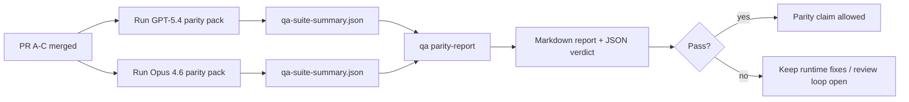

# GPT-5.4 / Codex 对等性维护者说明

本说明解释如何将 GPT-5.4 / Codex 对等性计划作为四个合并单元进行审查，同时不丢失原始的六契约架构。

## 合并单元

### PR A：strict-agentic 执行

负责：

- `executionContract`
- GPT-5 优先的同回合跟进执行
- `update_plan` 作为非终止性进度跟踪
- 显式阻塞状态替代仅规划的静默停止

不负责：

- 认证/运行时失败分类
- 权限真实性
- 重放/续执重设计
- 对等性基准测试

### PR B：运行时真实性

负责：

- Codex OAuth 作用域正确性
- 类型化的提供者/运行时失败分类
- 真实的 `/elevated full` 可用性和阻塞原因

不负责：

- 工具模式规范化
- 重放/存活状态
- 基准门控

### PR C：执行正确性

负责：

- 提供者拥有的 OpenAI/Codex 工具兼容性
- 无参数严格模式处理
- 重放无效状态可视化
- 暂停、阻塞和放弃的长任务状态可见性

不负责：

- 自选续执
- 提供者钩子之外的通用 Codex 方言行为
- 基准门控

### PR D：对等性测试框架

负责：

- 第一波 GPT-5.4 与 Opus 4.6 场景包
- 对等性文档
- 对等性报告和发布门控机制

不负责：

- QA 实验室之外的运行时行为变更
- 测试框架内部的认证/代理/DNS 模拟

## 映射回原始六契约

| 原始契约              | 合并单元 |
| --------------------- | -------- |
| 提供者传输/认证正确性 | PR B     |
| 工具契约/模式兼容性   | PR C     |
| 同回合执行            | PR A     |
| 权限真实性            | PR B     |
| 重放/续执/存活正确性  | PR C     |
| 基准/发布门控         | PR D     |

## 审查顺序

1. PR A
2. PR B
3. PR C
4. PR D

PR D 是验证层。它不应该成为运行时正确性 PR 被延迟的原因。

## 审查要点

### PR A

- GPT-5 运行执行或失败关闭，而不是停在评论上
- `update_plan` 不再单独看起来像进展
- 行为保持 GPT-5 优先和嵌入式 Pi 范围

### PR B

- 认证/代理/运行时失败不再归入通用的"模型失败"处理
- `/elevated full` 只在实际可用时才被描述为可用
- 阻塞原因对模型和面向用户的运行时都可见

### PR C

- 严格的 OpenAI/Codex 工具注册行为可预测
- 无参数工具不会在严格模式检查中失败
- 重放和压缩结果保留真实的存活状态

### PR D

- 场景包可理解且可重现
- 测试包包含变更重放安全性的测试路径，而不仅是只读流程
- 报告可被人类和自动化工具阅读
- 对等性声明有证据支持，而非传闻

PR D 预期产物：

- 每次模型运行的 `qa-suite-report.md` / `qa-suite-summary.json`
- 包含聚合和场景级别比较的 `qa-agentic-parity-report.md`
- 包含机器可读判定的 `qa-agentic-parity-summary.json`

## 发布门控

在以下条件满足之前，不要声称 GPT-5.4 对等或优于 Opus 4.6：

- PR A、PR B 和 PR C 已合并
- PR D 干净地运行了第一波对等性测试包
- 运行时真实性回归测试套件保持绿色
- 对等性报告显示无虚假成功案例且停止行为无回归

对等性测试框架不是唯一的证据来源。在审查中保持这一区分的明确性：

- PR D 负责基于场景的 GPT-5.4 与 Opus 4.6 比较
- PR B 确定性测试套件仍然负责认证/代理/DNS 和完全访问真实性证据

## 目标到证据映射

| 完成门控项                     | 主要负责人  | 审查工件                                                          |
| ------------------------------ | ----------- | ----------------------------------------------------------------- |
| 无仅规划停滞                   | PR A        | strict-agentic 运行时测试和 `approval-turn-tool-followthrough`    |
| 无伪造进展或虚假工具完成       | PR A + PR D | 对等性虚假成功计数及场景级报告详情                                |
| 无错误的 `/elevated full` 指导 | PR B        | 确定性运行时真实性测试套件                                        |
| 重放/存活失败保持显式          | PR C + PR D | 生命周期/重放测试套件及 `compaction-retry-mutating-tool`          |
| GPT-5.4 匹配或超越 Opus 4.6    | PR D        | `qa-agentic-parity-report.md` 和 `qa-agentic-parity-summary.json` |

## 审查者速查：变更前后对比

| 变更前用户可见的问题                         | 变更后的审查信号                                      |
| -------------------------------------------- | ----------------------------------------------------- |
| GPT-5.4 在规划后停止                         | PR A 显示执行或阻塞行为，而非仅评论完成               |
| 使用严格 OpenAI/Codex 模式时工具使用感觉脆弱 | PR C 保持工具注册和无参数调用的可预测性               |
| `/elevated full` 提示有时具有误导性          | PR B 将指导与实际运行时能力和阻塞原因关联             |
| 长任务可能消失在重放/压缩的模糊性中          | PR C 发出显式的暂停、阻塞、放弃和重放无效状态         |
| 对等性声明基于传闻                           | PR D 生成报告和 JSON 判定，两个模型具有相同的场景覆盖 |
