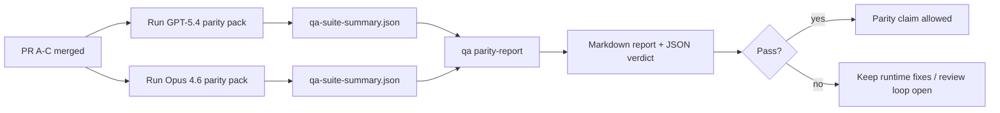

# GPT-5.4 / Codex 对等性维护者说明

本说明介绍了如何将 GPT-5.4 / Codex 对等性计划作为四个合并单元进行审查，同时不丢失原始的六合约架构。

## 合并单元

### PR A：严格代理执行

拥有：

- `executionContract`
- GPT-5 优先的同轮次跟进执行
- `update_plan` 作为非终端进度跟踪
- 显式阻塞状态，而非仅计划的静默停止

不拥有：

- 身份验证/运行时失败分类
- 权限真实性
- 重放/继续机制重新设计
- 对等性基准测试

### PR B：运行时真实性

拥有：

- Codex OAuth 作用域正确性
- 类型化提供商/运行时故障分类
- 真实的 `/elevated full` 可用性及受阻原因

不负责：

- 工具架构规范化
- 重放/存活状态
- 基准筛选

### PR C：执行正确性

负责：

- 提供商拥有的 OpenAI/Codex 工具兼容性
- 无参数严格架构处理
- 重放无效的呈现
- 已暂停、受阻和放弃的长任务状态可见性

不负责：

- 自主延续
- 提供商钩子之外的通用 Codex 方言行为
- 基准筛选

### PR D：对等性测试工具

负责：

- 第一波 GPT-5.4 与 Opus 4.6 场景包
- 对等性文档
- 对等性报告和发布门控机制

不负责：

- QA 实验室之外的运行时行为更改
- 测试工具内的 auth/proxy/DNS 模拟

## 映射回原始的六个合约

| 原始合约                  | 合并单元 |
| ------------------------- | -------- |
| Provider 传输/auth 正确性 | PR B     |
| 工具合约/架构兼容性       | PR C     |
| 同轮执行                  | PR A     |
| 权限真实性                | PR B     |
| 重放/继续/活跃性正确性    | PR C     |
| 基准/发布关卡             | PR D     |

## 审查顺序

1. PR A
2. PR B
3. PR C
4. PR D

PR D 是证明层。它不应成为推迟运行时正确性 PR 的原因。

## 检查要点

### PR A

- GPT-5 执行动作或安全失败，而不是止步于评论
- `update_plan` 本身不再看起来像是进展
- 行为保持 GPT-5 优先且限于嵌入式 Pi

### PR B

- 认证/代理/运行时故障不再合并到通用的“模型失败”处理中
- `/elevated full` 仅在实际可用时被描述为可用
- 阻止原因对模型和面向用户的运行时均可见

### PR C

- 严格的 OpenAI/Codex 工具注册行为可预测
- 无参数工具不会通过严格的架构检查失败
- 重放和压缩结果保留了真实活性状态

### PR D

- 场景包易于理解且可复现
- 该包包含变体重放安全通道，而不仅仅是只读流程
- 报告可供人类和自动化工具阅读
- 对等性声明有证据支持，而非仅凭轶事

PR D 的预期产出：

- 每次模型运行的 `qa-suite-report.md` / `qa-suite-summary.json`
- 包含总体和场景级比较的 `qa-agentic-parity-report.md`
- 带有机器可读结论的 `qa-agentic-parity-summary.json`

## 发布门控

在满足以下条件之前，不得声称 GPT-5.4 与 Opus 4.6 持平或优于 Opus 4.6：

- PR A、PR B 和 PR C 已合并
- PR D 干净地运行了首批对等性测试包
- 运行时真实性回归测试套件保持绿色（通过）
- 对等性报告显示无虚假成功案例，且停止行为无回归

Parity 框架并非唯一的证据来源。在审查中请明确区分这一点：

- PR D 负责基于场景的 GPT-5.4 与 Opus 4.6 的比较
- PR B 的确定性套件仍负责认证/代理/DNS 和完全访问的真实性证据

## 目标与证据映射

| 完成关卡项目                   | 主要责任人  | 审查工件                                                          |
| ------------------------------ | ----------- | ----------------------------------------------------------------- |
| 无仅限计划的停滞               | PR A        | 严格代理运行时测试和 `approval-turn-tool-followthrough`           |
| 无虚假进度或虚假工具完成       | PR A + PR D | parity 虚假成功计数加上场景级别的报告详细信息                     |
| 无错误的 `/elevated full` 指导 | PR B        | 确定性运行时真实性套件                                            |
| 重放/存活故障仍保持明确        | PR C + PR D | 生命周期/重放套件加上 `compaction-retry-mutating-tool`            |
| GPT-5.4 匹配或优于 Opus 4.6    | PR D        | `qa-agentic-parity-report.md` 和 `qa-agentic-parity-summary.json` |

## 审查者速记：变更前 vs 变更后

| 之前用户可见的问题                             | 之后的审查信号                                                  |
| ---------------------------------------------- | --------------------------------------------------------------- |
| GPT-5.4 在规划后停止                           | PR A 显示执行或阻止行为，而不是仅评论的补全                     |
| 工具使用在严格的 OpenAI/Codex 模式下感觉很脆弱 | PR C 保持工具注册和无参数调用的可预测性                         |
| `/elevated full` 提示有时具有误导性            | PR B 将指导与实际运行时能力和阻止原因联系起来                   |
| 长任务可能会消失在重放/压缩的歧义中            | PR C 发出明确的暂停、阻止、放弃和重试无效状态                   |
| 对等声明是轶事的                               | PR D 生成报告以及 JSON 判决，在两个模型上具有相同的场景覆盖范围 |
