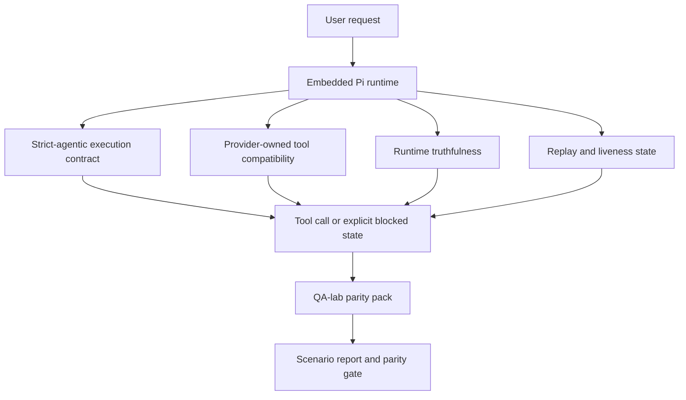
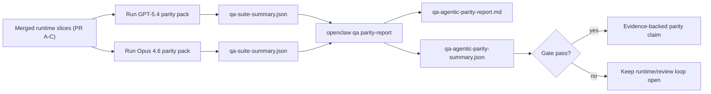

# GPT-5.4 / Codex Agentic Parity in OpenClaw

OpenClaw already worked well with 工具-using frontier models, but GPT-5.4 and Codex-style models were still underperforming in a few practical ways:

- they could stop after planning instead of doing the work
- they could use strict OpenAI/Codex 工具 schemas incorrectly
- they could ask for `/elevated full` even when full access was impossible
- they could lose long-running task state during replay or compaction
- parity claims against Claude Opus 4.6 were based on anecdotes instead of repeatable scenarios

This parity program fixes those gaps in four reviewable slices.

## What changed

### PR A: strict-agentic execution

此版本为嵌入式 Pi GPT-5 运行增加了一个可选择的 `strict-agentic` 执行合约。

启用后，OpenClaw 将不再接受仅计划的轮次作为“足够好”的完成。如果模型仅说明其打算做什么，而未实际使用工具或取得进展，OpenClaw 将重试并提示立即行动，然后以明确的阻塞状态失败关闭，而不是静默结束任务。

这最能改善 GPT-5.4 在以下方面的体验：

- 简短的“好的，去做”后续
- 第一步显而易见的代码任务
- `update_plan` 应用于进度跟踪而非填充文本的流程

### PR B：运行时真实性

此版本使 OpenClaw 在以下两方面据实以告：

- 提供商/运行时调用失败的原因
- `/elevated full` 是否实际可用

这意味着 GPT-5.4 可以针对缺失范围、身份验证刷新失败、HTML 403 身份验证失败、代理问题、DNS 或超时失败以及受阻的完全访问模式获得更好的运行时信号。模型产生错误的补救措施幻觉或持续要求运行时无法提供的权限模式的可能性降低。

### PR C：执行正确性

这一部分改进了两种正确性：

- 提供商拥有的 OpenAI/Codex 工具架构兼容性
- 重放和长任务存活状态呈现

工具兼容性工作减少了严格的 OpenAI/Codex 工具注册时的架构摩擦，特别是在无参数工具和严格的对象根预期方面。重放/存活状态工作使得长时间运行的任务更具可观察性，因此暂停、受阻和被遗弃的状态是可见的，而不会消失在通用的失败文本中。

### PR D：对等机制

此版本添加了第一波 QA 实验室对等包，以便可以通过相同的场景测试 GPT-5.4 和 Opus 4.6，并使用共享证据进行比较。

对等包是验证层。它本身不会改变运行时行为。

在拥有两个 `qa-suite-summary.json` 构件后，使用以下命令生成发布门禁比较：

```bash
pnpm openclaw qa parity-report \
  --repo-root . \
  --candidate-summary .artifacts/qa-e2e/gpt54/qa-suite-summary.json \
  --baseline-summary .artifacts/qa-e2e/opus46/qa-suite-summary.json \
  --output-dir .artifacts/qa-e2e/parity
```

该命令写入：

- 一份人类可读的 Markdown 报告
- 一份机器可读的 JSON 判定
- 一个明确的 `pass` / `fail` 门禁结果

## 为何这在实践中改进了 GPT-5.4

在此工作之前，OpenClaw 上的 GPT-5.4 在实际编码会话中可能感觉不如 Opus 那样具有智能体特性，因为运行时容忍了对 GPT-5 系列模型尤其有害的行为：

- 仅包含评论的轮次
- 围绕工具的 schema 摩擦
- 模糊的权限反馈
- 静默重放或压缩中断

目标不是让 GPT-5.4 模仿 Opus。目标是赋予 GPT-5.4 一个运行时合约，该合约奖励实质进展，提供更清晰的工具和权限语义，并将故障模式转换为显式的机器和人类可读状态。

这将用户体验从：

- “模型有一个不错的计划但停止了”

变为：

- “模型要么采取了行动，要么 OpenClaw 明确指出了它无法行动的确切原因”

## GPT-5.4 用户的前后对比

| 在此计划之前                                                             | 在 PR A-D 之后                                                     |
| ------------------------------------------------------------------------ | ------------------------------------------------------------------ |
| GPT-5.4 可能在制定合理的计划后停止，而不执行下一步工具操作               | PR A 将“仅计划”转变为“立即行动或展示受阻状态”                      |
| 严格的工具架构可能会以令人困惑的方式拒绝无参数或 OpenAI/Codex 形式的工具 | PR C 使提供商拥有的工具注册和调用更具可预测性                      |
| `/elevated full` 指导可能在受阻的运行时中含糊不清或错误                  | PR B 为 GPT-5.4 和用户提供了真实的运行时和权限提示                 |
| 重放或压缩失败可能会让人感觉任务默默地消失了                             | PR C 显式地呈现了已暂停、已阻塞、已放弃和重放无效的结果            |
| “GPT-5.4 感觉比 Opus 差”大多只是传闻                                     | PR D 将其转化为相同的场景包、相同的指标以及一个硬性的通过/失败关卡 |

## 架构



## 发布流程



## 场景包

第一波对等包目前涵盖了五个场景：

### `approval-turn-tool-followthrough`

检查模型在短暂批准后不会停在“我会这样做”。它应该在同一轮中采取第一个具体行动。

### `model-switch-tool-continuity`

检查使用工具的工作在模型/运行时切换边界之间保持连贯，而不是重置为注释或丢失执行上下文。

### `source-docs-discovery-report`

检查模型是否能读取源代码和文档，综合发现，并以代理方式继续执行任务，而不是生成简短的摘要并提前停止。

### `image-understanding-attachment`

检查涉及附件的混合模式任务是否保持可执行，且不会退化为模糊的叙述。

### `compaction-retry-mutating-tool`

检查具有实际变更写入的任务是否保持重放不安全性显式，而不是在运行压缩、重试或在压力下丢失回复状态时静默地看起来重放安全。

## 场景矩阵

| 场景                               | 测试内容                    | 良好的 GPT-5.4 行为                                    | 失败信号                                                 |
| ---------------------------------- | --------------------------- | ------------------------------------------------------ | -------------------------------------------------------- |
| `approval-turn-tool-followthrough` | 计划后的简短批准回合        | 立即开始第一个具体的工具操作，而不是重申意图           | 仅有计划的后续跟进、无工具活动，或没有实际阻碍的阻塞回合 |
| `model-switch-tool-continuity`     | 工具使用下的运行时/模型切换 | 保留任务上下文并继续连贯执行                           | 重置为评论，丢失工具上下文，或在切换后停止               |
| `source-docs-discovery-report`     | 来源阅读 + 综合 + 执行      | 查找来源，使用工具，并在无停顿的情况下生成有用的报告   | 摘要单薄，缺失工具工作，或在不完整回合停止               |
| `image-understanding-attachment`   | 附件驱动的代理工作          | 解释附件，将其连接到工具，并继续任务                   | 叙述模糊，忽略附件，或没有具体的下一步操作               |
| `compaction-retry-mutating-tool`   | 压缩压力下的变更工作        | 执行真实写入，并在副作用之后保持重放不安全性的显式状态 | 发生变更写入，但重放安全性被隐含、缺失或矛盾             |

## 发布关卡

只有当合并后的运行时同时通过 parity pack 和 runtime-truthfulness 回归测试时，GPT-5.4 才能被视为达到同等水平或更好。

必需的结果：

- 当下一个工具操作明确时，不会出现仅停滞在计划阶段的情况
- 没有实际执行就不会有虚假的完成
- 没有不正确的 `/elevated full` 指导
- 没有静默重放或压缩中断
- parity pack 指标至少与商定的 Opus 4.6 基线一样强

对于首批 harness，关卡会比较：

- 完成率
- 意外停止率
- 有效工具调用率
- 虚假成功计数

同等性证据被有意分为两层：

- PR D 通过 QA-lab 证明了相同场景下 GPT-5.4 与 Opus 4.6 的行为对比
- PR B 确定性套件证明了 harness 之外的 auth、proxy、DNS 和 `/elevated full` 的真实性

## 目标-证据矩阵

| 完成关卡项目                                 | 所属 PR     | 证据来源                                                          | 通过信号                                                         |
| -------------------------------------------- | ----------- | ----------------------------------------------------------------- | ---------------------------------------------------------------- |
| GPT-5.4 在规划后不再停滞                     | PR A        | `approval-turn-tool-followthrough` 加上 PR A 运行时套件           | 批准轮次会触发实际工作或显式阻塞状态                             |
| GPT-5.4 不再伪造进度或伪造工具完成           | PR A + PR D | 对等报告场景结果和伪成功计数                                      | 没有可疑的通过结果，没有仅评论的完成                             |
| GPT-5.4 不再提供错误的 `/elevated full` 指导 | PR B        | 确定性真实性套件                                                  | 阻塞原因和完全访问提示保持运行时准确                             |
| 重放/活性故障保持显式                        | PR C + PR D | PR C 生命周期/重放套件加上 `compaction-retry-mutating-tool`       | 变更工作保持重放不安全显式，而不是静默消失                       |
| GPT-5.4 在商定指标上匹配或超越 Opus 4.6      | PR D        | `qa-agentic-parity-report.md` 和 `qa-agentic-parity-summary.json` | 相同的场景覆盖范围，且在补全、停止行为或有效工具使用方面没有回归 |

## 如何读取对等性结论

将 `qa-agentic-parity-summary.json` 中的结论作为第一波对等性包的最终机器可读决策。

- `pass` 意味着 GPT-5.4 覆盖了与 Opus 4.6 相同的场景，并且在商定的聚合指标上没有回归。
- `fail` 意味着至少触发了一个硬性关卡：补全能力较弱、意外停止情况更糟、有效工具使用较弱、任何虚假成功案例，或场景覆盖范围不匹配。
- “shared/base CI issue” 本身并不是对等性结果。如果 PR D 之外的 CI 噪音阻碍了运行，结论应等待一次干净的合并运行时执行，而不是从分支时代的日志中推断。
- Auth、proxy、DNS 和 `/elevated full` 真实性仍然来自 PR B 的确定性测试套件，因此最终发布的声明需要同时满足：通过 PR D 的对等验证以及 PR B 的绿色真实性覆盖。

## 谁应该启用 `strict-agentic`

在以下情况下使用 `strict-agentic`：

- 当下一步很明显时，预期代理会立即采取行动
- GPT-5.4 或 Codex 系列模型是主要的运行时模型
- 您更喜欢显式的阻塞状态，而不是“有帮助的”仅总结回复

在以下情况下保留默认契约：

- 您想要现有的较宽松的行为
- 您没有使用 GPT-5 系列模型
- 您正在测试提示词而不是运行时强制执行
