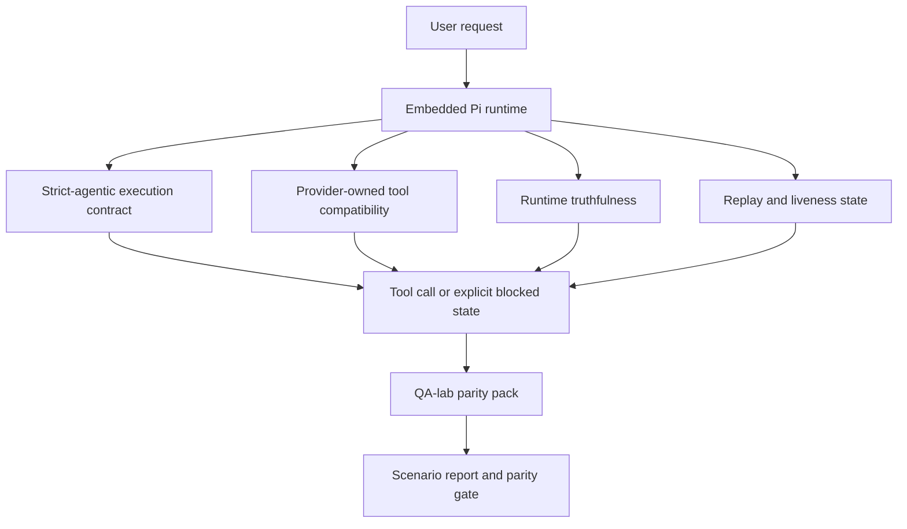
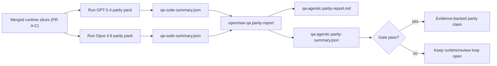

# OpenClaw 中的 GPT-5.4 / Codex Agentic 对等性

OpenClaw 在与使用工具的前沿模型配合方面已经表现良好，但 GPT-5.4 和 Codex 风格的模型在实际应用中仍有几种表现不佳的情况：

- 它们可能会在规划后停止，而不是开展工作
- 它们可能会错误地使用严格的 OpenAI/Codex 工具架构
- 即使在完全访问是不可能的情况下，它们也可能请求 `/elevated full`
- 它们可能在重放或压缩期间丢失长时间运行的任务状态
- 针对 Claude Opus 4.6 的对等性声明是基于轶事，而非可重复的情景

该对等性计划在四个可审查的部分中修复了这些差距。

## 变更内容

### PR A：严格的智能体执行

此部分为嵌入式 Pi GPT-5 运行添加了一个可选的 `strict-agentic` 执行合约。

启用后，OpenClaw 将停止接受仅计划的回合作为“足够好”的完成。如果模型仅说明其打算做什么，而未实际使用工具或取得进展，OpenClaw 将使用立即行动的引导进行重试，然后以明确的受阻状态失败关闭，而不是静默结束任务。

这最显著改善了以下方面的 GPT-5.4 体验：

- 简短的“好的，去做”后续操作
- 第一步显而易见的代码任务
- `update_plan` 应用于进度跟踪而非填充文本的流程

### PR B：运行时真实性

此部分使 OpenClaw 在以下两方面如实告知：

- 提供商/运行时调用失败的原因
- `/elevated full` 是否实际可用

这意味着 GPT-5.4 针对缺失范围、身份验证刷新失败、HTML 403 身份验证失败、代理问题、DNS 或超时失败以及受阻的完全访问模式，能获得更好的运行时信号。该模型不太可能产生错误的补救方案幻觉，或持续请求运行时无法提供的权限模式。

### PR C：执行正确性

此部分改善了两种正确性：

- 提供商拥有的 OpenAI/Codex 工具架构兼容性
- 重放和长任务活跃性呈现

工具兼容性工作减少了严格的 OpenAI/Codex 工具注册的架构摩擦，特别是在无参数工具和严格的对象根预期方面。重放/活跃性工作使长时间运行的任务更具可观察性，因此暂停、受阻和放弃状态可见，而不会消失在通用的失败文本中。

### PR D：一致性测试套件

此部分增加了第一波 QA 实验室一致性测试包，以便可以通过相同的场景对 GPT-5.4 和 Opus 4.6 进行测试，并使用共享的证据进行比较。

一致性测试包是验证层。它本身不会改变运行时行为。

拥有两个 `qa-suite-summary.json` 构件后，使用以下命令生成发布门禁比较：

```bash
pnpm openclaw qa parity-report \
  --repo-root . \
  --candidate-summary .artifacts/qa-e2e/gpt54/qa-suite-summary.json \
  --baseline-summary .artifacts/qa-e2e/opus46/qa-suite-summary.json \
  --output-dir .artifacts/qa-e2e/parity
```

该命令会写入：

- 一份人类可读的 Markdown 报告
- 一份机器可读的 JSON 判定结果
- 一个明确的 `pass` / `fail` 门禁结果

## 为何这能实际改善 GPT-5.4

在此工作之前，OpenClaw 上的 GPT-5.4 在实际编码会话中可能感觉不如 Opus 智能（agentic），因为运行时容忍了对 GPT-5 系列模型特别有害的行为：

- 仅包含评论的回合
- 工具周围的架构摩擦
- 模糊的权限反馈
- 静默重放或压缩中断

目标不是让 GPT-5.4 模仿 Opus。目标是赋予 GPT-5.4 一个运行时契约，该契约奖励实际进展，提供更清晰的工具和权限语义，并将故障模式转换为明确的机器和人类可读状态。

这将用户体验从：

- “模型有一个很好的计划但停止了”

变为：

- “模型要么采取了行动，要么 OpenClaw 呈现了它无法做到的确切原因”

## GPT-5.4 用户的体验对比

| 在此计划之前                                                             | 在 PR A-D 之后                                                 |
| ------------------------------------------------------------------------ | -------------------------------------------------------------- |
| GPT-5.4 可能会在制定合理的计划后停止，而不采取下一步工具行动             | PR A 将“仅计划”转变为“立即行动或呈现阻塞状态”                  |
| 严格的工具架构可能会以令人困惑的方式拒绝无参数或 OpenAI/Codex 形状的工具 | PR C 使提供商拥有的工具注册和调用更具可预测性                  |
| `/elevated full` 指导在阻塞的运行时中可能模糊或错误                      | PR B 为 GPT-5.4 和用户提供真实的运行时和权限提示               |
| 重放或压缩失败可能让人觉得任务无声无息地消失了                           | PR C 明确呈现暂停、阻塞、放弃和重放无效的结果                  |
| “GPT-5.4 感觉比 Opus 差”主要是传闻                                       | PR D 将其转变为相同的场景包、相同的指标以及硬性的通过/失败门禁 |

## 架构



## 发布流程



## 场景包

第一波一致性测试包目前涵盖五个场景：

### `approval-turn-tool-followthrough`

检查模型在短暂确认后不会停在“我会做那件事”。它应在同一轮中采取第一个具体行动。

### `model-switch-tool-continuity`

检查使用工具的工作在模型/运行时切换边界内保持连贯，而不是重置为评论或丢失执行上下文。

### `source-docs-discovery-report`

检查模型能否阅读源代码和文档、综合发现，并以主动方式继续任务，而不是生成简短摘要并提前停止。

### `image-understanding-attachment`

检查涉及附件的混合模式任务保持可执行，不会退化为模糊的叙述。

### `compaction-retry-mutating-tool`

检查具有实际变更写入的任务是否保持重放不安全性的显式声明，而不是在运行压缩、重试或在压力下丢失回复状态时静默看起来重放安全。

## 场景矩阵

| 场景                               | 测试内容                    | 良好的 GPT-5.4 行为                                    | 失败信号                                                       |
| ---------------------------------- | --------------------------- | ------------------------------------------------------ | -------------------------------------------------------------- |
| `approval-turn-tool-followthrough` | 计划后的简短确认轮次        | 立即开始第一个具体的工具操作，而不是重申意图           | 仅有计划的后续、无工具活动，或在无实际阻碍的情况下被阻止的轮次 |
| `model-switch-tool-continuity`     | 使用工具时的运行时/模型切换 | 保留任务上下文并继续连贯地行动                         | 重置为评论、丢失工具上下文，或在切换后停止                     |
| `source-docs-discovery-report`     | 源代码阅读 + 综合 + 行动    | 查找源代码、使用工具并生成有用的报告而不停滞           | 简短摘要、缺少工具工作或轮次不完整时停止                       |
| `image-understanding-attachment`   | 由附件驱动的主动工作        | 解释附件、将其与工具连接并继续任务                     | 模糊叙述、忽略附件或无具体下一步行动                           |
| `compaction-retry-mutating-tool`   | 压缩压力下的变更工作        | 执行实际写入并在副作用发生后保持重放不安全性的显式声明 | 发生了变更写入，但重放安全性被隐含、缺失或矛盾                 |

## 发布关卡

只有当合并后的运行时同时通过对等包和运行时真实性回归测试时，GPT-5.4 才能被视为达到对等或更好水平。

必需结果：

- 当下一个工具操作明确时，没有仅有计划的停滞
- 没有真实执行就没有虚假完成
- 没有不正确的 `/elevated full` 指导
- 没有静默重放或压缩放弃
- 对等包指标至少与商定的 Opus 4.6 基线一样强

对于第一波测试工具，该关卡比较：

- 完成率
- 意外停止率
- 有效工具调用率
- 虚假成功计数

对等证据有意分为两层：

- PR D 通过 QA 实验室证明相同场景下 GPT-5.4 与 Opus 4.6 的行为
- PR B 确定性套件在工具外证明 auth、proxy、DNS 和 `/elevated full` 的真实性

## 目标到证据矩阵

| 完成关卡项目                                 | 拥有 PR     | 证据来源                                                          | 通过信号                                                   |
| -------------------------------------------- | ----------- | ----------------------------------------------------------------- | ---------------------------------------------------------- |
| GPT-5.4 不再在规划后停滞                     | PR A        | `approval-turn-tool-followthrough` 加上 PR A 运行时套件           | 批准轮次触发实际工作或显式阻止状态                         |
| GPT-5.4 不再伪造进度或虚假工具完成           | PR A + PR D | 对等报告场景结果和虚假成功计数                                    | 没有可疑的通过结果，也没有仅包含评论的完成                 |
| GPT-5.4 不再提供错误的 `/elevated full` 指导 | PR B        | 确定性真实性套件                                                  | 阻止原因和完全访问提示在运行时保持准确                     |
| 重放/活跃性故障保持显式                      | PR C + PR D | PR C 生命周期/重放套件加上 `compaction-retry-mutating-tool`       | 变异工作保持重放不安全显式，而不是静默消失                 |
| GPT-5.4 在商定指标上匹配或优于 Opus 4.6      | PR D        | `qa-agentic-parity-report.md` 和 `qa-agentic-parity-summary.json` | 相同的场景覆盖，且在完成、停止行为或有效工具使用上没有回归 |

## 如何阅读对等裁决

使用 `qa-agentic-parity-summary.json` 中的裁决作为第一波对等包的最终机器可读决策。

- `pass` 表示 GPT-5.4 覆盖了与 Opus 4.6 相同的场景，并且在商定的汇总指标上没有回归。
- `fail` 表示至少触发了一个硬关卡：完成度较弱、意外停止更严重、有效工具使用较弱、任何虚假成功案例或场景覆盖不匹配。
- “shared/base CI issue” 本身不是一个对等性结果。如果 PR D 之外的 CI 噪音阻塞了一次运行，结论应该等待一次干净的合并后运行时执行，而不是从分支时代的日志推断。
- Auth、proxy、DNS 和 `/elevated full` 的真实性仍然来自 PR B 的确定性套件，因此最终的版本声明需要两者兼备：通过的 PR D 对等性结论和绿色的 PR B 真实性覆盖。

## 谁应该启用 `strict-agentic`

在以下情况下使用 `strict-agentic`：

- 当下一步操作显而易见时，预期代理立即采取行动
- GPT-5.4 或 Codex 系列模型是主要运行时
- 你更喜欢明确的阻塞状态，而不是“有益的”仅作回顾的回复

在以下情况下保持默认约定：

- 你想要现有的较宽松的行为
- 你没有使用 GPT-5 系列模型
- 你正在测试提示词，而不是运行时强制执行
