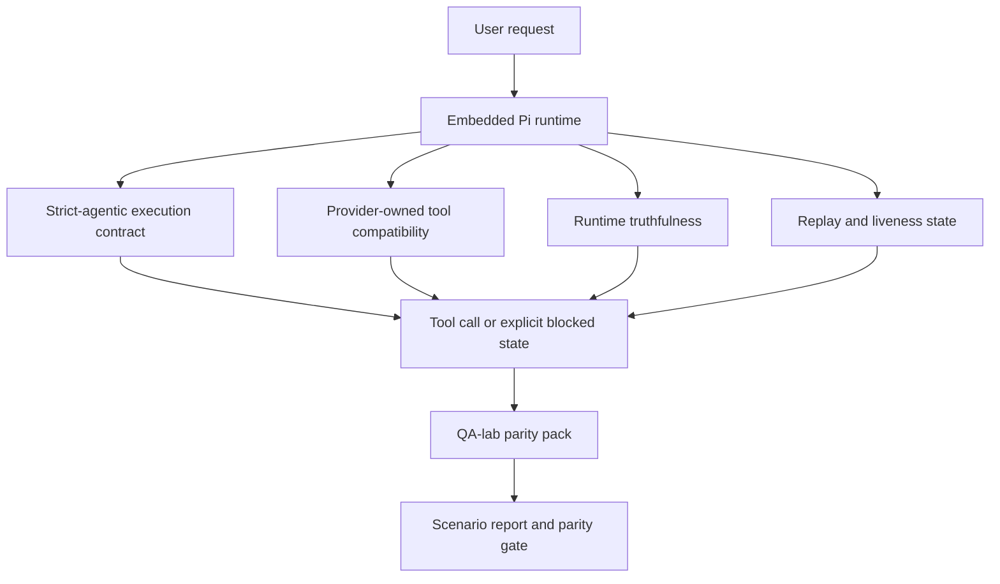
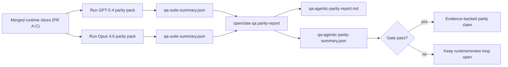

# OpenClaw 中的 GPT-5.4 / Codex 智能体对等性

OpenClaw 已经能够很好地配合使用工具的前沿模型工作，但 GPT-5.4 和 Codex 风格的模型在一些实际场景中仍然存在不足：

- 它们可能在完成规划后停止，而不实际执行工作
- 它们可能错误地使用严格的 OpenAI/Codex 工具模式
- 它们可能在没有完全访问权限时仍然请求 `/elevated full`
- 它们可能在重放或压缩期间丢失长时间运行的任务状态
- 针对 Claude Opus 4.6 的对等性声明基于传闻，而非可重复的场景

本对等性计划通过四个可审查的切片修复了这些差距。

## 变更内容

### PR A：strict-agentic 执行

本切片为嵌入式 Pi GPT-5 运行添加了可选的 `strict-agentic` 执行契约。

启用后，OpenClaw 不再将仅规划回合视为"足够好"的完成。如果模型只是说明了意图而没有实际使用工具或取得进展，OpenClaw 会以立即行动的指引进行重试，然后以显式的阻塞状态失败关闭，而不是静默结束任务。

这在以下场景中对 GPT-5.4 体验改善最大：

- 简短的"好的，执行吧"后续指令
- 第一步显而易见的代码任务
- `update_plan` 应该用于进度跟踪而非填充文本的流程

### PR B：运行时真实性

本切片使 OpenClaw 在以下两个方面说实话：

- 提供者/运行时调用失败的原因
- `/elevated full` 是否实际可用

这意味着 GPT-5.4 能获得更好的运行时信号，包括缺失的作用域、认证刷新失败、HTML 403 认证失败、代理问题、DNS 或超时失败，以及被阻止的完全访问模式。模型不太可能幻觉出错误的修复方案或持续请求运行时无法提供的权限模式。

### PR C：执行正确性

本切片改进了两种正确性：

- 提供者拥有的 OpenAI/Codex 工具模式兼容性
- 重放和长任务存活状态的可视化

工具兼容性工作减少了严格 OpenAI/Codex 工具注册的模式摩擦，特别是在无参数工具和严格对象根期望方面。重放/存活工作使长时间运行的任务更具可观察性，因此暂停、阻塞和放弃的状态是可见的，而不是消失在通用失败文本中。

### PR D：对等性测试框架

本切片添加了第一波 QA 实验室对等性测试包，使 GPT-5.4 和 Opus 4.6 能通过相同场景进行测试，并使用共享证据进行比较。

对等性测试包是验证层。它本身不会改变运行时行为。

获得两个 `qa-suite-summary.json` 工件后，使用以下命令生成发布门控比较：

```bash
pnpm openclaw qa parity-report \
  --repo-root . \
  --candidate-summary .artifacts/qa-e2e/gpt54/qa-suite-summary.json \
  --baseline-summary .artifacts/qa-e2e/opus46/qa-suite-summary.json \
  --output-dir .artifacts/qa-e2e/parity
```

该命令会生成：

- 一份人类可读的 Markdown 报告
- 一份机器可读的 JSON 判定
- 一个明确的 `pass` / `fail` 门控结果

## 为什么这在实践中改善了 GPT-5.4

在此工作之前，GPT-5.4 在 OpenClaw 上的实际编码会话中可能感觉不如 Opus 具有智能体性，因为运行时容忍了对 GPT-5 风格模型特别有害的行为：

- 仅评论回合
- 工具的模式摩擦
- 模糊的权限反馈
- 静默的重放或压缩中断

目标不是让 GPT-5.4 模仿 Opus。目标是给 GPT-5.4 一个奖励真实进展的运行时契约，提供更清晰的工具和权限语义，并将失败模式转化为明确的机器和人类可读状态。

这将用户体验从：

- "模型有一个好计划但停止了"

变为：

- "模型要么执行了，要么 OpenClaw 显示了它无法执行的确切原因"

## GPT-5.4 用户的变更前后对比

| 本计划之前                                                           | PR A-D 之后                                                    |
| -------------------------------------------------------------------- | -------------------------------------------------------------- |
| GPT-5.4 可能在合理规划后停止，而不执行下一个工具步骤                 | PR A 将"仅规划"转变为"立即行动或显示阻塞状态"                  |
| 严格工具模式可能以令人困惑的方式拒绝无参数或 OpenAI/Codex 形式的工具 | PR C 使提供者拥有的工具注册和调用更具可预测性                  |
| `/elevated full` 指导在被阻止的运行时中可能模糊或错误                | PR B 为 GPT-5.4 和用户提供真实的运行时和权限提示               |
| 重放或压缩失败可能感觉像任务静默消失了                               | PR C 显式显示暂停、阻塞、放弃和重放无效的结果                  |
| "GPT-5.4 感觉不如 Opus" 主要基于传闻                                 | PR D 将其转化为相同的场景包、相同的指标和严格的 pass/fail 门控 |

## 架构



## 发布流程



## 场景包

第一波对等性测试包目前涵盖五个场景：

### `approval-turn-tool-followthrough`

检查模型在简短批准后不会停留在"我会做的"。它应该在同一个回合中执行第一个具体操作。

### `model-switch-tool-continuity`

检查使用工具的工作在模型/运行时切换边界之间保持连贯，而不是重置为评论或丢失执行上下文。

### `source-docs-discovery-report`

检查模型能够阅读源代码和文档、综合发现，并以智能体方式继续任务，而不是生成浅显摘要后提前停止。

### `image-understanding-attachment`

检查涉及附件的混合模式任务保持可操作性，不会退化为模糊叙述。

### `compaction-retry-mutating-tool`

检查具有实际变更写入的任务保持重放不安全性的显式状态，而不是在运行压缩、重试或在压力下丢失回复状态时静默地看起来重放安全。

## 场景矩阵

| 场景                               | 测试内容                    | 良好的 GPT-5.4 行为                                | 失败信号                                           |
| ---------------------------------- | --------------------------- | -------------------------------------------------- | -------------------------------------------------- |
| `approval-turn-tool-followthrough` | 规划后的简短批准回合        | 立即开始第一个具体工具操作，而不是重述意图         | 仅规划后续、无工具活动，或没有真正阻塞器的阻塞回合 |
| `model-switch-tool-continuity`     | 工具使用下的运行时/模型切换 | 保留任务上下文并连贯地继续执行                     | 重置为评论、丢失工具上下文，或切换后停止           |
| `source-docs-discovery-report`     | 源代码阅读 + 综合 + 行动    | 查找源代码、使用工具，并生成有用的报告而不停滞     | 浅显摘要、缺少工具工作，或不完整回合停止           |
| `image-understanding-attachment`   | 附件驱动的智能体工作        | 解释附件，将其与工具关联，并继续任务               | 模糊叙述、附件被忽略，或无具体下一步操作           |
| `compaction-retry-mutating-tool`   | 压缩压力下的变更工作        | 执行实际写入并在副作用后保持重放不安全性的显式状态 | 变更写入发生但重放安全性被隐含、缺失或矛盾         |

## 发布门控

GPT-5.4 只有在合并后的运行时同时通过对等性测试包和运行时真实性回归测试时，才能被认为达到对等或更好。

必需结果：

- 当下一个工具操作明确时，不出现仅规划停滞
- 不出现没有实际执行的虚假完成
- 不出现错误的 `/elevated full` 指导
- 不出现静默的重放或压缩放弃
- 对等性测试包指标至少与约定的 Opus 4.6 基线一样强

对于第一波测试框架，门控比较：

- 完成率
- 非预期停止率
- 有效工具调用率
- 虚假成功计数

对等性证据有意分为两层：

- PR D 通过 QA 实验室证明相同场景下 GPT-5.4 与 Opus 4.6 的行为
- PR B 确定性测试套件证明框架之外的认证、代理、DNS 和 `/elevated full` 真实性

## 目标到证据矩阵

| 完成门控项                                   | 归属 PR     | 证据来源                                                          | 通过信号                                               |
| -------------------------------------------- | ----------- | ----------------------------------------------------------------- | ------------------------------------------------------ |
| GPT-5.4 不再在规划后停滞                     | PR A        | `approval-turn-tool-followthrough` 及 PR A 运行时测试套件         | 批准回合触发实际工作或显式阻塞状态                     |
| GPT-5.4 不再伪造进展或虚假工具完成           | PR A + PR D | 对等性报告场景结果和虚假成功计数                                  | 无可疑通过结果且无仅评论完成                           |
| GPT-5.4 不再给出错误的 `/elevated full` 指导 | PR B        | 确定性真实性测试套件                                              | 阻塞原因和完全访问提示保持运行时准确                   |
| 重放/存活失败保持显式                        | PR C + PR D | PR C 生命周期/重放测试套件及 `compaction-retry-mutating-tool`     | 变更工作保持重放不安全性的显式状态，而不是静默消失     |
| GPT-5.4 在约定指标上匹配或超越 Opus 4.6      | PR D        | `qa-agentic-parity-report.md` 和 `qa-agentic-parity-summary.json` | 相同场景覆盖且在完成率、停止行为或有效工具使用上无回归 |

## 如何阅读对等性判定

使用 `qa-agentic-parity-summary.json` 中的判定作为第一波对等性测试包的最终机器可读决策。

- `pass` 意味着 GPT-5.4 覆盖了与 Opus 4.6 相同的场景，且在约定的聚合指标上没有回归。
- `fail` 意味着至少一个硬门控被触发：更弱的完成率、更差的非预期停止、更弱的有效工具使用、任何虚假成功案例，或场景覆盖不匹配。
- "共享/基础 CI 问题"本身不是对等性结果。如果 PR D 之外的 CI 噪声阻塞了运行，判定应等待干净的合并运行时执行，而不是从分支时代的日志中推断。
- 认证、代理、DNS 和 `/elevated full` 真实性仍然来自 PR B 的确定性测试套件，因此最终发布声明需要两者兼备：通过的 PR D 对等性判定和绿色的 PR B 真实性覆盖。

## 谁应该启用 `strict-agentic`

在以下情况下启用 `strict-agentic`：

- 期望智能体在下一步明显时立即行动
- GPT-5.4 或 Codex 系列模型是主要运行时
- 您更倾向于显式阻塞状态而非"有用的"仅回顾回复

在以下情况下保持默认契约：

- 您想要现有的更宽松行为
- 您未使用 GPT-5 系列模型
- 您正在测试提示而非运行时强制执行
