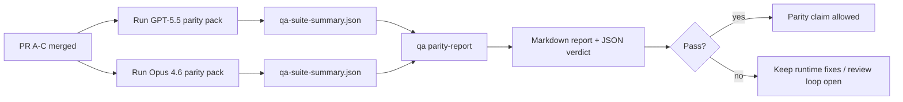

本文档说明了如何将 GPT-5.5 / Codex 对等程序作为四个合并单元进行审查，同时不失原始的六合约架构。

## 合并单元

### PR A：严格代理执行

拥有：

- `executionContract`
- GPT-5 优先的同轮跟进
- 作为非终端进度跟踪的 `update_plan`
- 显式的阻塞状态，而非仅计划的静默停止

不拥有：

- 身份验证/运行时故障分类
- 权限真实性
- 重放/继续重设计
- 对等基准测试

### PR B：运行时真实性

拥有：

- Codex OAuth 范围正确性
- 类型化的提供商/运行时故障分类
- 真实的 `/elevated full` 可用性和阻塞原因

不拥有：

- 工具架构规范化
- 重放/存活状态
- 基准门控

### PR C：执行正确性

拥有：

- 提供商拥有的 OpenAI/Codex 工具兼容性
- 无参数的严格架构处理
- 重放无效的呈现
- 已暂停、已阻塞和已放弃的长任务状态可见性

不拥有：

- 自主的继续
- 提供商挂钩之外的通用 Codex 方言行为
- 基准门控

### PR D：对等测试工具

拥有：

- 第一波 GPT-5.5 与 Opus 4.6 的场景包
- 对等文档
- 对等报告和发布门控机制

不拥有：

- QA 实验室之外的运行时行为更改
- 测试工具内部的身份验证/代理/DNS 模拟

## 映射回原始的六个合约

| 原始合约                  | 合并单元 |
| ------------------------- | -------- |
| 提供商传输/身份验证正确性 | PR B     |
| 工具合约/架构兼容性       | PR C     |
| 同轮执行                  | PR A     |
| 权限真实性                | PR B     |
| 重放/继续/存活正确性      | PR C     |
| 基准/发布门控             | PR D     |

## 审查顺序

1. PR A
2. PR B
3. PR C
4. PR D

PR D 是验证层。它不应成为延迟运行时正确性 PR 的原因。

## 注意事项

### PR A

- GPT-5 运行执行操作或以失败关闭，而不是停留在评论上
- `update_plan` 本身不再看起来像进度
- 行为保持 GPT-5 优先和嵌入式 Pi 范围

### PR B

- auth/proxy/runtime 故障不再归并为通用的“模型失败”处理
- `/elevated full` 仅在实际可用时才被描述为可用
- 模型和面向用户的运行时均能看见阻止原因

### PR C

- 严格的 OpenAI/Codex 工具注册行为可预测
- 无参数工具不会因严格模式检查而失败
- 重放和压缩结果保留真实的活跃状态

### PR D

- 场景包易于理解且可重现
- 该包包含可变重放安全通道，而不仅仅是只读流
- 报告可供人类和自动化程序阅读
- 对等性声明有证据支持，而非仅凭传闻

PR D 的预期产出：

- 每次模型运行的 `qa-suite-report.md` / `qa-suite-summary.json`
- 包含汇总和场景级比较的 `qa-agentic-parity-report.md`
- 带有机器可读结论的 `qa-agentic-parity-summary.json`

## 发布关卡

在满足以下条件之前，不得声称 GPT-5.5 与 Opus 4.6 持平或更优：

- PR A、PR B 和 PR C 已合并
- PR D 干净地运行了首批对等性包
- 运行时真实性回归套件保持绿色（通过）
- 对等性报告显示无虚假成功案例，且停止行为无回归

对等性工具不是唯一的证据来源。在审查时请明确区分：

- PR D 负责基于场景的 GPT-5.5 与 Opus 4.6 对比
- PR B 确定性套件仍负责 auth/proxy/DNS 和完全访问权限真实性证据

## 快速维护者合并工作流

当您准备合并对等性 PR 并希望采用可重复的低风险顺序时，请使用此流程。

1. 合并前确认已达到证据门槛：
   - 可重现的症状或失败的测试
   - 在受影响代码中验证了根本原因
   - 在相关路径中进行修复
   - 回归测试或明确的手动验证记录
2. 合并前进行分类/标记：
   - 当 PR 不应落地时，应用任何 `r:*` 自动关闭标记
   - 确保合并候选者没有未解决的阻止讨论
3. 在受影响表面上进行本地验证：
   - `pnpm check:changed`
   - 当测试发生变更或错误修复的信心取决于测试覆盖率时，运行 `pnpm test:changed`
4. 使用标准维护者流程（`/landpr` 流程）进行落地，然后验证：
   - 关联议题的自动关闭行为
   - `main` 上的 CI 和合并后状态
5. 合并后，对相关的开放 PR/issue 运行重复搜索，并仅使用规范引用进行关闭。

如果证据栏项目中有任何一项缺失，请请求更改而不是合并。

## 目标到证据的映射

| 完成门控项目                   | 主要负责人  | 审查产物                                                          |
| ------------------------------ | ----------- | ----------------------------------------------------------------- |
| 无仅计划的停滞                 | PR A        | 严格代理运行时测试和 `approval-turn-tool-followthrough`           |
| 无虚假进度或虚假工具完成       | PR A + PR D | 对等虚假成功计数加上场景级报告详细信息                            |
| 无错误的 `/elevated full` 指导 | PR B        | 确定性运行时真实性套件                                            |
| 重放/存活失败保持明确          | PR C + PR D | 生命周期/重放套件加上 `compaction-retry-mutating-tool`            |
| GPT-5.5 匹配或优于 Opus 4.6    | PR D        | `qa-agentic-parity-report.md` 和 `qa-agentic-parity-summary.json` |

## 审查者速记：之前 vs 之后

| 之前的用户可见问题                                 | 之后的审查信号                                                            |
| -------------------------------------------------- | ------------------------------------------------------------------------- |
| GPT-5.5 在规划后停止                               | PR A 展示了行动或阻止行为，而不是仅评论完成                               |
| 在使用严格的 OpenAI/Codex 模式时，工具使用感觉脆弱 | PR C 使工具注册和无参数调用可预测                                         |
| `/elevated full` 提示有时具有误导性                | PR B 将指导与实际运行时能力及阻止原因联系起来                             |
| 长任务可能会消失在重放/压缩的歧义中                | PR C 发出明确的暂停、阻止、放弃和重放无效状态                             |
| 对等声明是传闻性的                                 | PR D 生成一份报告加上 JSON 判决，该判决在两种模型上具有相同的场景覆盖范围 |

## 相关

- [GPT-5.5 / Codex 代理对等](/zh/help/gpt55-codex-agentic-parity)
