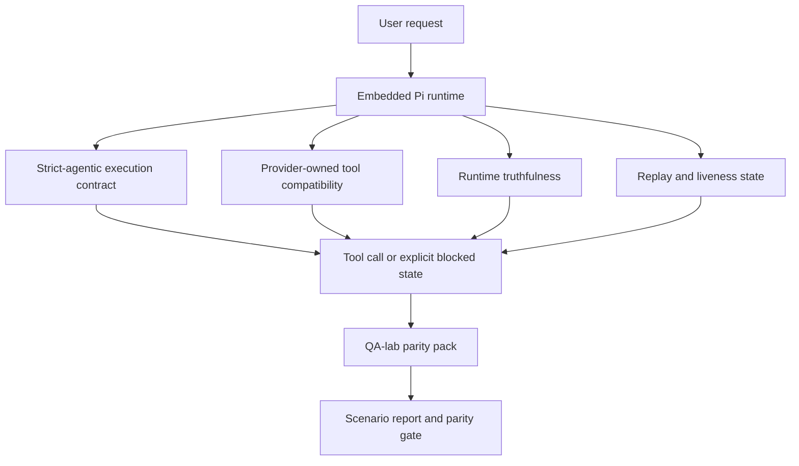
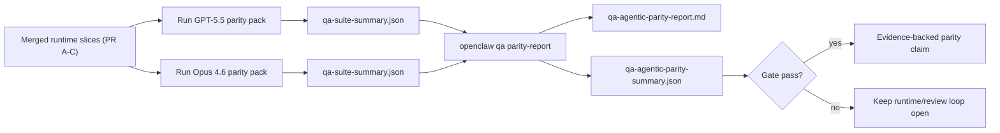

OpenClaw 在使用工具的先进模型上已经运行良好，但 GPT-5.5 和 Codex 风格的模型在一些实际方面仍然表现不佳：

- 它们可能在规划后停止，而不是执行工作
- 它们可能错误地使用严格的 OpenAI/Codex 工具模式
- 即使完全访问是不可能的，它们也可能请求 `/elevated full`
- 在重放或压缩期间，它们可能会丢失长时间运行的任务状态
- 针对 Claude Opus 4.6 的同等性声明是基于轶事，而不是可重复的场景

此同等性程序在四个可审查的部分修复了这些差距。

## 变更内容

### PR A：严格代理执行

此部分为嵌入式 Pi GPT-5 运行添加了一个可选的 `strict-agentic` 执行契约。

启用后，OpenClaw 将停止接受仅规划的轮次作为“足够好”的完成。如果模型只说明其打算做什么，而不实际使用工具或取得进展，OpenClaw 将通过立即行动的引导重试，然后以明确的阻止状态失败关闭，而不是静默结束任务。

这最能改善 GPT-5.5 在以下方面的体验：

- 简短的“好的，去做”后续跟进
- 第一步显而易见的代码任务
- 在 `update_plan` 应该是进度跟踪而不是填充文本的流程中

### PR B：运行时真实性

此部分使 OpenClaw 能够在两件事上讲真话：

- 提供商/运行时调用失败的原因
- `/elevated full` 是否实际可用

这意味着 GPT-5.5 可以针对缺失范围、身份验证刷新失败、HTML 403 身份验证失败、代理问题、DNS 或超时失败以及阻止的完全访问模式获得更好的运行时信号。该模型不太可能幻觉错误的补救措施，或不断请求运行时无法提供的权限模式。

### PR C：执行正确性

此部分改善了两种正确性：

- 提供商拥有的 OpenAI/Codex 工具模式兼容性
- 重放和长任务活性呈现

工具兼容性工作减少了严格 OpenAI/Codex 工具注册的模式摩擦，特别是在无参数工具和严格对象根期望方面。重放/活跃性工作使长时间运行的任务更具可观测性，因此暂停、阻塞和放弃状态是可见的，而不是消失在通用的失败文本中。

### PR D：对等工具

此部分增加了首批 QA 实验室对等包，以便 GPT-5.5 和 Opus 4.6 可以通过相同的场景进行测试，并使用共享的证据进行比较。

对等包是验证层。它本身不会改变运行时行为。

在拥有两个 `qa-suite-summary.json` 产物后，使用以下命令生成发布门控比较：

```bash
pnpm openclaw qa parity-report \
  --repo-root . \
  --candidate-summary .artifacts/qa-e2e/gpt55/qa-suite-summary.json \
  --baseline-summary .artifacts/qa-e2e/opus46/qa-suite-summary.json \
  --output-dir .artifacts/qa-e2e/parity
```

该命令会写入：

- 一份人类可读的 Markdown 报告
- 一份机器可读的 JSON 判定结果
- 一个明确的 `pass` / `fail` 门控结果

## 为什么这能在实践中改进 GPT-5.5

在此工作之前，在 OpenClaw 上运行的 GPT-5.5 在实际编码会话中可能不如 Opus 那样具有代理性，因为运行时容忍了对 GPT-5 风格模型尤其有害的行为：

- 仅评论的回合
- 围绕工具的模式摩擦
- 模糊的权限反馈
- 静默重放或压缩中断

目标不是让 GPT-5.5 模仿 Opus。目标是赋予 GPT-5.5 一个运行时合约，该合约奖励实际进展，提供更清晰的工具和权限语义，并将故障模式转换为明确的机器和人类可读状态。

这将用户体验从：

- “模型有一个很好的计划但停止了”

改变为：

- “模型要么采取了行动，要么 OpenClaw 呈现了它无法做到的确切原因”

## GPT-5.5 用户的改进前后对比

| 在此计划之前                                                                 | 在 PR A-D 之后                                                     |
| ---------------------------------------------------------------------------- | ------------------------------------------------------------------ |
| GPT-5.5 可能会在制定合理的计划后停止，而不采取下一步工具步骤                 | PR A 将“仅计划”转变为“立即行动或呈现阻塞状态”                      |
| 严格的工具模式可能会以令人困惑的方式拒绝无参数工具或 OpenAI/Codex 形状的工具 | PR C 使提供商拥有的工具注册和调用更具可预测性                      |
| 在阻塞的运行时中，`/elevated full` 指导可能模糊或错误                        | PR B 为 GPT-5.5 和用户提供真实的运行时和权限提示                   |
| 重放或压缩失败可能会让人感觉任务无声无息地消失了                             | PR C 将已暂停、已阻塞、已放弃和重放无效的结果明确地显示出来        |
| “GPT-5.5 感觉比 Opus 差”这种说法大多只是传闻                                 | PR D 将其转变为相同的场景包、相同的指标以及一个严格的通过/失败关口 |

## 架构



## 发布流程



## 场景包

首批对等场景包目前涵盖五个场景：

### `approval-turn-tool-followthrough`

检查模型在短暂确认后不会停在“我会去做”这一步。它应该在同一轮中采取第一个具体行动。

### `model-switch-tool-continuity`

检查使用工具的工作在模型/运行时切换边界中是否保持连贯，而不是重置为评论或丢失执行上下文。

### `source-docs-discovery-report`

检查模型是否能够阅读源代码和文档、综合发现结果，并以代理方式继续任务，而不是生成肤浅的总结并过早停止。

### `image-understanding-attachment`

检查涉及附件的混合模式任务是否保持可执行，不会退化为模糊的叙述。

### `compaction-retry-mutating-tool`

检查具有实际变更写入的任务是否保持重放不安全性的显式状态，而不是在运行压缩、重试或在压力下丢失回复状态时悄悄看起来像是重放安全的。

## 场景矩阵

| 场景                               | 测试内容                      | 良好的 GPT-5.5 行为                              | 失败信号                                                             |
| ---------------------------------- | ----------------------------- | ------------------------------------------------ | -------------------------------------------------------------------- |
| `approval-turn-tool-followthrough` | 计划后的简短确认轮次          | 立即开始第一个具体的工具操作，而不是重申意图     | 仅计划的后续跟进、无工具活动或在没有真正阻碍因素的情况下被阻塞的轮次 |
| `model-switch-tool-continuity`     | 工具使用期间的运行时/模型切换 | 保留任务上下文并继续连贯地执行操作               | 重置为评论、丢失工具上下文或在切换后停止                             |
| `source-docs-discovery-report`     | 源代码阅读 + 综合 + 行动      | 查找来源、使用工具并生成有用的报告而不停顿       | 肤浅的总结、缺少工具工作或轮次未完成即停止                           |
| `image-understanding-attachment`   | 由附件驱动的代理工作          | 解释附件、将其连接到工具并继续任务               | 模糊的叙述、忽略附件或没有具体的后续行动                             |
| `compaction-retry-mutating-tool`   | 压缩压力下的突变工作          | 执行真正的写入，并在副作用发生后明确重放不安全性 | 发生了突变写入，但重放安全性被隐含、缺失或相互矛盾                   |

## 发布关卡

只有当合并后的运行时同时通过了同等套件和运行时真实性回归测试时，GPT-5.5 才能被视为达到同等或更好的水平。

必需的结果：

- 当下一个工具操作明确时，不会出现仅计划的停滞
- 没有真实执行就不会有虚假完成
- 没有错误的 `/elevated full` 指导
- 没有静默重放或压缩丢弃
- 同等套件指标至少与约定的 Opus 4.6 基线一样强

对于第一波测试工具，关卡会比较：

- 完成率
- 意外停止率
- 有效工具调用率
- 虚假成功计数

同等证据有意分为两层：

- PR D 通过 QA 实验室证明相同场景下 GPT-5.5 与 Opus 4.6 的行为
- PR B 确定性套件在工具外部证明 auth、proxy、DNS 和 `/elevated full` 的真实性

## 目标到证据矩阵

| 完成关卡项目                                 | 负责 PR     | 证据来源                                                          | 通过信号                                                           |
| -------------------------------------------- | ----------- | ----------------------------------------------------------------- | ------------------------------------------------------------------ |
| GPT-5.5 不再在规划后停滞                     | PR A        | `approval-turn-tool-followthrough` 加上 PR A 运行时套件           | 批准回合触发真正的工作或明确的阻塞状态                             |
| GPT-5.5 不再伪造进度或虚假工具完成           | PR A + PR D | 同等报告场景结果和虚假成功计数                                    | 没有可疑的通过结果，也没有仅包含评论的完成                         |
| GPT-5.5 不再提供错误的 `/elevated full` 指导 | PR B        | 确定性真实性套件                                                  | 阻塞原因和完全访问提示保持运行时准确                               |
| 重放/活跃性失败保持明确                      | PR C + PR D | PR C 生命周期/重放套件加上 `compaction-retry-mutating-tool`       | 突变工作使重放不安全性保持明确，而不是静默消失                     |
| GPT-5.5 在约定指标上匹配或超越 Opus 4.6      | PR D        | `qa-agentic-parity-report.md` 和 `qa-agentic-parity-summary.json` | 相同的场景覆盖范围，并且在完成、停止行为或有效工具使用方面没有回归 |

## 如何解读同等结论

将 `qa-agentic-parity-summary.json` 中的结论作为第一波同等套件的最终机器可读决策。

- `pass` 意味着 GPT-5.5 覆盖了与 Opus 4.6 相同的场景，并且在商定的综合指标上没有退步。
- `fail` 意味着至少有一个硬性门槛被触发：补全能力较弱、非预期停止情况更严重、有效工具使用能力较弱、任何虚假成功案例，或场景覆盖率不匹配。
- "shared/base CI issue" 本身并不是一个对等性结果。如果 PR D 之外的 CI 噪音阻碍了运行，则裁决应等待一次干净的合并运行时执行，而不是从分支时期的日志中进行推断。
- Auth、proxy、DNS 和 `/elevated full` 真实性仍然来自 PR B 的确定性套件，因此最终的发布声明需要同时满足：通过的 PR D 对等性裁决和绿色的 PR B 真实性覆盖率。

## 谁应该启用 `strict-agentic`

在以下情况下使用 `strict-agentic`：

- 当下一步显而易见时，预期代理会立即采取行动
- GPT-5.5 或 Codex 系列模型是主要的运行时
- 相比“乐于助人”的仅作回顾的回复，您更喜欢明确的阻塞状态

在以下情况下保留默认合约：

- 您希望保留现有的较宽松的行为
- 您没有使用 GPT-5 系列模型
- 您正在测试提示词而不是运行时执行

## 相关

- [GPT-5.5 / Codex parity maintainer notes](/zh/help/gpt55-codex-agentic-parity-maintainers)
