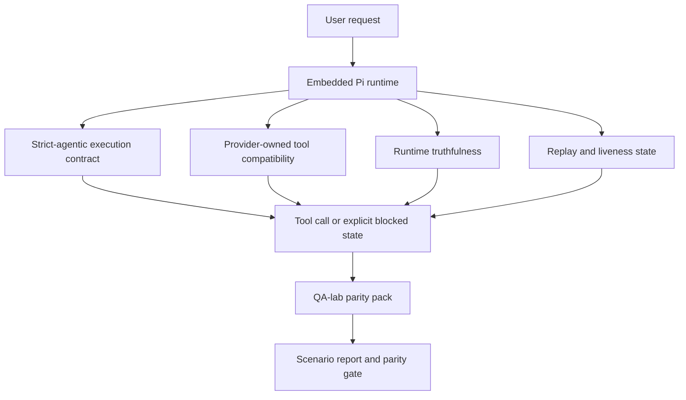
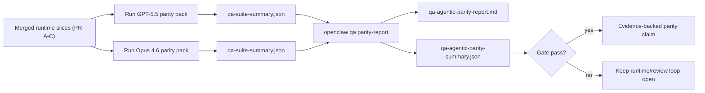

# OpenClaw 中 GPT-5.5 / Codex 代理对等性

OpenClaw 在与使用工具的前沿模型配合方面已经表现良好，但 GPT-5.5 和 Codex 风格模型在几个实际方面仍然表现不佳：

- 它们可能在规划后停止，而不是执行工作
- 它们可能错误地使用严格的 OpenAI/Codex 工具架构
- 即使在完全访问不可能的情况下，它们也可能请求 `/elevated full`
- 在重放或压缩期间，它们可能会丢失长时间运行的任务状态
- 针对 Claude Opus 4.6 的对等性声明是基于轶事，而不是可重复的场景

此对等性计划在四个可审查的部分中修复了这些差距。

## 更改内容

### PR A：严格代理执行

此部分为嵌入式 Pi GPT-5 运行增加了一个可选的 `strict-agentic` 执行合约。

启用后，OpenClaw 将停止接受仅计划的轮次作为“足够好”的完成。如果模型只说明它打算做什么，而不实际使用工具或取得进展，OpenClaw 将使用立即执行的提示重试，然后以显式的阻止状态失败关闭，而不是静默结束任务。

这最能改善 GPT-5.5 在以下方面的体验：

- 简短的“好的，去做”跟进
- 第一步显而易见的代码任务
- `update_plan` 应该是进度跟踪而不是填充文本的流程

### PR B：运行时真实性

此部分使 OpenClaw 在两个方面如实告知：

- 提供商/运行时调用失败的原因
- `/elevated full` 是否实际可用

这意味着 GPT-5.5 可以获得关于缺失范围、身份验证刷新失败、HTML 403 身份验证失败、代理问题、DNS 或超时失败以及阻止的完全访问模式的更好运行时信号。模型不太可能产生错误的修复幻觉，或者继续请求运行时无法提供的权限模式。

### PR C：执行正确性

此部分改善了两种类型的正确性：

- 提供商拥有的 OpenAI/Codex 工具架构兼容性
- 重放和长任务活跃度呈现

工具兼容性工作减少了严格的 OpenAI/Codex 工具注册的模式摩擦，特别是在无参数工具和严格的对象根期望方面。重放/活跃性工作使长时间运行的任务更具可观察性，因此暂停、阻塞和放弃状态是可见的，而不是消失在通用的失败文本中。

### PR D：一致性测试工具

此部分添加了第一波 QA 实验室一致性包，以便可以通过相同场景对 GPT-5.5 和 Opus 4.6 进行测试，并使用共享证据进行比较。

一致性包是证明层。它本身不会改变运行时行为。

拥有两个 `qa-suite-summary.json` 制品后，使用以下命令生成发布门禁比较：

```bash
pnpm openclaw qa parity-report \
  --repo-root . \
  --candidate-summary .artifacts/qa-e2e/gpt55/qa-suite-summary.json \
  --baseline-summary .artifacts/qa-e2e/opus46/qa-suite-summary.json \
  --output-dir .artifacts/qa-e2e/parity
```

该命令会写入：

- 一份人类可读的 Markdown 报告
- 一份机器可读的 JSON 判定
- 一个明确的 `pass` / `fail` 门禁结果

## 为什么这在实践中改进了 GPT-5.5

在此工作之前，OpenClaw 上的 GPT-5.5 在实际编码会话中可能会感觉不如 Opus 智能，因为运行时容忍了那些对 GPT-5 风格模型特别有害的行为：

- 仅评论的轮次
- 围绕工具的模式摩擦
- 模糊的权限反馈
- 静默重放或压缩中断

目标不是让 GPT-5.5 模仿 Opus。目标是给 GPT-5.5 提供一个运行时契约，该契约奖励实际进展，提供更清晰的工具和权限语义，并将失败模式转化为明确的机器和人类可读状态。

这将用户体验从：

- “模型有一个很好的计划但停止了”

变为：

- “模型要么采取了行动，要么 OpenClaw 呈现了它无法做到的确切原因”

## GPT-5.5 用户的改进前后对比

| 在此程序之前                                                             | 在 PR A-D 之后                                                       |
| ------------------------------------------------------------------------ | -------------------------------------------------------------------- |
| GPT-5.5 可能在制定合理的计划后停止，而不采取下一个工具步骤               | PR A 将“仅计划”转变为“立即行动或呈现阻塞状态”                        |
| 严格的工具模式可能会以令人困惑的方式拒绝无参数或 OpenAI/Codex 形状的工具 | PR C 使提供商拥有的工具注册和调用更具可预测性                        |
| 在阻塞的运行时中，`/elevated full` 指导可能含糊不清或错误                | PR B 为 GPT-5.5 和用户提供真实的运行时和权限提示                     |
| 重放或压缩失败可能会让人觉得任务静默消失了                               | PR C 明确显示了暂停、阻塞、放弃和重放无效的结果                      |
| “GPT-5.5 感觉比 Opus 差”大部分只是传闻                                   | PR D 将其转变为相同的场景包、相同的指标，以及一个硬性的通过/失败门控 |

## 架构



## 发布流程



## 场景包

首批对等性包目前涵盖五个场景：

### `approval-turn-tool-followthrough`

检查模型在简短确认后不会停止在“I'll do that”这句话上。它应在同一轮中采取第一个具体行动。

### `model-switch-tool-continuity`

检查使用工具的工作在模型/运行时切换边界之间是否保持连贯，而不是重置为评论或丢失执行上下文。

### `source-docs-discovery-report`

检查模型是否可以阅读源码和文档，综合发现，并以代理方式继续任务，而不是生成肤浅的总结并提前停止。

### `image-understanding-attachment`

检查涉及附件的混合模式任务保持可执行，并且不会崩溃为模糊的叙述。

### `compaction-retry-mutating-tool`

检查具有实际变更写入的任务保持重放不安全性的明确状态，而不是在运行压缩、重试或在压力下丢失回复状态时悄然看起来是重放安全的。

## 场景矩阵

| 场景                               | 测试内容                    | 良好的 GPT-5.5 行为                                      | 失败信号                                                                 |
| ---------------------------------- | --------------------------- | -------------------------------------------------------- | ------------------------------------------------------------------------ |
| `approval-turn-tool-followthrough` | 计划后的简短确认轮次        | 立即开始第一个具体的工具操作，而不是重申意图             | 仅有计划的后续跟进、无工具活动，或在没有实际阻塞因素的情况下被阻塞的轮次 |
| `model-switch-tool-continuity`     | 使用工具时的运行时/模型切换 | 保留任务上下文并继续连贯地行动                           | 重置为评论、丢失工具上下文，或在切换后停止                               |
| `source-docs-discovery-report`     | 源码阅读 + 综合 + 行动      | 查找源码，使用工具，并在不拖延的情况下生成有用的报告     | 肤浅的总结、缺少工具工作，或轮次未完成就停止                             |
| `image-understanding-attachment`   | 附件驱动的代理工作          | 解释附件，将其与工具联系起来，并继续任务                 | 模糊的叙述、忽略附件，或没有具体的下一步行动                             |
| `compaction-retry-mutating-tool`   | 压缩压力下的变更工作        | 执行真正的写入并在副作用发生后保持重放不安全性的显式状态 | 发生了突变写入，但重放安全性是隐含的、缺失的或矛盾的                     |

## 发布关卡

只有当合并后的运行时同时通过同等测试包和运行时真实性回归测试时，GPT-5.5 才能被视为具有同等或更好的性能。

必需结果：

- 当下一个工具操作明确时，不会出现仅计划的停滞
- 没有真实执行就不会出现虚假完成
- 没有错误的 `/elevated full` 指导
- 没有静默重放或压缩放弃
- 同等测试包指标至少与商定的 Opus 4.6 基线一样强

对于首批测试工具，关卡会比较：

- 完成率
- 意外停止率
- 有效工具调用率
- 虚假成功计数

同等证据有意分为两层：

- PR D 通过 QA 实验室证明相同场景下 GPT-5.5 与 Opus 4.6 的行为
- PR B 确定性测试套件在测试工具之外证明了身份验证、代理、DNS 和 `/elevated full` 的真实性

## 目标到证据矩阵

| 完成关卡项目                                 | 所属 PR     | 证据来源                                                          | 通过信号                                                       |
| -------------------------------------------- | ----------- | ----------------------------------------------------------------- | -------------------------------------------------------------- |
| GPT-5.5 不再在规划后停滞                     | PR A        | `approval-turn-tool-followthrough` 加上 PR A 运行时测试套件       | 批准轮次会触发实际工作或显式阻塞状态                           |
| GPT-5.5 不再伪造进度或虚假工具完成           | PR A + PR D | 同等报告场景结果和虚假成功计数                                    | 没有可疑的通过结果，也没有仅评论的完成                         |
| GPT-5.5 不再提供错误的 `/elevated full` 指导 | PR B        | 确定性真实性测试套件                                              | 阻塞原因和完全访问提示保持运行时准确                           |
| 重放/活动性故障保持显式状态                  | PR C + PR D | PR C 生命周期/重放测试套件加上 `compaction-retry-mutating-tool`   | 突变工作保持重放不安全性显式，而不是静默消失                   |
| GPT-5.5 在商定指标上匹配或击败 Opus 4.6      | PR D        | `qa-agentic-parity-report.md` 和 `qa-agentic-parity-summary.json` | 相同的场景覆盖范围，在完成、停止行为或有效工具使用方面没有回归 |

## 如何解读同等裁决

将 `qa-agentic-parity-summary.json` 中的裁决作为首批同等测试包的最终机器可读决策。

- `pass` 表示 GPT-5.5 覆盖了与 Opus 4.6 相同的场景，并且在商定的总体指标上没有退化。
- `fail` 表示至少触碰到一个硬性门槛：补全能力较弱、意外停止情况更严重、有效工具使用较弱、任何虚假成功案例或场景覆盖不匹配。
- “shared/base CI issue”本身并不是一个对等性结果。如果 PR D 之外的 CI 噪音阻断了运行，该裁决应等待一次干净的合并运行时执行，而不是从分支时代的日志中推断。
- Auth、proxy、DNS 和 `/elevated full` 的真实性仍然来自 PR B 的确定性套件，因此最终的发布声明需要两者兼备：通过 PR D 的对等性裁决以及绿色的 PR B 真实性覆盖。

## 谁应该启用 `strict-agentic`

在以下情况下使用 `strict-agentic`：

- 当下一步显而易见时，代理应立即采取行动
- GPT-5.5 或 Codex 系列模型是主要的运行时
- 你更倾向于明确的阻止状态，而不是“有帮助的”仅限总结的回复

在以下情况下保留默认协议：

- 你希望现有的较宽松行为
- 你未使用 GPT-5 系列模型
- 你正在测试提示词，而不是运行时强制执行

## 相关

- [GPT-5.5 / Codex parity maintainer notes](/zh/help/gpt55-codex-agentic-parity-maintainers)
