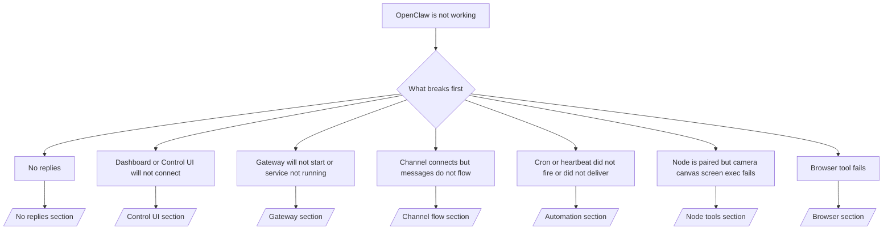

# 故障排除

如果您只有 2 分钟，请将此页面作为分流入口。

## 前 60 秒

按顺序运行以下步骤：

```bash
openclaw status
openclaw status --all
openclaw gateway probe
openclaw gateway status
openclaw doctor
openclaw channels status --probe
openclaw logs --follow
```

良好的输出表现（单行）：

- `openclaw status` → 显示已配置的渠道，且没有明显的身份验证错误。
- `openclaw status --all` → 完整的报告存在且可分享。
- `openclaw gateway probe` → 预期的网关目标可访问 (`Reachable: yes`)。`RPC: limited - missing scope: operator.read` 表示降级的诊断信息，并非连接失败。
- `openclaw gateway status` → `Runtime: running` 和 `RPC probe: ok`。
- `openclaw doctor` → 没有阻塞性的配置/服务错误。
- `openclaw channels status --probe` → 渠道报告 `connected` 或 `ready`。
- `openclaw logs --follow` → 活动稳定，没有重复的致命错误。

## Anthropic 长上下文 429 错误

如果您看到：
`HTTP 429: rate_limit_error: Extra usage is required for long context requests`，
请前往 [/gateway/故障排除#anthropic-429-extra-usage-required-for-long-context](/en/gateway/troubleshooting#anthropic-429-extra-usage-required-for-long-context)。

## 插件安装因缺少 openclaw 扩展而失败

如果安装失败并出现 `package.json missing openclaw.extensions`，说明插件包
使用的是 OpenClaw 不再接受的旧格式。

在插件包中修复：

1. 将 `openclaw.extensions` 添加到 `package.json`。
2. 将条目指向构建的运行时文件（通常是 `./dist/index.js`）。
3. 重新发布插件并再次运行 `openclaw plugins install <package>`。

示例：

```json
{
  "name": "@openclaw/my-plugin",
  "version": "1.2.3",
  "openclaw": {
    "extensions": ["./dist/index.js"]
  }
}
```

参考：[插件架构](/en/plugins/architecture)

## 决策树



<AccordionGroup>
  <Accordion title="No replies">
    ```bash
    openclaw status
    openclaw gateway status
    openclaw channels status --probe
    openclaw pairing list --channel <channel> [--account <id>]
    openclaw logs --follow
    ```

    良好的输出看起来像：

    - `Runtime: running`
    - `RPC probe: ok`
    - 您的渠道在 `channels status --probe` 中显示已连接/就绪
    - 发送者显示已批准（或 私信 策略为开放/允许列表）

    常见日志特征：

    - `drop guild message (mention required` → 提及门控在 Discord 中阻止了该消息。
    - `pairing request` → 发送者未获批准，正在等待 私信 配对批准。
    - 渠道日志中的 `blocked` / `allowlist` → 发送者、房间或群组被过滤。

    深度页面：

    - [/gateway/故障排除#no-replies](/en/gateway/troubleshooting#no-replies)
    - [/channels/故障排除](/en/channels/troubleshooting)
    - [/channels/pairing](/en/channels/pairing)

  </Accordion>

  <Accordion title="Dashboard or Control UI will not connect">
    ```bash
    openclaw status
    openclaw gateway status
    openclaw logs --follow
    openclaw doctor
    openclaw channels status --probe
    ```

    良好的输出如下所示：

    - `Dashboard: http://...` 显示在 `openclaw gateway status` 中
    - `RPC probe: ok`
    - 日志中没有认证循环

    常见的日志特征：

    - `device identity required` → HTTP/非安全上下文无法完成设备认证。
    - `AUTH_TOKEN_MISMATCH` 且带有重试提示（`canRetryWithDeviceToken=true`）→ 可能会自动进行一次受信任的设备令牌重试。
    - 该重试后重复出现 `unauthorized` → 令牌/密码错误、认证模式不匹配或过时的已配对设备令牌。
    - `gateway connect failed:` → UI 针对的 URL/端口错误或网关不可达。

    深度页面：

    - [/gateway/故障排除#dashboard-control-ui-connectivity](/en/gateway/troubleshooting#dashboard-control-ui-connectivity)
    - [/web/control-ui](/en/web/control-ui)
    - [/gateway/authentication](/en/gateway/authentication)

  </Accordion>

  <Accordion title="Gateway(网关) will not start or service installed but not running">
    ```bash
    openclaw status
    openclaw gateway status
    openclaw logs --follow
    openclaw doctor
    openclaw channels status --probe
    ```

    良好的输出如下所示：

    - `Service: ... (loaded)`
    - `Runtime: running`
    - `RPC probe: ok`

    常见的日志特征：

    - `Gateway start blocked: set gateway.mode=local` → 网关模式未设置/远程。
    - `refusing to bind gateway ... without auth` → 非环回绑定且没有令牌/密码。
    - `another gateway instance is already listening` 或 `EADDRINUSE` → 端口已被占用。

    深度页面：

    - [/gateway/故障排除#gateway-service-not-running](/en/gateway/troubleshooting#gateway-service-not-running)
    - [/gateway/background-process](/en/gateway/background-process)
    - [/gateway/configuration](/en/gateway/configuration)

  </Accordion>

  <Accordion title="渠道已连接但消息未流转">
    ```bash
    openclaw status
    openclaw gateway status
    openclaw logs --follow
    openclaw doctor
    openclaw channels status --probe
    ```

    良好的输出如下所示：

    - 渠道传输已连接。
    - 配对/允许列表检查通过。
    - 在需要的地方检测到了提及。

    常见日志特征：

    - `mention required` → 群组提及拦截阻止了处理。
    - `pairing` / `pending` → 私信发送者尚未获得批准。
    - `not_in_channel`, `missing_scope`, `Forbidden`, `401/403` → 渠道权限令牌问题。

    深入页面：

    - [/gateway/故障排除#渠道-connected-messages-not-flowing](/en/gateway/troubleshooting#channel-connected-messages-not-flowing)
    - [/channels/故障排除](/en/channels/troubleshooting)

  </Accordion>

  <Accordion title="Cron 或心跳未触发或未传递">
    ```bash
    openclaw status
    openclaw gateway status
    openclaw cron status
    openclaw cron list
    openclaw cron runs --id <jobId> --limit 20
    openclaw logs --follow
    ```

    良好的输出如下所示：

    - `cron.status` 显示已启用并具有下一次唤醒时间。
    - `cron runs` 显示最近的 `ok` 条目。
    - 心跳已启用且不在活动时间之外。

    常见日志特征：

    - `cron: scheduler disabled; jobs will not run automatically` → cron 已禁用。
    - `heartbeat skipped` 且带有 `reason=quiet-hours` → 超出配置的活动时间。
    - `requests-in-flight` → 主通道繁忙；心跳唤醒已推迟。
    - `unknown accountId` → 心跳传递目标账户不存在。

    深入页面：

    - [/gateway/故障排除#cron-and-heartbeat-delivery](/en/gateway/troubleshooting#cron-and-heartbeat-delivery)
    - [/automation/故障排除](/en/automation/troubleshooting)
    - [/gateway/heartbeat](/en/gateway/heartbeat)

  </Accordion>

  <Accordion title="Node is paired but 工具 fails camera canvas screen exec">
    ```bash
    openclaw status
    openclaw gateway status
    openclaw nodes status
    openclaw nodes describe --node <idOrNameOrIp>
    openclaw logs --follow
    ```

    正常的输出如下所示：

    - 节点显示为已连接并且已针对角色 `node` 配对。
    - 您正在调用的命令存在 Capability。
    - 工具的权限状态已授予。

    常见日志签名：

    - `NODE_BACKGROUND_UNAVAILABLE` → 将节点应用置于前台。
    - `*_PERMISSION_REQUIRED` → 操作系统权限被拒绝或缺失。
    - `SYSTEM_RUN_DENIED: approval required` → 批准执行操作正在处理中。
    - `SYSTEM_RUN_DENIED: allowlist miss` → 命令不在执行允许列表中。

    深度页面：

    - [/gateway/故障排除#node-paired-工具-fails](/en/gateway/troubleshooting#node-paired-tool-fails)
    - [/nodes/故障排除](/en/nodes/troubleshooting)
    - [/tools/exec-approvals](/en/tools/exec-approvals)

  </Accordion>

  <Accordion title="Browser 工具 fails">
    ```bash
    openclaw status
    openclaw gateway status
    openclaw browser status
    openclaw logs --follow
    openclaw doctor
    ```

    正常的输出如下所示：

    - 浏览器状态显示 `running: true` 和所选的浏览器/配置文件。
    - `openclaw` 启动，或者 `user` 可以看到本地 Chrome 标签页。

    常见日志签名：

    - `Failed to start Chrome CDP on port` → 本地浏览器启动失败。
    - `browser.executablePath not found` → 配置的二进制路径错误。
    - `No Chrome tabs found for profile="user"` → Chrome MCP 附加配置文件没有打开本地 Chrome 标签页。
    - `Browser attachOnly is enabled ... not reachable` → 仅附加配置文件没有活动的 CDP 目标。

    深度页面：

    - [/gateway/故障排除#browser-工具-fails](/en/gateway/troubleshooting#browser-tool-fails)
    - [/tools/browser-linux-故障排除](/en/tools/browser-linux-troubleshooting)
    - [/tools/browser-wsl2-windows-remote-cdp-故障排除](/en/tools/browser-wsl2-windows-remote-cdp-troubleshooting)

  </Accordion>
</AccordionGroup>
