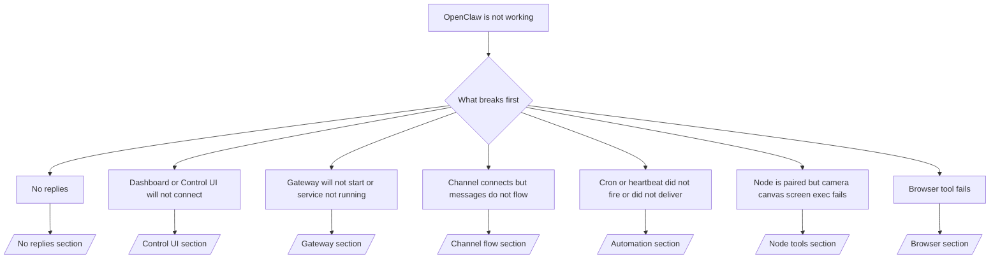

# 故障排除

如果您只有 2 分钟，请将此页面作为分流入口。

## 前 60 秒

按顺序运行以下步骤：

```bash
openclaw status
openclaw status --all
openclaw gateway probe
openclaw gateway status
openclaw doctor
openclaw channels status --probe
openclaw logs --follow
```

良好的输出表现（单行）：

- `openclaw status` → 显示已配置的通道，没有明显的身份验证错误。
- `openclaw status --all` → 完整的报告已存在且可共享。
- `openclaw gateway probe` → 预期的网关目标可达 (`Reachable: yes`)。`Capability: ...` 告诉您探针能够证明的身份验证级别，而 `Read probe: limited - missing scope: operator.read` 是降级的诊断信息，而非连接失败。
- `openclaw gateway status` → `Runtime: running`、`Connectivity probe: ok` 以及合理的 `Capability: ...` 行。如果您也需要读取范围的 RPC 证明，请使用 `--require-rpc`。
- `openclaw doctor` → 没有阻塞性配置/服务错误。
- `openclaw channels status --probe` → 可达的网关返回实时的每账户传输状态以及探针/审计结果，例如 `works` 或 `audit ok`；如果网关不可达，该命令将回退到仅配置摘要。
- `openclaw logs --follow` → 活动稳定，无重复的致命错误。

## Anthropic 长上下文 429 错误

如果您看到：
`HTTP 429: rate_limit_error: Extra usage is required for long context requests`，
请转至 [/gateway/故障排除#anthropic-429-extra-usage-required-for-long-context](/zh/gateway/troubleshooting#anthropic-429-extra-usage-required-for-long-context)。

## 本地 OpenAI 兼容后端直接有效但在 OpenClaw 中失败

如果您的本地或自托管 `/v1` 后端响应小型直接 `/v1/chat/completions` 探针，但在 `openclaw infer model run` 或正常代理轮次中失败：

1. 如果错误提及 `messages[].content` 需要字符串，请设置
   `models.providers.<provider>.models[].compat.requiresStringContent: true`。
2. 如果后端仅在 OpenClaw 代理轮次中失败，请设置
   `models.providers.<provider>.models[].compat.supportsTools: false` 并重试。
3. 如果微小的直接调用仍然有效，但较大的 OpenClaw 提示使后端崩溃，请将剩余问题视为上游模型/服务器限制，并继续深入排查：
   [/gateway/故障排除#local-openai-compatible-backend-passes-direct-probes-but-agent-runs-fail](/zh/gateway/troubleshooting#local-openai-compatible-backend-passes-direct-probes-but-agent-runs-fail)

## 插件安装因缺少 openclaw 扩展而失败

如果安装失败并显示 `package.json missing openclaw.extensions`，则插件包使用的是 OpenClaw 不再接受的旧格式。

在插件包中修复：

1. 将 `openclaw.extensions` 添加到 `package.json`。
2. 将条目指向构建的运行时文件（通常是 `./dist/index.js`）。
3. 重新发布插件并再次运行 `openclaw plugins install <package>`。

示例：

```json
{
  "name": "@openclaw/my-plugin",
  "version": "1.2.3",
  "openclaw": {
    "extensions": ["./dist/index.js"]
  }
}
```

参考：[Plugin architecture](/zh/plugins/architecture)

## 决策树



<AccordionGroup>
  <Accordion title="No replies">
    ```bash
    openclaw status
    openclaw gateway status
    openclaw channels status --probe
    openclaw pairing list --channel <channel> [--account <id>]
    openclaw logs --follow
    ```

    正确的输出看起来像：

    - `Runtime: running`
    - `Connectivity probe: ok`
    - `Capability: read-only`、`write-capable` 或 `admin-capable`
    - 您的渠道显示传输已连接，并且在支持的情况下，`channels status --probe` 中显示 `works` 或 `audit ok`
    - 发送者显示已批准（或私信策略为开放/白名单）

    常见日志特征：

    - `drop guild message (mention required` → 提及门控在 Discord 中阻止了该消息。
    - `pairing request` → 发送者未批准且正在等待私信配对批准。
    - 渠道日志中的 `blocked` / `allowlist` → 发送者、房间或组被过滤。

    深入页面：

    - [/gateway/故障排除#no-replies](/zh/gateway/troubleshooting#no-replies)
    - [/channels/故障排除](/zh/channels/troubleshooting)
    - [/channels/pairing](/zh/channels/pairing)

  </Accordion>

  <Accordion title="仪表盘或控制 UI 无法连接">
    ```bash
    openclaw status
    openclaw gateway status
    openclaw logs --follow
    openclaw doctor
    openclaw channels status --probe
    ```

    正确的输出如下所示：

    - `Dashboard: http://...` 显示在 `openclaw gateway status` 中
    - `Connectivity probe: ok`
    - `Capability: read-only`、`write-capable` 或 `admin-capable`
    - 日志中无认证循环

    常见日志特征：

    - `device identity required` → HTTP/非安全上下文无法完成设备认证。
    - `origin not allowed` → 浏览器 `Origin` 不允许用于控制 UI
      网关目标。
    - `AUTH_TOKEN_MISMATCH` 并带有重试提示 (`canRetryWithDeviceToken=true`) → 可能会自动进行一次受信任的设备令牌重试。
    - 该缓存令牌重试会重用与配对设备令牌一起存储的缓存作用域集。显式 `deviceToken` / 显式 `scopes` 调用方将改为保留其请求的作用域集。
    - 在异步 Tailscale Serve 控制 UI 路径上，对同一 `{scope, ip}` 的失败尝试在限制器记录失败之前被序列化，因此第二次并发的不良重试可能已经显示 `retry later`。
    - 来自本地主机
      浏览器源的 `too many failed authentication attempts (retry later)` → 来自同一 `Origin` 的重复失败将被暂时锁定；另一个本地主机源使用单独的存储桶。
    - 该重试后重复出现 `unauthorized` → 令牌/密码错误、认证模式不匹配或过时的配对设备令牌。
    - `gateway connect failed:` → UI 针对的是错误的 URL/端口或无法访问的网关。

    深入页面：

    - [/gateway/故障排除#dashboard-control-ui-connectivity](/zh/gateway/troubleshooting#dashboard-control-ui-connectivity)
    - [/web/control-ui](/zh/web/control-ui)
    - [/gateway/authentication](/zh/gateway/authentication)

  </Accordion>

  <Accordion title="Gateway(网关) will not start or service installed but not running">
    ```bash
    openclaw status
    openclaw gateway status
    openclaw logs --follow
    openclaw doctor
    openclaw channels status --probe
    ```

    Good output looks like:

    - `Service: ... (loaded)`
    - `Runtime: running`
    - `Connectivity probe: ok`
    - `Capability: read-only`, `write-capable`, or `admin-capable`

    Common log signatures:

    - `Gateway start blocked: set gateway.mode=local` or `existing config is missing gateway.mode` → gateway mode is remote, or the config file is missing the local-mode stamp and should be repaired.
    - `refusing to bind gateway ... without auth` → non-loopback bind without a valid gateway auth path (token/password, or trusted-proxy where configured).
    - `another gateway instance is already listening` or `EADDRINUSE` → port already taken.

    Deep pages:

    - [/gateway/故障排除#gateway-service-not-running](/zh/gateway/troubleshooting#gateway-service-not-running)
    - [/gateway/background-process](/zh/gateway/background-process)
    - [/gateway/configuration](/zh/gateway/configuration)

  </Accordion>

  <Accordion title="渠道连接但消息无法流动">
    ```bash
    openclaw status
    openclaw gateway status
    openclaw logs --follow
    openclaw doctor
    openclaw channels status --probe
    ```

    Good output looks like:

    - Channel transport is connected.
    - Pairing/allowlist checks pass.
    - Mentions are detected where required.

    Common log signatures:

    - `mention required` → group mention gating blocked processing.
    - `pairing` / `pending` → 私信 sender is not approved yet.
    - `not_in_channel`, `missing_scope`, `Forbidden`, `401/403` → 渠道 permission token issue.

    Deep pages:

    - [/gateway/故障排除#渠道-connected-messages-not-flowing](/zh/gateway/troubleshooting#channel-connected-messages-not-flowing)
    - [/channels/故障排除](/zh/channels/troubleshooting)

  </Accordion>

  <Accordion title="Cron 或 heartbeat 未触发或未传递">
    ```bash
    openclaw status
    openclaw gateway status
    openclaw cron status
    openclaw cron list
    openclaw cron runs --id <jobId> --limit 20
    openclaw logs --follow
    ```

    良好的输出如下所示：

    - `cron.status` 显示已启用，并有下次唤醒时间。
    - `cron runs` 显示最近的 `ok` 条目。
    - Heartbeat 已启用，且不在活动时间之外。

    常见日志特征：

    - `cron: scheduler disabled; jobs will not run automatically` → cron 已禁用。
    - `heartbeat skipped` 且带有 `reason=quiet-hours` → 超出配置的活动时间。
    - `heartbeat skipped` 且带有 `reason=empty-heartbeat-file` → `HEARTBEAT.md` 存在，但仅包含空白/仅标头的脚手架。
    - `heartbeat skipped` 且带有 `reason=no-tasks-due` → `HEARTBEAT.md` 任务模式处于活动状态，但尚未达到任何任务间隔。
    - `heartbeat skipped` 且带有 `reason=alerts-disabled` → 所有 heartbeat 可见性均已禁用（`showOk`、`showAlerts` 和 `useIndicator` 均已关闭）。
    - `requests-in-flight` → 主通道繁忙；heartbeat 唤醒已延迟。
    - `unknown accountId` → heartbeat 传递目标帐户不存在。

    深度页面：

    - [/gateway/故障排除#cron-and-heartbeat-delivery](/zh/gateway/troubleshooting#cron-and-heartbeat-delivery)
    - [/automation/cron-jobs#故障排除](/zh/automation/cron-jobs#troubleshooting)
    - [/gateway/heartbeat](/zh/gateway/heartbeat)

    </Accordion>

    <Accordion title="节点已配对但工具无法执行摄像头、画布或屏幕操作">
      ```bash
      openclaw status
      openclaw gateway status
      openclaw nodes status
      openclaw nodes describe --node <idOrNameOrIp>
      openclaw logs --follow
      ```

      正常的输出如下所示：

      - 节点显示为已连接且已针对角色 `node` 进行了配对。
      - 您正在调用的命令存在相应的功能。
      - 针对该工具的权限状态已授予。

      常见日志特征：

      - `NODE_BACKGROUND_UNAVAILABLE` → 将节点应用置于前台。
      - `*_PERMISSION_REQUIRED` → 操作系统权限被拒绝或缺失。
      - `SYSTEM_RUN_DENIED: approval required` → 批准待处理。
      - `SYSTEM_RUN_DENIED: allowlist miss` → 命令不在执行允许列表中。

      深入页面：

      - [/gateway/故障排除#node-paired-工具-fails](/zh/gateway/troubleshooting#node-paired-tool-fails)
      - [/nodes/故障排除](/zh/nodes/troubleshooting)
      - [/tools/exec-approvals](/zh/tools/exec-approvals)

    </Accordion>

    <Accordion title="Exec 突然要求批准">
      ```bash
      openclaw config get tools.exec.host
      openclaw config get tools.exec.security
      openclaw config get tools.exec.ask
      openclaw gateway restart
      ```

      发生了什么变化：

      - 如果未设置 `tools.exec.host`，默认值为 `auto`。
      - 当沙盒运行时处于活动状态时，`host=auto` 解析为 `sandbox`，否则为 `gateway`。
      - `host=auto` 仅用于路由；无提示“YOLO”行为来自网关/节点上的 `security=full` 加上 `ask=off`。
      - 在 `gateway` 和 `node` 上，未设置的 `tools.exec.security` 默认为 `full`。
      - 未设置的 `tools.exec.ask` 默认为 `off`。
      - 结果：如果您看到批准请求，则某些本地主机或每会话策略将 exec 从当前默认值收紧了。

      恢复当前的默认无需批准行为：

      ```bash
      openclaw config set tools.exec.host gateway
      openclaw config set tools.exec.security full
      openclaw config set tools.exec.ask off
      openclaw gateway restart
      ```

      更安全的替代方案：

      - 如果您只需要稳定的主机路由，请仅设置 `tools.exec.host=gateway`。
      - 如果您想要主机 exec 但仍希望在允许列表缺失时进行审查，请将 `security=allowlist` 与 `ask=on-miss` 一起使用。
      - 如果您希望 `host=auto` 解析回 `sandbox`，请启用沙盒模式。

      常见日志特征：

      - `Approval required.` → 命令正在等待 `/approve ...`。
      - `SYSTEM_RUN_DENIED: approval required` → 节点主机 exec 批准正在等待中。
      - `exec host=sandbox requires a sandbox runtime for this session` → 隐式/显式沙盒选择，但沙盒模式已关闭。

      深入页面：

      - [/tools/exec](/zh/tools/exec)
      - [/tools/exec-approvals](/zh/tools/exec-approvals)
      - [/gateway/security#what-the-audit-checks-high-level](/zh/gateway/security#what-the-audit-checks-high-level)

    </Accordion>

    <Accordion title="Browser 工具 fails">
      ```bash
      openclaw status
      openclaw gateway status
      openclaw browser status
      openclaw logs --follow
      openclaw doctor
      ```

      正常的输出看起来像这样：

      - 浏览器状态显示 `running: true` 以及所选的浏览器/配置文件。
      - `openclaw` 启动，或者 `user` 可以看到本地 Chrome 标签页。

      常见日志特征：

      - `unknown command "browser"` 或 `unknown command 'browser'` → `plugins.allow` 已设置且不包含 `browser`。
      - `Failed to start Chrome CDP on port` → 本地浏览器启动失败。
      - `browser.executablePath not found` → 配置的二进制路径错误。
      - `browser.cdpUrl must be http(s) or ws(s)` → 配置的 CDP URL 使用了不支持的方案。
      - `browser.cdpUrl has invalid port` → 配置的 CDP URL 端口错误或超出范围。
      - `No Chrome tabs found for profile="user"` → Chrome MCP 附加配置文件没有打开的本地 Chrome 标签页。
      - `Remote CDP for profile "<name>" is not reachable` → 此主机无法访问配置的远程 CDP 端点。
      - `Browser attachOnly is enabled ... not reachable` 或 `Browser attachOnly is enabled and CDP websocket ... is not reachable` → 仅附加配置文件没有活动的 CDP 目标。
      - 仅附加或远程 CDP 配置文件上的视口/暗色模式/语言环境/离线覆盖过时 → 运行 `openclaw browser stop --browser-profile <name>` 以关闭活动控制会话并释放模拟状态，而无需重启网关。

      深入页面：

      - [/gateway/故障排除#browser-工具-fails](/zh/gateway/troubleshooting#browser-tool-fails)
      - [/tools/browser#missing-browser-command-or-工具](/zh/tools/browser#missing-browser-command-or-tool)
      - [/tools/browser-linux-故障排除](/zh/tools/browser-linux-troubleshooting)
      - [/tools/browser-wsl2-windows-remote-cdp-故障排除](/zh/tools/browser-wsl2-windows-remote-cdp-troubleshooting)

    </Accordion>

  </AccordionGroup>

## 相关

- [常见问题](/zh/help/faq) — 经常被问到的问题
- [Gateway(网关) 故障排除](/zh/gateway/troubleshooting) — Gateway(网关) 特定的问题
- [Doctor](/zh/gateway/doctor) — 自动健康检查和修复
- [渠道 故障排除](/zh/channels/troubleshooting) — 渠道连接问题
- [自动化 故障排除](/zh/automation/cron-jobs#troubleshooting) — cron 和 heartbeat 问题
