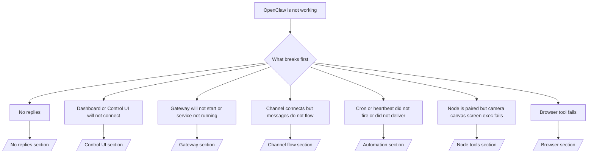

如果您只有 2 分钟，请将此页面作为分流入口。

## 前 60 秒

按顺序执行以下确切步骤：

```bash
openclaw status
openclaw status --all
openclaw gateway probe
openclaw gateway status
openclaw doctor
openclaw channels status --probe
openclaw logs --follow
```

一行内良好的输出：

- `openclaw status` → 显示配置的通道且没有明显的认证错误。
- `openclaw status --all` → 完整的报告已存在且可共享。
- `openclaw gateway probe` → 预期的网关目标可达 (`Reachable: yes`)。`Capability: ...` 告诉您探针能证明的认证级别，而 `Read probe: limited - missing scope: operator.read` 是降级的诊断，而不是连接失败。
- `openclaw gateway status` → `Runtime: running`、`Connectivity probe: ok` 以及合理的 `Capability: ...` 行。如果您还需要读取范围的 RPC 证明，请使用 `--require-rpc`。
- `openclaw doctor` → 没有阻塞性的配置/服务错误。
- `openclaw channels status --probe` → 可达的网关返回实时的逐账户传输状态加上探针/审计结果，如 `works` 或 `audit ok`；如果网关不可达，该命令将回退到仅配置摘要。
- `openclaw logs --follow` → 稳定的活动，无重复的致命错误。

## Anthropic 长上下文 429

如果您看到：
`HTTP 429: rate_limit_error: Extra usage is required for long context requests`，
请转到 [/gateway/故障排除#anthropic-429-extra-usage-required-for-long-context](/zh/gateway/troubleshooting#anthropic-429-extra-usage-required-for-long-context)。

## 本地 OpenAI 兼容后端直接工作但在 OpenClaw 中失败

如果您的本地或自托管 `/v1` 后端能响应小型直接的 `/v1/chat/completions` 探针，但在 `openclaw infer model run` 或正常代理轮次中失败：

1. 如果错误提到 `messages[].content` 需要字符串，请设置 `models.providers.<provider>.models[].compat.requiresStringContent: true`。
2. 如果后端仅在 OpenClaw 代理轮次中失败，请设置 `models.providers.<provider>.models[].compat.supportsTools: false` 并重试。
3. 如果微小的直接调用仍然有效，但较大的 OpenClaw 提示导致后端崩溃，请将剩余问题视为上游模型/服务器限制，并继续深入运行手册：
   [/gateway/故障排除#local-openai-compatible-backend-passes-direct-probes-but-agent-runs-fail](/zh/gateway/troubleshooting#local-openai-compatible-backend-passes-direct-probes-but-agent-runs-fail)

## 插件安装因缺少 openclaw 扩展而失败

如果安装因 `package.json missing openclaw.extensions` 而失败，则该插件包使用的是 OpenClaw 不再接受的旧格式。

在插件包中修复：

1. 将 `openclaw.extensions` 添加到 `package.json`。
2. 将条目指向构建后的运行时文件（通常是 `./dist/index.js`）。
3. 重新发布插件并再次运行 `openclaw plugins install <package>`。

示例：

```json
{
  "name": "@openclaw/my-plugin",
  "version": "1.2.3",
  "openclaw": {
    "extensions": ["./dist/index.js"]
  }
}
```

参考：[插件架构](/zh/plugins/architecture)

## 决策树



<AccordionGroup>
  <Accordion title="No replies">
    ```bash
    openclaw status
    openclaw gateway status
    openclaw channels status --probe
    openclaw pairing list --channel <channel> [--account <id>]
    openclaw logs --follow
    ```

    正常的输出如下所示：

    - `Runtime: running`
    - `Connectivity probe: ok`
    - `Capability: read-only`、`write-capable` 或 `admin-capable`
    - 您的渠道显示传输已连接，并且在支持的情况下，`channels status --probe` 中显示 `works` 或 `audit ok`
    - 发送者似乎已获批准（或 私信 策略为开放/允许列表）

    常见日志特征：

    - `drop guild message (mention required` → 提及拦截在 Discord 中阻止了该消息。
    - `pairing request` → 发送者未获批准，正在等待 私信 配对批准。
    - `blocked` / `allowlist` 在渠道日志中 → 发送者、房间或组已被过滤。

    深入页面：

    - [/gateway/故障排除#no-replies](/zh/gateway/troubleshooting#no-replies)
    - [/channels/故障排除](/zh/channels/troubleshooting)
    - [/channels/pairing](/zh/channels/pairing)

  </Accordion>

  <Accordion title="Dashboard or Control UI will not connect">
    ```bash
    openclaw status
    openclaw gateway status
    openclaw logs --follow
    openclaw doctor
    openclaw channels status --probe
    ```

    正常的输出看起来像这样：

    - `Dashboard: http://...` 显示在 `openclaw gateway status` 中
    - `Connectivity probe: ok`
    - `Capability: read-only`、`write-capable` 或 `admin-capable`
    - 日志中没有认证循环

    常见的日志特征：

    - `device identity required` → HTTP/非安全上下文无法完成设备认证。
    - `origin not allowed` → 浏览器 `Origin` 不允许用于 Control UI
      网关目标。
    - `AUTH_TOKEN_MISMATCH` 并带有重试提示 (`canRetryWithDeviceToken=true`) → 可能会自动进行一次受信任的设备令牌重试。
    - 该缓存令牌重试会重用与配对设备令牌一起存储的缓存作用域集。显式 `deviceToken` / 显式 `scopes` 调用者会改为保留其请求的作用域集。
    - 在异步 Tailscale Serve Control UI 路径上，针对同一个 `{scope, ip}` 的失败尝试会在限制器记录失败之前进行序列化，因此第二个并发的不良重试可能已经显示 `retry later`。
    - 来自本地主机
      浏览器源的 `too many failed authentication attempts (retry later)` → 来自同一 `Origin` 的重复失败将被暂时锁定；另一个本地主机源使用单独的存储桶。
    - 该重试后的重复 `unauthorized` → 令牌/密码错误、认证模式不匹配或过期的配对设备令牌。
    - `gateway connect failed:` → UI 针对了错误的 URL/端口或无法到达的网关。

    深入页面：

    - [/gateway/故障排除#dashboard-control-ui-connectivity](/zh/gateway/troubleshooting#dashboard-control-ui-connectivity)
    - [/web/control-ui](/zh/web/control-ui)
    - [/gateway/authentication](/zh/gateway/authentication)

  </Accordion>

  <Accordion title="Gateway(网关)无法启动或服务已安装但未运行">
    ```bash
    openclaw status
    openclaw gateway status
    openclaw logs --follow
    openclaw doctor
    openclaw channels status --probe
    ```

    正确的输出看起来像：

    - `Service: ... (loaded)`
    - `Runtime: running`
    - `Connectivity probe: ok`
    - `Capability: read-only`、`write-capable` 或 `admin-capable`

    常见日志特征：

    - `Gateway start blocked: set gateway.mode=local` 或 `existing config is missing gateway.mode` → 网关模式为远程模式，或者配置文件缺少本地模式标记，需要进行修复。
    - `refusing to bind gateway ... without auth` → 非回环绑定且没有有效的网关身份验证路径（令牌/密码或配置的受信任代理）。
    - `another gateway instance is already listening` 或 `EADDRINUSE` → 端口已被占用。

    深度页面：

    - [/gateway/故障排除#gateway-service-not-running](/zh/gateway/troubleshooting#gateway-service-not-running)
    - [/gateway/background-process](/zh/gateway/background-process)
    - [/gateway/configuration](/zh/gateway/configuration)

  </Accordion>

  <Accordion title="渠道已连接但消息无法流转">
    ```bash
    openclaw status
    openclaw gateway status
    openclaw logs --follow
    openclaw doctor
    openclaw channels status --probe
    ```

    正确的输出看起来像：

    - 渠道传输已连接。
    - 配对/白名单检查通过。
    - 在需要的地方检测到了提及。

    常见日志特征：

    - `mention required` → 群组提及拦截阻止了处理。
    - `pairing` / `pending` → 私信发送者尚未被批准。
    - `not_in_channel`、`missing_scope`、`Forbidden`、`401/403` → 渠道权限令牌问题。

    深度页面：

    - [/gateway/故障排除#渠道-connected-messages-not-flowing](/zh/gateway/troubleshooting#channel-connected-messages-not-flowing)
    - [/channels/故障排除](/zh/channels/troubleshooting)

  </Accordion>

  <Accordion title="Cron 或心跳未触发或未传递">
    ```bash
    openclaw status
    openclaw gateway status
    openclaw cron status
    openclaw cron list
    openclaw cron runs --id <jobId> --limit 20
    openclaw logs --follow
    ```

    良好的输出如下所示：

    - `cron.status` 显示已启用并有下一次唤醒时间。
    - `cron runs` 显示最近的 `ok` 条目。
    - 心跳已启用且不在活动时间之外。

    常见日志特征：

    - `cron: scheduler disabled; jobs will not run automatically` → cron 已禁用。
    - `heartbeat skipped` 且带有 `reason=quiet-hours` → 超出配置的活动时间。
    - `heartbeat skipped` 且带有 `reason=empty-heartbeat-file` → `HEARTBEAT.md` 存在，但仅包含空白/仅标头的脚手架。
    - `heartbeat skipped` 且带有 `reason=no-tasks-due` → `HEARTBEAT.md` 任务模式处于活动状态，但尚无任何任务间隔到期。
    - `heartbeat skipped` 且带有 `reason=alerts-disabled` → 所有心跳可见性均已禁用（`showOk`、`showAlerts` 和 `useIndicator` 均处于关闭状态）。
    - `requests-in-flight` → 主通道忙；心跳唤醒已延迟。
    - `unknown accountId` → 心跳传递目标帐户不存在。

    深度页面：

    - [/gateway/故障排除#cron-and-heartbeat-delivery](/zh/gateway/troubleshooting#cron-and-heartbeat-delivery)
    - [/automation/cron-jobs#故障排除](/zh/automation/cron-jobs#troubleshooting)
    - [/gateway/heartbeat](/zh/gateway/heartbeat)

  </Accordion>

  <Accordion title="Node is paired but 工具 fails camera canvas screen exec">
    ```bash
    openclaw status
    openclaw gateway status
    openclaw nodes status
    openclaw nodes describe --node <idOrNameOrIp>
    openclaw logs --follow
    ```

    正常的输出如下所示：

    - 节点被列为已连接并已配对，角色为 `node`。
    - 您正在调用的命令存在权限。
    - 已授予该工具的权限状态。

    常见日志特征：

    - `NODE_BACKGROUND_UNAVAILABLE` → 将节点应用置于前台。
    - `*_PERMISSION_REQUIRED` → 操作系统权限被拒绝或缺失。
    - `SYSTEM_RUN_DENIED: approval required` → 批准执行待定。
    - `SYSTEM_RUN_DENIED: allowlist miss` → 命令不在执行允许列表中。

    深入页面：

    - [/gateway/故障排除#node-paired-工具-fails](/zh/gateway/troubleshooting#node-paired-tool-fails)
    - [/nodes/故障排除](/zh/nodes/troubleshooting)
    - [/tools/exec-approvals](/zh/tools/exec-approvals)

  </Accordion>

  <Accordion title="Exec 突然请求审批">
    ```bash
    openclaw config get tools.exec.host
    openclaw config get tools.exec.security
    openclaw config get tools.exec.ask
    openclaw gateway restart
    ```

    变更内容：

    - 如果未设置 `tools.exec.host`，默认值为 `auto`。
    - 当沙箱运行时处于活动状态时，`host=auto` 解析为 `sandbox`，否则解析为 `gateway`。
    - `host=auto` 仅涉及路由；无提示的“YOLO”行为来自于网关/节点上的 `security=full` 加上 `ask=off`。
    - 在 `gateway` 和 `node` 上，未设置的 `tools.exec.security` 默认为 `full`。
    - 未设置的 `tools.exec.ask` 默认为 `off`。
    - 结果：如果您看到了审批提示，说明某些主机本地或每个会话的策略收紧了执行权限，使其偏离了当前的默认设置。

    恢复当前默认的无审批行为：

    ```bash
    openclaw config set tools.exec.host gateway
    openclaw config set tools.exec.security full
    openclaw config set tools.exec.ask off
    openclaw gateway restart
    ```

    更安全的替代方案：

    - 如果您只想要稳定的主机路由，请仅设置 `tools.exec.host=gateway`。
    - 如果您想要主机执行但仍希望在允许列表遗漏时进行审查，请将 `security=allowlist` 与 `ask=on-miss` 结合使用。
    - 如果您希望 `host=auto` 解析回 `sandbox`，请启用沙箱模式。

    常见日志签名：

    - `Approval required.` → 命令正在等待 `/approve ...`。
    - `SYSTEM_RUN_DENIED: approval required` → 节点主机执行审批正在等待。
    - `exec host=sandbox requires a sandbox runtime for this session` → 隐式/显式沙箱选择，但沙箱模式已关闭。

    深入页面：

    - [/tools/exec](/zh/tools/exec)
    - [/tools/exec-approvals](/zh/tools/exec-approvals)
    - [/gateway/security#what-the-audit-checks-high-level](/zh/gateway/security#what-the-audit-checks-high-level)

  </Accordion>

  <Accordion title="浏览器工具失败">
    ```bash
    openclaw status
    openclaw gateway status
    openclaw browser status
    openclaw logs --follow
    openclaw doctor
    ```

    正常的输出如下所示：

    - 浏览器状态显示 `running: true` 和所选的浏览器/配置文件。
    - `openclaw` 启动，或者 `user` 可以看到本地 Chrome 标签页。

    常见日志特征：

    - `unknown command "browser"` 或 `unknown command 'browser'` → `plugins.allow` 已设置且不包含 `browser`。
    - `Failed to start Chrome CDP on port` → 本地浏览器启动失败。
    - `browser.executablePath not found` → 配置的二进制路径错误。
    - `browser.cdpUrl must be http(s) or ws(s)` → 配置的 CDP URL 使用了不支持的方案。
    - `browser.cdpUrl has invalid port` → 配置的 CDP URL 端口错误或超出范围。
    - `No Chrome tabs found for profile="user"` → Chrome MCP 附加配置文件没有打开的本地 Chrome 标签页。
    - `Remote CDP for profile "<name>" is not reachable` → 此主机无法访问配置的远程 CDP 端点。
    - `Browser attachOnly is enabled ... not reachable` 或 `Browser attachOnly is enabled and CDP websocket ... is not reachable` → 仅附加配置文件没有活动的 CDP 目标。
    - 仅附加或远程 CDP 配置文件上的视口/深色模式/语言环境/离线覆盖设置过时 → 运行 `openclaw browser stop --browser-profile <name>` 以关闭活动控制会话并释放仿真状态，而无需重启 Gateway(网关)。

    深入页面：

    - [/gateway/故障排除#browser-工具-fails](/zh/gateway/troubleshooting#browser-tool-fails)
    - [/tools/browser#missing-browser-command-or-工具](/zh/tools/browser#missing-browser-command-or-tool)
    - [/tools/browser-linux-故障排除](/zh/tools/browser-linux-troubleshooting)
    - [/tools/browser-wsl2-windows-remote-cdp-故障排除](/zh/tools/browser-wsl2-windows-remote-cdp-troubleshooting)

  </Accordion>

</AccordionGroup>

## 相关

- [常见问题](/zh/help/faq) — 经常被问到的问题
- [Gateway(网关) 故障排除](/zh/gateway/troubleshooting) — Gateway(网关) 特定的问题
- [Doctor](/zh/gateway/doctor) — 自动化健康检查和修复
- [渠道故障排除](/zh/channels/troubleshooting) — 渠道连接问题
- [自动化故障排除](/zh/automation/cron-jobs#troubleshooting) — cron 和心跳问题
