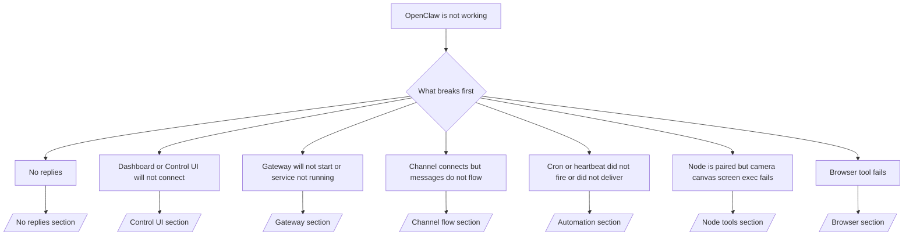

# 故障排除

如果您只有 2 分钟，请将此页面作为分流入口。

## 前 60 秒

按顺序运行以下步骤：

```bash
openclaw status
openclaw status --all
openclaw gateway probe
openclaw gateway status
openclaw doctor
openclaw channels status --probe
openclaw logs --follow
```

良好的输出表现（单行）：

- `openclaw status` → 显示已配置的通道，没有明显的身份验证错误。
- `openclaw status --all` → 完整的报告已存在且可共享。
- `openclaw gateway probe` → 预期的网关目标可访问 (`Reachable: yes`)。`RPC: limited - missing scope: operator.read` 是降级的诊断，而不是连接失败。
- `openclaw gateway status` → `Runtime: running` 和 `RPC probe: ok`。
- `openclaw doctor` → 没有阻止性的配置/服务错误。
- `openclaw channels status --probe` → 可达的网关返回实时的每个账户传输状态以及探测/审计结果，例如 `works` 或 `audit ok`；如果网关不可达，该命令将回退到仅配置摘要。
- `openclaw logs --follow` → 稳定的活动，没有重复的致命错误。

## Anthropic 长上下文 429 错误

如果您看到：
`HTTP 429: rate_limit_error: Extra usage is required for long context requests`,
请转到 [/gateway/故障排除#anthropic-429-extra-usage-required-for-long-context](/en/gateway/troubleshooting#anthropic-429-extra-usage-required-for-long-context)。

## 本地 OpenAI 兼容后端直接有效但在 OpenClaw 中失败

如果您的本地或自托管 `/v1` 后端可以响应小型直接
`/v1/chat/completions` 探测，但在 `openclaw infer model run` 或正常
智能体轮次中失败：

1. 如果错误提到 `messages[].content` 期望字符串，请设置
   `models.providers.<provider>.models[].compat.requiresStringContent: true`。
2. 如果后端仍然仅在 OpenClaw 智能体轮次上失败，请设置
   `models.providers.<provider>.models[].compat.supportsTools: false` 并重试。
3. 如果微小的直接调用仍然有效，但较大的 OpenClaw 提示使后端崩溃，
   请将剩余问题视为上游模型/服务器限制，并
   继续查看深度运行手册：
   [/gateway/故障排除#local-openai-compatible-backend-passes-direct-probes-but-agent-runs-fail](/en/gateway/troubleshooting#local-openai-compatible-backend-passes-direct-probes-but-agent-runs-fail)

## 插件安装因缺少 openclaw 扩展而失败

如果安装因 `package.json missing openclaw.extensions` 而失败，则该插件包
使用的是 OpenClaw 不再接受的旧格式。

在插件包中修复：

1. 将 `openclaw.extensions` 添加到 `package.json`。
2. 将条目指向构建的运行时文件（通常是 `./dist/index.js`）。
3. 重新发布插件并再次运行 `openclaw plugins install <package>`。

示例：

```json
{
  "name": "@openclaw/my-plugin",
  "version": "1.2.3",
  "openclaw": {
    "extensions": ["./dist/index.js"]
  }
}
```

参考：[插件架构](/en/plugins/architecture)

## 决策树



<AccordionGroup>
  <Accordion title="无回复">
    ```bash
    openclaw status
    openclaw gateway status
    openclaw channels status --probe
    openclaw pairing list --channel <channel> [--account <id>]
    openclaw logs --follow
    ```

    良好的输出如下所示：

    - `Runtime: running`
    - `RPC probe: ok`
    - 您的渠道显示传输已连接，并且（在支持的情况下）在 `channels status --probe` 中显示 `works` 或 `audit ok`
    - 发送者显示已批准（或私信策略为开放/允许列表）

    常见日志签名：

    - `drop guild message (mention required` → 提及限制在 Discord 中拦截了消息。
    - `pairing request` → 发送者未获批准，正在等待私信配对批准。
    - 渠道日志中的 `blocked` / `allowlist` → 发送者、房间或组已被过滤。

    深度页面：

    - [/gateway/故障排除#no-replies](/en/gateway/troubleshooting#no-replies)
    - [/channels/故障排除](/en/channels/troubleshooting)
    - [/channels/pairing](/en/channels/pairing)

  </Accordion>

  <Accordion title="Dashboard or Control UI will not connect">
    ```bash
    openclaw status
    openclaw gateway status
    openclaw logs --follow
    openclaw doctor
    openclaw channels status --probe
    ```

    Good output looks like:

    - `Dashboard: http://...` is shown in `openclaw gateway status`
    - `RPC probe: ok`
    - No auth loop in logs

    Common log signatures:

    - `device identity required` → HTTP/non-secure context cannot complete device auth.
    - `origin not allowed` → browser `Origin` is not allowed for the Control UI
      gateway target.
    - `AUTH_TOKEN_MISMATCH` with retry hints (`canRetryWithDeviceToken=true`) → one trusted device-token retry may occur automatically.
    - That cached-token retry reuses the cached scope set stored with the paired
      device token. Explicit `deviceToken` / explicit `scopes` callers keep
      their requested scope set instead.
    - On the async Tailscale Serve Control UI path, failed attempts for the same
      `{scope, ip}` are serialized before the limiter records the failure, so a
      second concurrent bad retry can already show `retry later`.
    - `too many failed authentication attempts (retry later)` from a localhost
      browser origin → repeated failures from that same `Origin` are temporarily
      locked out; another localhost origin uses a separate bucket.
    - repeated `unauthorized` after that retry → wrong token/password, auth mode mismatch, or stale paired device token.
    - `gateway connect failed:` → UI is targeting the wrong URL/port or unreachable gateway.

    Deep pages:

    - [/gateway/故障排除#dashboard-control-ui-connectivity](/en/gateway/troubleshooting#dashboard-control-ui-connectivity)
    - [/web/control-ui](/en/web/control-ui)
    - [/gateway/authentication](/en/gateway/authentication)

  </Accordion>

  <Accordion title="Gateway(网关) will not start or service installed but not running">
    ```bash
    openclaw status
    openclaw gateway status
    openclaw logs --follow
    openclaw doctor
    openclaw channels status --probe
    ```

    Good output looks like:

    - `Service: ... (loaded)`
    - `Runtime: running`
    - `RPC probe: ok`

    Common log signatures:

    - `Gateway start blocked: set gateway.mode=local` or `existing config is missing gateway.mode` → gateway mode is remote, or the config file is missing the local-mode stamp and should be repaired.
    - `refusing to bind gateway ... without auth` → non-loopback bind without a valid gateway auth path (token/password, or trusted-proxy where configured).
    - `another gateway instance is already listening` or `EADDRINUSE` → port already taken.

    Deep pages:

    - [/gateway/故障排除#gateway-service-not-running](/en/gateway/troubleshooting#gateway-service-not-running)
    - [/gateway/background-process](/en/gateway/background-process)
    - [/gateway/configuration](/en/gateway/configuration)

  </Accordion>

  <Accordion title="渠道连接但消息未流动">
    ```bash
    openclaw status
    openclaw gateway status
    openclaw logs --follow
    openclaw doctor
    openclaw channels status --probe
    ```

    Good output looks like:

    - Channel transport is connected.
    - Pairing/allowlist checks pass.
    - Mentions are detected where required.

    Common log signatures:

    - `mention required` → group mention gating blocked processing.
    - `pairing` / `pending` → 私信 sender is not approved yet.
    - `not_in_channel`, `missing_scope`, `Forbidden`, `401/403` → 渠道 permission token issue.

    Deep pages:

    - [/gateway/故障排除#渠道-connected-messages-not-flowing](/en/gateway/troubleshooting#channel-connected-messages-not-flowing)
    - [/channels/故障排除](/en/channels/troubleshooting)

  </Accordion>

  <Accordion title="Cron 或心跳未触发或未送达">
    ```bash
    openclaw status
    openclaw gateway status
    openclaw cron status
    openclaw cron list
    openclaw cron runs --id <jobId> --limit 20
    openclaw logs --follow
    ```

    良好的输出如下所示：

    - `cron.status` 显示已启用并带有下次唤醒时间。
    - `cron runs` 显示最近的 `ok` 条目。
    - 心跳已启用且未处于活动时间之外。

    常见日志特征：

- `cron: scheduler disabled; jobs will not run automatically` → cron 已禁用。
- `heartbeat skipped` 且带有 `reason=quiet-hours` → 超出配置的活动时间。
- `heartbeat skipped` 且带有 `reason=empty-heartbeat-file` → `HEARTBEAT.md` 存在，但仅包含空白/仅表头的脚手架。
- `heartbeat skipped` 且带有 `reason=no-tasks-due` → `HEARTBEAT.md` 任务模式处于活动状态，但尚未达到任何任务间隔。
- `heartbeat skipped` 且带有 `reason=alerts-disabled` → 所有心跳可见性均已禁用（`showOk`、`showAlerts` 和 `useIndicator` 均关闭）。
- `requests-in-flight` → 主通道忙碌；心跳唤醒已推迟。- `unknown accountId` → 心跳送达目标账户不存在。

      深入页面：

      - [/gateway/故障排除#cron-and-heartbeat-delivery](/en/gateway/troubleshooting#cron-and-heartbeat-delivery)
      - [/automation/cron-jobs#故障排除](/en/automation/cron-jobs#troubleshooting)
      - [/gateway/heartbeat](/en/gateway/heartbeat)

    </Accordion>

    <Accordion title="Node is paired but 工具 fails camera canvas screen exec">
    ```bash
    openclaw status
    openclaw gateway status
    openclaw nodes status
    openclaw nodes describe --node <idOrNameOrIp>
    openclaw logs --follow
    ```

      良好的输出如下所示：

      - 节点被列为已连接并已配对角色 `node`。
      - 您调用的命令存在 Capability。
      - 已授予该工具的权限状态。

      常见日志特征：

      - `NODE_BACKGROUND_UNAVAILABLE` → 将节点应用置于前台。
      - `*_PERMISSION_REQUIRED` → 操作系统权限被拒绝或缺失。
      - `SYSTEM_RUN_DENIED: approval required` → exec 审批待处理。
      - `SYSTEM_RUN_DENIED: allowlist miss` → 命令不在 exec 允许列表中。

      深度页面：

      - [/gateway/故障排除#node-paired-工具-fails](/en/gateway/troubleshooting#node-paired-tool-fails)
      - [/nodes/故障排除](/en/nodes/troubleshooting)
      - [/tools/exec-approvals](/en/tools/exec-approvals)

    </Accordion>

    <Accordion title="Exec 突然请求审批">
    ```bash
    openclaw config get tools.exec.host
    openclaw config get tools.exec.security
    openclaw config get tools.exec.ask
    openclaw gateway restart
    ```

      变更内容：

      - 如果未设置 `tools.exec.host`，默认值为 `auto`。
      - 当沙盒运行时处于活动状态时，`host=auto` 解析为 `sandbox`，否则为 `gateway`。
      - `host=auto` 仅用于路由；无提示的“YOLO”行为来自 `security=full` 加上网关/节点上的 `ask=off`。
      - 在 `gateway` 和 `node` 上，未设置的 `tools.exec.security` 默认为 `full`。
      - 未设置的 `tools.exec.ask` 默认为 `off`。
      - 结果：如果您看到审批请求，说明某些主机本地或每个会话的策略将执行限制得比当前默认值更严格。

      恢复当前默认的无审批行为：

      ```bash
      openclaw config set tools.exec.host gateway
      openclaw config set tools.exec.security full
      openclaw config set tools.exec.ask off
      openclaw gateway restart
      ```

      更安全的替代方案：

      - 如果您只想要稳定的主机路由，请仅设置 `tools.exec.host=gateway`。
      - 如果您想要主机执行但仍希望在允许列表未命中时进行审查，请将 `security=allowlist` 与 `ask=on-miss` 一起使用。
      - 如果您希望 `host=auto` 解析回 `sandbox`，请启用沙盒模式。

      常见日志特征：

      - `Approval required.` → 命令正在等待 `/approve ...`。
      - `SYSTEM_RUN_DENIED: approval required` → 节点主机执行审批待定。
      - `exec host=sandbox requires a sandbox runtime for this session` → 隐式/显式沙盒选择，但沙盒模式已关闭。

      深度页面：

      - [/tools/exec](/en/tools/exec)
      - [/tools/exec-approvals](/en/tools/exec-approvals)
      - [/gateway/security#runtime-expectation-drift](/en/gateway/security#runtime-expectation-drift)

    </Accordion>

    <Accordion title="Browser 工具 fails">
    ```bash
    openclaw status
    openclaw gateway status
    openclaw browser status
    openclaw logs --follow
    openclaw doctor
    ```

      良好的输出如下所示：

      - 浏览器状态显示 `running: true` 以及所选的浏览器/配置文件。
      - `openclaw` 已启动，或者 `user` 可以看到本地 Chrome 标签页。

      常见日志特征：

      - `unknown command "browser"` 或 `unknown command 'browser'` → `plugins.allow` 已设置且不包含 `browser`。
      - `Failed to start Chrome CDP on port` → 本地浏览器启动失败。
      - `browser.executablePath not found` → 配置的二进制路径错误。
      - `browser.cdpUrl must be http(s) or ws(s)` → 配置的 CDP URL 使用了不支持的协议。
      - `browser.cdpUrl has invalid port` → 配置的 CDP URL 端口错误或超出范围。
      - `No Chrome tabs found for profile="user"` → Chrome MCP 附加配置文件没有打开的本地 Chrome 标签页。
      - `Remote CDP for profile "<name>" is not reachable` → 此主机无法访问配置的远程 CDP 端点。
      - `Browser attachOnly is enabled ... not reachable` 或 `Browser attachOnly is enabled and CDP websocket ... is not reachable` → 仅附加配置文件没有活动的 CDP 目标。
      - 仅附加或远程 CDP 配置文件上的视口/暗黑模式/区域设置/离线覆盖过期 → 运行 `openclaw browser stop --browser-profile <name>` 以关闭活动控制会话并释放模拟状态，而无需重启网关。

      深度页面：

      - [/gateway/故障排除#browser-工具-fails](/en/gateway/troubleshooting#browser-tool-fails)
      - [/tools/browser#missing-browser-command-or-工具](/en/tools/browser#missing-browser-command-or-tool)
      - [/tools/browser-linux-故障排除](/en/tools/browser-linux-troubleshooting)
      - [/tools/browser-wsl2-windows-remote-cdp-故障排除](/en/tools/browser-wsl2-windows-remote-cdp-troubleshooting)

    </Accordion>
</AccordionGroup>

## 相关

- [常见问题](/en/help/faq) — 经常被问到的问题
- [Gateway(网关) 故障排除](/en/gateway/troubleshooting) — Gateway(网关) 特定的问题
- [Doctor](/en/gateway/doctor) — 自动化的健康检查和修复
- [渠道 故障排除](/en/channels/troubleshooting) — 渠道 连接问题
- [自动化 故障排除](/en/automation/cron-jobs#troubleshooting) — cron 和心跳 问题
