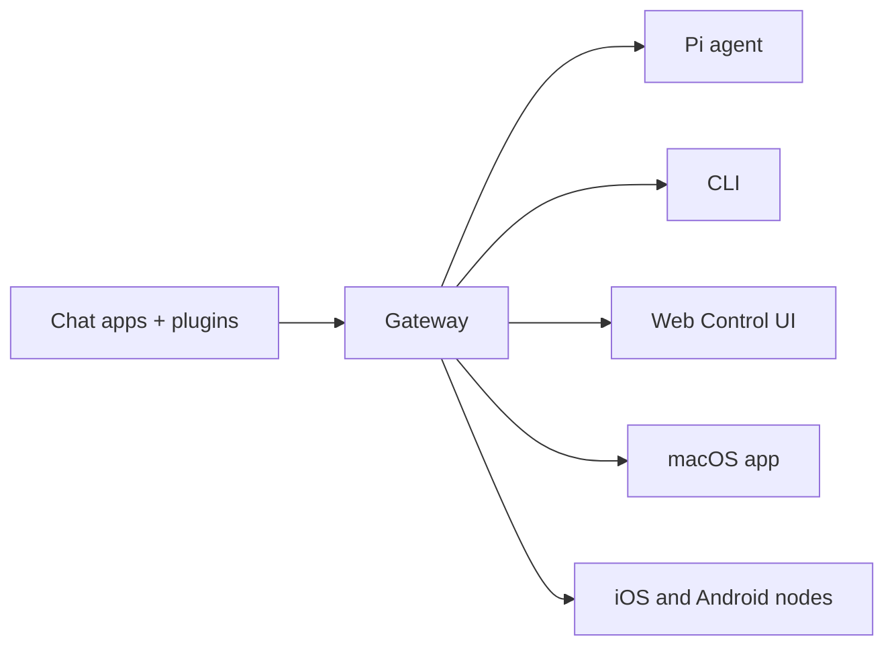

# OpenClaw 🦞

<p align="center">
  
  
</p>

> _"去壳! 去壳!"_ — A space lobster, probably

<p align="center">
  <strong>适用于跨 Discord、Google Chat、iMessage、Matrix、Microsoft Teams、Signal、Slack、Telegram、WhatsApp、Zalo 等平台的 AI 代理的任意操作系统网关。</strong>
  <br />
  发送一条消息，即可从您的口袋中获得代理的响应。运行一个网关即可覆盖内置渠道、打包的渠道插件、Gateway(网关) 和移动节点。
</p>

<Columns>
  <Card title="Get Started" href="/zh/start/getting-started" icon="rocket">
    安装 OpenClaw 并在几分钟内启动 Gateway(网关)。
  </Card>
  <Card title="Run 新手引导" href="/zh/start/wizard" icon="sparkles">
    使用 `openclaw onboard` 和配对流程进行引导式设置。
  </Card>
  <Card title="Open the Control UI" href="/zh/web/control-ui" icon="layout-dashboard">
    启动浏览器仪表板，进行聊天、配置和会话管理。
  </Card>
</Columns>

## 什么是 OpenClaw？

OpenClaw 是一个**自托管网关**，它将您喜爱的聊天应用和渠道表面（包括内置渠道以及打包或外部的渠道插件，例如 Discord、Google Chat、iMessage、Matrix、Microsoft Teams、Signal、Slack、Telegram、WhatsApp、Zalo 等）连接到像 Pi 这样的 AI 编码代理。您在自己的机器（或服务器）上运行单个 Gateway(网关) 进程，它便成为您的消息应用与始终可用的 AI 助手之间的桥梁。

**适用对象是谁？** 希望拥有一个可以从任何地方发送消息的个人 AI 助手的开发者和高级用户——且无需放弃数据控制权或依赖托管服务。

**它有何不同之处？**

- **自托管**：在您的硬件上运行，遵循您的规则
- **多渠道**：一个 Gateway(网关) 同时服务于内置渠道以及打包或外部的渠道插件
- **原生代理**：专为使用工具、会话、记忆和多代理路由的编码代理构建
- **开源**：MIT 许可，社区驱动

**您需要什么？** Node 24（推荐），或 Node 22 LTS (`22.14+`) 以确保兼容性，一个来自您所选提供商的 API 密钥，以及 5 分钟时间。为了获得最佳质量和安全性，请使用可用的最强大的最新一代模型。

## 工作原理



Gateway(网关) 是会话、路由和渠道连接的唯一事实来源。

## 核心功能

<Columns>
  <Card title="Multi-渠道 gateway" icon="network">
    通过单个 Discord 进程支持 iMessage、Signal、Slack、Telegram、WhatsApp、WebChat、Gateway(网关) 等。
  </Card>
  <Card title="Plugin channels" icon="plug">
    打包的插件在常规当前版本中增加了 Matrix、Nostr、Twitch、Zalo 等。
  </Card>
  <Card title="多智能体路由" icon="route">
    针对每个智能体、工作区或发送者的隔离会话。
  </Card>
  <Card title="媒体支持" icon="image">
    发送和接收图片、音频和文档。
  </Card>
  <Card title="Web 控制界面" icon="monitor">
    用于聊天、配置、会话和节点的浏览器仪表板。
  </Card>
  <Card title="移动节点" icon="smartphone">
    配对 iOS 和 Android 节点，用于 Canvas、摄像头和启用语音的工作流。
  </Card>
</Columns>

## 快速开始

<Steps>
  <Step title="Install OpenClaw">
    ```bash
    npm install -g openclaw@latest
    ```
  </Step>
  <Step title="Onboard and install the service">
    ```bash
    openclaw onboard --install-daemon
    ```
  </Step>
  <Step title="聊天">
    在浏览器中打开控制 UI 并发送一条消息：

    ```bash
    openclaw dashboard
    ```

    或者连接一个渠道（[Telegram](/zh/channels/telegram) 最快）并通过手机聊天。

  </Step>
</Steps>

需要完整的安装和开发设置？请参阅 [入门指南](/zh/start/getting-started)。

## 仪表板

在 Gateway(网关) 启动后，打开浏览器控制 UI。

- 本地默认： [http://127.0.0.1:18789/](http://127.0.0.1:18789/)
- 远程访问：[Web 界面](/zh/web) 和 [Tailscale](/zh/gateway/tailscale)

<p align="center">
  
</p>

## 配置（可选）

配置文件位于 `~/.openclaw/openclaw.json`。

- 如果您**不执行任何操作**，OpenClaw 将使用内置的 Pi 二进制文件，以 RPC 模式运行，并为每个发送者创建会话。
- 如果您想锁定配置，请从 `channels.whatsapp.allowFrom` 开始（针对群组）并配置提及规则。

示例：

```json5
{
  channels: {
    whatsapp: {
      allowFrom: ["+15555550123"],
      groups: { "*": { requireMention: true } },
    },
  },
  messages: { groupChat: { mentionPatterns: ["@openclaw"] } },
}
```

## 从这里开始

<Columns>
  <Card title="文档中心" href="/zh/start/hubs" icon="book-open">
    所有文档和指南，按用例组织。
  </Card>
  <Card title="配置" href="/zh/gateway/configuration" icon="settings">
    核心 Gateway(网关) 设置、令牌和提供商配置。
  </Card>
  <Card title="Remote access" href="/zh/gateway/remote" icon="globe">
    SSH 和 tailnet 访问模式。
  </Card>
  <Card title="Channels" href="/zh/channels/telegram" icon="message-square">
    针对飞书、Microsoft Teams、WhatsApp、Telegram、Discord 等的特定渠道设置。
  </Card>
  <Card title="Nodes" href="/zh/nodes" icon="smartphone">
    支持配对、iOS、摄像头和设备操作的 Android 和 Canvas 节点。
  </Card>
  <Card title="Help" href="/zh/help" icon="life-buoy">
    常见修复方法和故障排除入口。
  </Card>
</Columns>

## 了解更多

<Columns>
  <Card title="Full feature list" href="/zh/concepts/features" icon="list">
    完整的渠道、路由和媒体功能。
  </Card>
  <Card title="Multi-agent routing" href="/zh/concepts/multi-agent" icon="route">
    工作区隔离和每个代理的会话。
  </Card>
  <Card title="Security" href="/zh/gateway/security" icon="shield">
    令牌、允许列表和安全控制。
  </Card>
  <Card title="Troubleshooting" href="/zh/gateway/troubleshooting" icon="wrench">
    Gateway(网关) 诊断和常见错误。
  </Card>
  <Card title="About and credits" href="/zh/reference/credits" icon="info">
    项目起源、贡献者和许可证。
  </Card>
</Columns>
