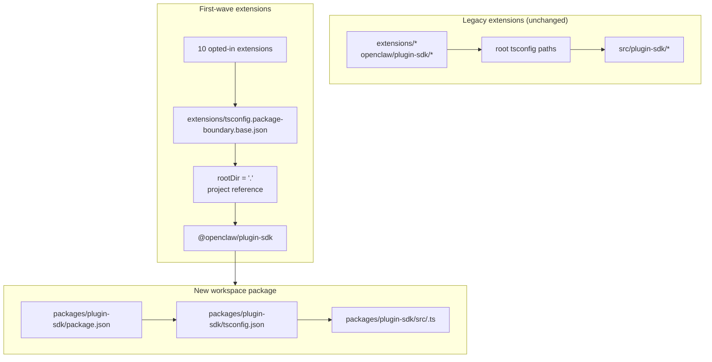

# refactor: 逐步将 plugin-sdk 设为真正的 workspace 包

## 概述

本计划在 `packages/plugin-sdk` 处引入了一个真正的 plugin SDK workspace 包，并使用它让一小波首批扩展选择加入编译器强制的包边界。目标是使非法的相对导入在正常的 `tsc` 下失败，适用于一组选定的捆绑提供商扩展，而无需强制进行仓库范围的迁移或产生巨大的合并冲突面。

关键的增量措施是暂时并行运行两种模式：

| 模式         | 导入形态                 | 使用者                     | 强制执行                    |
| ------------ | ------------------------ | -------------------------- | --------------------------- |
| 传统模式     | `openclaw/plugin-sdk/*`  | 所有现有的未选择加入的扩展 | 保持当前的宽松行为          |
| 选择加入模式 | `@openclaw/plugin-sdk/*` | 仅限首批扩展               | 包本地 `rootDir` + 项目引用 |

## 问题框架

当前的仓库导出了一个巨大的公共插件 SDK 表面，但它不是一个真正的 workspace 包。相反：

- 根 `tsconfig.json` 将 `openclaw/plugin-sdk/*` 直接映射到
  `src/plugin-sdk/*.ts`
- 未选择加入先前实验的扩展仍然共享
  该全局源别名行为
- 仅当允许的 SDK 导入停止解析为原始
  仓库源时，添加 `rootDir` 才有效

这意味着仓库可以描述所需的边界策略，但 TypeScript 并未为大多数扩展清晰地执行该策略。

你需要一条增量路径，以便：

- 使 `plugin-sdk` 成为现实
- 将 SDK 向名为 `@openclaw/plugin-sdk` 的 workspace 包推进
- 在第一个 PR 中仅更改大约 10 个扩展
- 将其余扩展树保留在旧方案上，直到后续清理
- 避免将 `tsconfig.plugin-sdk.dts.json` + postinstall 生成的声明
  工作流作为首批推广的主要机制

## 需求追溯

- R1. 在 `packages/` 下为 plugin SDK 创建一个真正的 workspace 包。
- R2. 将新包命名为 `@openclaw/plugin-sdk`。
- R3. 为新的 SDK 包提供其自己的 `package.json` 和 `tsconfig.json`。
- R4. 在迁移窗口期内，保持旧的 `openclaw/plugin-sdk/*` 导入对未选择加入的扩展可用。
- R5. 在第一个 PR 中仅选择加入一小批首批扩展。
- R6. 对于离开其包根目录的相对导入，首批扩展必须以失败关闭（fail closed）。
- R7. 首批扩展必须通过包依赖项和 TS 项目引用来使用 SDK，而不是通过根 `paths` 别名。
- R8. 该计划必须避免为了编辑器正确性而在整个代码仓库中进行强制性的安装后生成步骤。
- R9. 首批推广必须作为一个中等规模的 PR 进行审查和合并，而不是整个代码仓库 300+ 个文件的重构。

## 范围边界

- 在第一个 PR 中不包含所有打包扩展的完全迁移。
- 不要求在第一个 PR 中删除 `src/plugin-sdk`。
- 不要求立即重新连接每个根构建或测试路径以使用新包。
- 不尝试为每个未选择加入的扩展强制显示 VS Code 波浪线。
- 不对扩展树的其余部分进行广泛的 lint 清理。
- 除了针对已选择加入扩展的导入解析、包所有权和边界执行之外，没有大的运行时行为更改。

## 背景与研究

### 相关代码和模式

- `pnpm-workspace.yaml` 已经包括 `packages/*` 和 `extensions/*`，因此 `packages/plugin-sdk` 下的新工作区包符合现有的代码仓库布局。
- 现有的工作区包，例如 `packages/memory-host-sdk/package.json` 和 `packages/plugin-package-contract/package.json`，已经使用基于 `src/*.ts` 的包本地 `exports` 映射。
- 根 `package.json` 目前通过 `./plugin-sdk` 和 `./plugin-sdk/*` 导出发布 SDK 表面，其后端支持为 `dist/plugin-sdk/*.js` 和 `dist/plugin-sdk/*.d.ts`。
- `src/plugin-sdk/entrypoints.ts` 和 `scripts/lib/plugin-sdk-entrypoints.json` 已经作为 SDK 表面的规范入口点清单。
- 根 `tsconfig.json` 目前映射：
  - `openclaw/plugin-sdk` -> `src/plugin-sdk/index.ts`
  - `openclaw/plugin-sdk/*` -> `src/plugin-sdk/*.ts`
- 先前的边界实验表明，只有当允许的 SDK 导入停止解析到扩展包之外的原始源代码后，包本地 `rootDir` 才能用于非法的相对导入。

### 第一波扩展集

本计划假设第一波是以提供商为主的集合，最不可能引入复杂的渠道运行时边缘情况：

- `extensions/anthropic`
- `extensions/exa`
- `extensions/firecrawl`
- `extensions/groq`
- `extensions/mistral`
- `extensions/openai`
- `extensions/perplexity`
- `extensions/tavily`
- `extensions/together`
- `extensions/xai`

### 第一波 SDK 表面清单

第一波扩展目前导入了一个可控的 SDK 子路径子集。初始的 `@openclaw/plugin-sdk` 包只需要涵盖这些：

- `agent-runtime`
- `cli-runtime`
- `config-runtime`
- `core`
- `image-generation`
- `media-runtime`
- `media-understanding`
- `plugin-entry`
- `plugin-runtime`
- `provider-auth`
- `provider-auth-api-key`
- `provider-auth-login`
- `provider-auth-runtime`
- `provider-catalog-shared`
- `provider-entry`
- `provider-http`
- `provider-model-shared`
- `provider-onboard`
- `provider-stream-family`
- `provider-stream-shared`
- `provider-tools`
- `provider-usage`
- `provider-web-fetch`
- `provider-web-search`
- `realtime-transcription`
- `realtime-voice`
- `runtime-env`
- `secret-input`
- `security-runtime`
- `speech`
- `testing`

### 经验教训

- 此工作树中不存在相关的 `docs/solutions/` 条目。

### 外部参考

- 此计划无需进行外部研究。代码仓库中已包含相关的工作区包和 SDK 导出模式。

## 关键技术决策

- 引入 `@openclaw/plugin-sdk` 作为新的工作区包，同时在迁移期间保持旧版根 `openclaw/plugin-sdk/*` 接口有效。理由：这允许第一波扩展集迁移到真正的包解析，而无需强制每个扩展和每个根构建路径立即更改。

- 使用专门的选入边界基础配置（如 `extensions/tsconfig.package-boundary.base.json`），而不是为所有人替换现有的扩展基础。理由：在迁移期间，代码仓库需要同时支持旧版和选入扩展模式。

- 从第一波扩展到 `packages/plugin-sdk/tsconfig.json` 使用 TS 项目引用，并为选入边界模式设置 `disableSourceOfProjectReferenceRedirect`。理由：这为 `tsc` 提供了真正的包图，同时不鼓励编辑器和编译器回退到原始源码遍历。

- 在第一波中将 `@openclaw/plugin-sdk` 保持为私有。理由：直接目标是内部边界强制和迁移安全，而不是在接口稳定之前发布第二个外部 SDK 契约。

- 在第一个实现切片中仅移动第一波 SDK 子路径，并为其余部分保留兼容性桥接。理由：在一个 PR 中物理移动所有 315 个 `src/plugin-sdk/*.ts` 文件，正是本计划试图避免的合并冲突面。

- 不依赖 `scripts/postinstall-bundled-plugins.mjs` 为第一波构建 SDK 声明。理由：显式的构建/引用流程更易于推理，并保持代码仓库行为更具可预测性。

## 未解决的问题

### 规划期间已解决

- 第一波应该包含哪些扩展？使用上面列出的 10 个提供商/网络搜索扩展，因为它们比较重的渠道包在结构上更加独立。

- 第一个 PR 应该替换整个扩展树吗？不。第一个 PR 应该并行支持两种模式，并且仅选入第一波。

- 第一波是否需要 postinstall 声明构建？不。包/引用图应该是显式的，并且 CI 应该有意运行相关的包本地类型检查。

### 推迟到实施阶段

- 第一批次的包能否仅通过项目引用直接指向包本地的 `src/*.ts`，
  还是仍需要 `@openclaw/plugin-sdk` 包执行小型的声明生成步骤。
  这是一个由实施方负责的 TS 图验证问题。

- 根 `openclaw` 包是应立即将第一批次 SDK 子路径代理到
  `packages/plugin-sdk` 的输出，还是继续在 `src/plugin-sdk` 下使用生成的
  兼容性垫片（shims）。
  这是一个兼容性和构建形态细节，取决于保持 CI 绿色的最小实施路径。

## 高层技术设计

> 这说明了预期的方法，并为审查提供方向性指导，而非实施规范。实施代理应将其视为上下文，而非要复现的代码。

## 实施单元

- [ ] **单元 1：引入真正的 `@openclaw/plugin-sdk` 工作区包**

**目标：** 为 SDK 创建一个真正的工作区包，使其能够拥有
第一批次子路径表面，而无需强制进行全仓库迁移。

**需求：** R1, R2, R3, R8, R9

**依赖项：** 无

**文件：**

- 创建： `packages/plugin-sdk/package.json`
- 创建： `packages/plugin-sdk/tsconfig.json`
- 创建： `packages/plugin-sdk/src/index.ts`
- 为第一批次 SDK 子路径创建： `packages/plugin-sdk/src/*.ts`
- 修改： `pnpm-workspace.yaml`（仅在需要调整 package-glob 时）
- 修改： `package.json`
- 修改： `src/plugin-sdk/entrypoints.ts`
- 修改： `scripts/lib/plugin-sdk-entrypoints.json`
- 测试： `src/plugins/contracts/plugin-sdk-workspace-package.contract.test.ts`

**方法：**

- 添加一个名为 `@openclaw/plugin-sdk` 的新工作区包。
- 仅从第一批次 SDK 子路径开始，而不是整个 315 个文件的树。
- 如果直接移动第一批次入口点会产生过大的差异，
  第一个 PR 可以先在 `packages/plugin-sdk/src` 中引入该子路径作为精简的
  包包装器，然后在针对该子路径集群的后续 PR 中将事实来源
  翻转至该包。
- 重用现有的入口点清单机制，以便在一个规范位置声明第一批次包表面。
- 在 workspace 包成为新的 opt-in 契约的同时，保留根包的导出以供旧版用户使用。

**遵循的模式：**

- `packages/memory-host-sdk/package.json`
- `packages/plugin-package-contract/package.json`
- `src/plugin-sdk/entrypoints.ts`

**测试场景：**

- 快乐路径（Happy path）：workspace 包导出计划中列出的每个首批子路径，且没有遗漏必需的首批导出。
- 边缘情况：当重新生成或对照规范清单比较首批条目列表时，包导出元数据保持稳定。
- 集成：引入新的 workspace 包后，根包的旧版 SDK 导出仍然存在。

**验证：**

- 仓库包含一个有效的 `@openclaw/plugin-sdk` workspace 包，具有稳定的首批导出映射，且根 `package.json` 中没有旧版导出回归。

- [ ] **单元 2：为包强制执行的扩展添加 opt-in TS 边界模式**

**目标：** 定义 opt-in 扩展将使用的 TS 配置模式，同时保持其他所有人的现有扩展 TS 行为不变。

**需求：** R4, R6, R7, R8, R9

**依赖项：** 单元 1

**文件：**

- 创建： `extensions/tsconfig.package-boundary.base.json`
- 创建： `tsconfig.boundary-optin.json`
- 修改： `extensions/xai/tsconfig.json`
- 修改： `extensions/openai/tsconfig.json`
- 修改： `extensions/anthropic/tsconfig.json`
- 修改： `extensions/mistral/tsconfig.json`
- 修改： `extensions/groq/tsconfig.json`
- 修改： `extensions/together/tsconfig.json`
- 修改： `extensions/perplexity/tsconfig.json`
- 修改： `extensions/tavily/tsconfig.json`
- 修改： `extensions/exa/tsconfig.json`
- 修改： `extensions/firecrawl/tsconfig.json`
- 测试： `src/plugins/contracts/extension-package-project-boundaries.test.ts`
- 测试： `test/extension-package-tsc-boundary.test.ts`

**方法：**

- 保留 `extensions/tsconfig.base.json` 供旧版扩展使用。
- 添加一个新的 opt-in 基础配置，该配置：
  - 设置 `rootDir: "."`
  - 引用 `packages/plugin-sdk`
  - 启用 `composite`
  - 在需要时禁用项目引用源重定向
- 为首批类型检查图添加专用的解决方案配置，而不是在同一 PR 中重塑根仓库 TS 项目。

**执行说明：** 在将模式应用于所有 10 个之前，先对一个选择加入的扩展进行失败的包本地金丝雀类型检查。

**遵循的模式：**

- 先前边界工作中现有的包本地扩展 `tsconfig.json` 模式
- 来自 `packages/memory-host-sdk` 的工作区包模式

**测试场景：**

- 正常路径：每个选择加入的扩展都通过包边界 TS 配置成功进行类型检查。
- 错误路径：对于选择加入的扩展，来自 `../../src/cli/acp-cli.ts` 的金丝雀相对导入失败并显示 `TS6059`。
- 集成：未选择加入的扩展保持不变，不需要参与新的解决方案配置。

**验证：**

- 为 10 个选择加入的扩展提供了一个专门的类型检查图，并且其中之一的错误相对导入会通过正常的 `tsc` 失败。

- [ ] **单元 3：将第一波扩展迁移到 `@openclaw/plugin-sdk`**

**目标：** 更改第一波扩展，通过依赖元数据、项目引用和包名导入来使用真实的 SDK 包。

**需求：** R5, R6, R7, R9

**依赖：** 单元 2

**文件：**

- 修改： `extensions/anthropic/package.json`
- 修改： `extensions/exa/package.json`
- 修改： `extensions/firecrawl/package.json`
- 修改： `extensions/groq/package.json`
- 修改： `extensions/mistral/package.json`
- 修改： `extensions/openai/package.json`
- 修改： `extensions/perplexity/package.json`
- 修改： `extensions/tavily/package.json`
- 修改： `extensions/together/package.json`
- 修改： `extensions/xai/package.json`
- 修改：10 个扩展根目录下当前引用 `openclaw/plugin-sdk/*` 的生产和测试导入

**方法：**

- 将 `@openclaw/plugin-sdk: workspace:*` 添加到第一波扩展的 `devDependencies` 中。
- 将这些包中的 `openclaw/plugin-sdk/*` 导入替换为 `@openclaw/plugin-sdk/*`。
- 将本地扩展内部导入保留在本地桶文件中，例如 `./api.ts` 和 `./runtime-api.ts`。
- 在此 PR 中不要更改未选择加入的扩展。

**遵循的模式：**

- 现有的扩展本地导入桶文件 (`api.ts`, `runtime-api.ts`)
- 其他 `@openclaw/*` 工作区包使用的包依赖形态

**测试场景：**

- 正常路径：在导入重写后，每个已迁移的扩展仍能通过其现有的插件测试注册/加载。
- 边缘情况：已选入的扩展集中，仅限测试使用的 SDK 导入仍能通过新包正确解析。
- 集成：已迁移的扩展不需要根 `openclaw/plugin-sdk/*` 别名即可进行类型检查。

**验证：**

- 首批扩展能够针对 `@openclaw/plugin-sdk` 进行构建和测试，而无需遗留的根 SDK 别名路径。

- [ ] **单元 4：在迁移部分期间保持遗留兼容性**

**目标：** 在迁移期间 SDK 同时以遗留形式和新包形式存在时，保持仓库其余部分的正常工作。

**需求：** R4, R8, R9

**依赖项：** 单元 1-3

**文件：**

- 修改：`src/plugin-sdk/*.ts` 以根据需要添加首批兼容性垫片
- 修改：`package.json`
- 修改：组装 SDK 构件的构建或导出管道
- 测试：`src/plugins/contracts/plugin-sdk-runtime-api-guardrails.test.ts`
- 测试：`src/plugins/contracts/plugin-sdk-index.bundle.test.ts`

**方法：**

- 保留根 `openclaw/plugin-sdk/*` 作为遗留扩展以及尚未迁移的外部消费者的兼容性接口。
- 对于已移至 `packages/plugin-sdk` 的首批子路径，使用生成的垫片或根导出代理布线。
- 在此阶段不要尝试弃用根 SDK 接口。

**遵循的模式：**

- 通过 `src/plugin-sdk/entrypoints.ts` 生成现有的根 SDK 导出
- 根 `package.json` 中现有的包导出兼容性

**测试场景：**

- 正常路径：在存在新包后，遗留根 SDK 导入对于未选入的扩展仍然可以解析。
- 边缘情况：在迁移窗口期间，首批子路径可以通过遗留根接口和新包接口正常工作。
- 集成：plugin-sdk 索引/包合约测试继续看到一致的公共接口。

**验证：**

- 该代码库同时支持旧版和选择加入的 SDK 使用模式，而不会破坏未更改的扩展。

- [ ] **单元 5：添加范围强制执行并记录迁移约定**

**目标：** 落地 CI 和贡献者指南，针对第一波扩展强制执行新行为，而无需假装整个扩展树已迁移。

**需求：** R5, R6, R8, R9

**依赖项：** 单元 1-4

**文件：**

- 修改： `package.json`
- 修改：应运行选择加入边界类型检查的 CI 工作流文件
- 修改： `AGENTS.md`
- 修改： `docs/plugins/sdk-overview.md`
- 修改： `docs/plugins/sdk-entrypoints.md`
- 修改： `docs/plans/2026-04-05-001-refactor-extension-package-resolution-boundary-plan.md`

**方法：**"

- 添加一个显式的第一波关卡，例如为 `packages/plugin-sdk` 加上 10 个选择加入的扩展运行专用的 `tsc -b` 解决方案。
- 记录该代码库现在同时支持旧版和选择加入的扩展模式，并且新的扩展边界工作应优先采用新的包路由。
- 记录下一波迁移规则，以便后续 PR 可以添加更多扩展，而无需重新争论架构。

**遵循的模式：**

- `src/plugins/contracts/` 下的现有契约测试
- 解释分阶段迁移的现有文档更新

**测试场景：**

- 快乐路径：新的第一波类型检查关卡对于工作区包和选择加入的扩展均通过。
- 错误路径：在选择加入的扩展中引入新的非法相对导入会导致范围类型检查关卡失败。
- 集成：CI 尚不要求未选择加入的扩展满足新的包边界模式。

**验证：**

- 第一波强制执行路径已记录、经过测试且可运行，而无需强制整个扩展树进行迁移。

## 全系统影响

- **交互图：** 此工作涉及 SDK 事实来源、根包导出、扩展包元数据、 TS 图布局和 CI 验证。
- **错误传播：** 主要预期的失败模式变为选择加入的扩展中的编译时 TS 错误 (`TS6059`)，而不是仅限自定义脚本的失败。
- **状态生命周期风险：** 双重迁移在根兼容性导出和新的工作空间包之间引入了漂移风险。
- **API 表面对等性：** 在迁移期间，首批子路径必须通过 `openclaw/plugin-sdk/*` 和 `@openclaw/plugin-sdk/*` 保持语义一致。
- **集成覆盖：** 仅进行单元测试是不够的；需要作用域包图类型检查来证明边界。
- **不变性：** 未选择加入的扩展在 PR 1 中保持其当前行为。本计划不声称实施仓库范围的导入边界强制。

## 风险与依赖

| 风险                                                 | 缓解措施                                                                     |
| ---------------------------------------------------- | ---------------------------------------------------------------------------- |
| 首批包仍然解析回原始源，`rootDir` 实际上并未严格失败 | 在扩展到完整集合之前，将第一个实施步骤设为一个已选择加入扩展的包引用金丝雀   |
| 一次移动过多的 SDK 源会重新产生最初的合并冲突问题    | 在第一个 PR 中仅移动首批子路径并保留根兼容性桥接                             |
| 旧版和新版 SDK 表面在语义上发生漂移                  | 保留单一入口清单，添加兼容性契约测试，并明确双重表面对等性                   |
| 根仓库构建/测试路径意外地开始以不受控的方式依赖新包  | 使用专用的选择加入解决方案配置，并将根范围的 TS 拓扑更改排除在第一个 PR 之外 |

## 分阶段交付

### 阶段 1

- 引入 `@openclaw/plugin-sdk`
- 定义首批子路径表面
- 证明一个已选择加入的扩展可以通过 `rootDir` 严格失败

### 阶段 2

- 选择加入 10 个首批扩展
- 为其他所有人保留根兼容性

### 阶段 3

- 在后续 PR 中添加更多扩展
- 将更多 SDK 子路径移动到工作空间包中
- 仅在旧版扩展集消失后才弃用根兼容性

## 文档 / 操作说明

- 第一个 PR 应明确将自身描述为双重模式迁移，而非仓库范围的强制完成。
- 迁移指南应使后续 PR 能够通过遵循相同的包/依赖/引用模式轻松添加更多扩展。

## 来源与参考

- 先前计划：`docs/plans/2026-04-05-001-refactor-extension-package-resolution-boundary-plan.md`
- 工作空间配置：`pnpm-workspace.yaml`
- 现有 SDK 入口点清单：`src/plugin-sdk/entrypoints.ts`
- 现有根 SDK 导出：`package.json`
- 现有工作区包模式：
  - `packages/memory-host-sdk/package.json`
  - `packages/plugin-package-contract/package.json`
