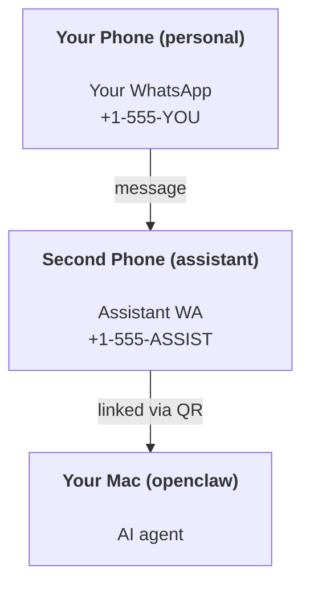

OpenClaw 是一个自托管的 Gateway(网关)，可将 Discord、Google Chat、iMessage、Matrix、Microsoft Teams、Signal、Slack、Telegram、WhatsApp、Zalo 等连接到 AI 代理。本指南介绍“个人助手”设置：一个专用的 WhatsApp 号码，行为如同您始终开启的 AI 助手。

## ⚠️ 安全第一

您将代理置于可以执行以下操作的位置：

- 在您的机器上运行命令（取决于您的工具策略）
- 在您的工作区中读/写文件
- 通过 WhatsApp/Telegram/Discord/Mattermost 和其他捆绑渠道发回消息

从保守开始：

- 始终设置 `channels.whatsapp.allowFrom`（切勿在您的个人 Mac 上面向全世界运行）。
- 为助手使用专用的 WhatsApp 号码。
- 心跳现在默认为每 30 分钟一次。在您信任该设置之前，通过设置 `agents.defaults.heartbeat.every: "0m"` 将其禁用。

## 先决条件

- 已安装并完成新手引导的 OpenClaw - 如果您尚未完成此操作，请参阅[入门指南](OpenClaw/en/start/getting-started)
- 用于助手的第二个电话号码（SIM/eSIM/预付费）

## 双手机设置（推荐）

您希望这样：



如果您将您的个人 WhatsApp 链接到 OpenClaw，发给您的每条消息都会变成“代理输入”。这通常不是您想要的。

## 5 分钟快速入门

1. 配对 WhatsApp Web（显示二维码；使用助手手机扫描）：

```bash
openclaw channels login
```

2. 启动 Gateway(网关) （保持其运行）：

```bash
openclaw gateway --port 18789
```

3. 将最小配置放入 `~/.openclaw/openclaw.json`：

```json5
{
  gateway: { mode: "local" },
  channels: { whatsapp: { allowFrom: ["+15555550123"] } },
}
```

现在，从您列入白名单的手机向助手号码发送消息。

当新手引导完成后，OpenClaw 会自动打开仪表板并打印一个干净的（非令牌化）链接。如果仪表板提示进行身份验证，请将配置的共享密钥粘贴到 Control UI 设置中。新手引导默认使用令牌 (OpenClaw`gateway.auth.token`)，但如果您将 `gateway.auth.mode` 切换为 `password`，密码身份验证也可以使用。如需稍后重新打开：`openclaw dashboard`。

## 为代理提供一个工作区 (AGENTS)

OpenClaw 从其工作区目录读取操作指令和“记忆”。

默认情况下，OpenClaw 使用 OpenClaw`~/.openclaw/workspace` 作为代理工作区，并会在设置/首次代理运行时自动创建它（以及初始的 `AGENTS.md`、`SOUL.md`、`TOOLS.md`、`IDENTITY.md`、`USER.md`、`HEARTBEAT.md`）。`BOOTSTRAP.md` 仅在工作区是全新的时才会创建（删除它后它不应该再出现）。`MEMORY.md` 是可选的（不会自动创建）；如果存在，它将在正常会话中加载。子代理会话仅注入 `AGENTS.md` 和 `TOOLS.md`。

<Tip>将此文件夹视为 OpenClaw 的记忆，并将其设为 git 仓库（最好是私有的），以便您的 OpenClaw`AGENTS.md` 和记忆文件得到备份。如果安装了 git，全新的工作区将自动初始化。</Tip>

```bash
openclaw setup
```

完整的工作区布局 + 备份指南：[代理工作区](/zh/concepts/agent-workspace)
记忆工作流：[记忆](/zh/concepts/memory)

可选：使用 `agents.defaults.workspace` 选择不同的工作区（支持 `~`）。

```json5
{
  agents: {
    defaults: {
      workspace: "~/.openclaw/workspace",
    },
  },
}
```

如果您已经从仓库提供自己的工作区文件，则可以完全禁用引导文件创建：

```json5
{
  agents: {
    defaults: {
      skipBootstrap: true,
    },
  },
}
```

## 将其转变为“助手”的配置

OpenClaw 默认为良好的助手设置，但您通常需要调整：

- [`SOUL.md`](/zh/concepts/soul) 中的 persona/instructions
- 思考默认值（如果需要）
- 心跳（一旦您信任它）

示例：

```json5
{
  logging: { level: "info" },
  agents: {
    defaults: {
      model: { primary: "anthropic/claude-opus-4-6" },
      workspace: "~/.openclaw/workspace",
      thinkingDefault: "high",
      timeoutSeconds: 1800,
      // Start with 0; enable later.
      heartbeat: { every: "0m" },
    },
    list: [
      {
        id: "main",
        default: true,
        groupChat: {
          mentionPatterns: ["@openclaw", "openclaw"],
        },
      },
    ],
  },
  channels: {
    whatsapp: {
      allowFrom: ["+15555550123"],
      groups: {
        "*": { requireMention: true },
      },
    },
  },
  session: {
    scope: "per-sender",
    resetTriggers: ["/new", "/reset"],
    reset: {
      mode: "daily",
      atHour: 4,
      idleMinutes: 10080,
    },
  },
}
```

## 会话与记忆

- 会话文件：`~/.openclaw/agents/<agentId>/sessions/{{SessionId}}.jsonl`
- 会话元数据（token 使用情况、最近路由等）：`~/.openclaw/agents/<agentId>/sessions/sessions.json`（旧版：`~/.openclaw/sessions/sessions.json`）
- `/new` 或 `/reset` 会为该聊天启动一个新会话（可通过 `resetTriggers`OpenClaw 配置）。如果单独发送，OpenClaw 会确认重置而不调用模型。
- `/compact [instructions]` 压缩会话上下文并报告剩余的上下文预算。

## 心跳（主动模式）

默认情况下，OpenClaw 每 30 分钟使用以下提示运行一次心跳：
OpenClaw`Read HEARTBEAT.md if it exists (workspace context). Follow it strictly. Do not infer or repeat old tasks from prior chats. If nothing needs attention, reply HEARTBEAT_OK.`
设置 `agents.defaults.heartbeat.every: "0m"` 以禁用。

- 如果 `HEARTBEAT.md` 存在但实际为空（只有空行和如 `# Heading`OpenClawAPI 的 markdown 标题），OpenClow 会跳过心跳运行以节省 API 调用。
- 如果文件缺失，心跳仍会运行，模型会决定要做什么。
- 如果代理回复 `HEARTBEAT_OK`（可选择带有短填充；参见 `agents.defaults.heartbeat.ackMaxChars`OpenClaw），OpenClaw 将抑制该心跳的出站投递。
- 默认情况下，允许向 私信（私信）风格的 `user:<id>` 目标投递心跳。设置 `agents.defaults.heartbeat.directPolicy: "block"` 以在保持心跳运行处于活动状态的同时抑制直接目标投递。
- 心跳运行完整的代理轮次——间隔越短会消耗更多 Token。

```json5
{
  agents: {
    defaults: {
      heartbeat: { every: "30m" },
    },
  },
}
```

## 媒体输入与输出

入站附件（图片/音频/文档）可以通过模板展示给你的命令：

- `{{MediaPath}}`（本地临时文件路径）
- `{{MediaUrl}}`（伪 URL）
- `{{Transcript}}`（如果启用了音频转录）

来自代理的出站附件：在单独的一行中包含 `MEDIA:<path-or-url>`（无空格）。该指令必须作为纯文本开始该行，位于代码围栏之外，且不使用 Markdown 包装器（如粗体或行内代码）。例如：

```
Here's the screenshot.
MEDIA:https://example.com/screenshot.png
```

OpenClaw 会提取这些内容，并作为媒体与文本一起发送。

以下形式不是附件指令，将作为普通文本发送：

```md
**MEDIA:https://example.com/screenshot.png**
`MEDIA:https://example.com/screenshot.png`
Here is the screenshot: MEDIA:https://example.com/screenshot.png
```

本地路径行为遵循与 agent 相同的文件读取信任模型：

- 如果 `tools.fs.workspaceOnly` 为 `true`，出站 `MEDIA:`OpenClaw 本地路径将仅限于 OpenClaw 临时根目录、媒体缓存、代理工作区路径和沙盒生成的文件。
- 如果 `tools.fs.workspaceOnly` 为 `false`，出站 `MEDIA:` 可以使用代理已被允许读取的主机本地文件。
- 本地路径可以是绝对路径、相对于工作区的路径，或者是带有 `~/` 的相对于主目录的路径。
- 主机本地发送仍然只允许媒体和安全文档类型（图像、音频、视频、PDF 和 Office 文档）。纯文本和类似机密的文件不被视为可发送的媒体。

这意味着当您的文件系统策略已允许这些读取操作时，现在可以发送工作区之外生成的图像/文件，而无需重新开放任意主机文本附件的数据渗漏风险。

## 操作检查清单

```bash
openclaw status          # local status (creds, sessions, queued events)
openclaw status --all    # full diagnosis (read-only, pasteable)
openclaw status --deep   # asks the gateway for a live health probe with channel probes when supported
openclaw health --json   # gateway health snapshot (WS; default can return a fresh cached snapshot)
```

日志位于 `/tmp/openclaw/` 下（默认：`openclaw-YYYY-MM-DD.log`）。

## 后续步骤

- WebChat：[WebChat](WebChatWebChat/en/web/webchat)
- Gateway(网关) 运维：[Gateway runbook](<Gateway(网关)Gateway(网关)/en/gateway>)
- Cron + 唤醒：[Cron jobs](/zh/automation/cron-jobs)
- macOS 菜单栏伴侣：[OpenClaw macOS app](macOSOpenClawmacOS/en/platforms/macos)
- iOS 节点应用：[iOS app](iOSiOS/en/platforms/ios)
- Android 节点应用：[Android app](AndroidAndroid/en/platforms/android)
- Windows 状态：[Windows (WSL2)](WindowsWindowsWSL2/en/platforms/windows)
- Linux 状态：[Linux app](LinuxLinux/en/platforms/linux)
- 安全性：[Security](/zh/gateway/security)

## 相关

- [入门指南](/zh/start/getting-started)
- [设置](/zh/start/setup)
- [频道概览](/zh/channels)
