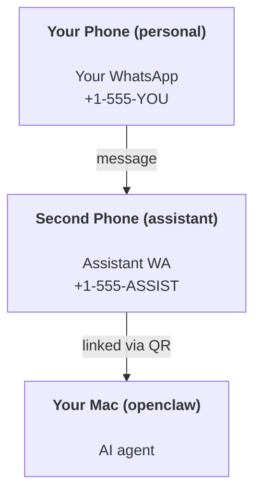

OpenClaw 是一个自托管的 Gateway(网关)，可将 Discord、Google Chat、iMessage、Matrix、Microsoft Teams、Signal、Slack、Telegram、WhatsApp、Zalo 等连接到 AI 代理。本指南介绍“个人助手”设置：一个专用的 WhatsApp 号码，行为如同您始终开启的 AI 助手。

## ⚠️ 安全第一

您将代理置于可以执行以下操作的位置：

- 在您的机器上运行命令（取决于您的工具策略）
- 在您的工作区中读/写文件
- 通过 WhatsApp/Telegram/Discord/Mattermost 和其他捆绑渠道发回消息

从保守开始：

- 始终设置 `channels.whatsapp.allowFrom`（切勿在您的个人 Mac 上运行面向全世界开放的服务）。
- 为助手使用专用的 WhatsApp 号码。
- 心跳现在默认为每 30 分钟一次。通过设置 `agents.defaults.heartbeat.every: "0m"` 禁用它，直到您信任该设置。

## 先决条件

- 已安装并完成 OpenClaw 入门配置 - 如果尚未完成，请参阅[入门指南](/zh/start/getting-started)
- 用于助手的第二个电话号码（SIM/eSIM/预付费）

## 双手机设置（推荐）

您希望这样：



如果您将您的个人 WhatsApp 链接到 OpenClaw，发给您的每条消息都会变成“代理输入”。这通常不是您想要的。

## 5 分钟快速入门

1. 配对 WhatsApp Web（显示二维码；使用助手手机扫描）：

```bash
openclaw channels login
```

2. 启动 Gateway(网关) （保持其运行）：

```bash
openclaw gateway --port 18789
```

3. 在 `~/.openclaw/openclaw.json` 中放置一个最小配置：

```json5
{
  gateway: { mode: "local" },
  channels: { whatsapp: { allowFrom: ["+15555550123"] } },
}
```

现在，从您列入白名单的手机向助手号码发送消息。

新手引导完成后，OpenClaw 会自动打开控制台并打印一个干净的（非 token 化的）链接。如果控制台提示进行身份验证，请将配置的共享密钥粘贴到 Control UI 设置中。新手引导默认使用 token (OpenClaw`gateway.auth.token`)，但如果您将 `gateway.auth.mode` 切换为 `password`，密码验证也可以使用。若要稍后重新打开：`openclaw dashboard`。

## 为代理提供一个工作区 (AGENTS)

OpenClaw 从其工作区目录读取操作指令和“记忆”。

默认情况下，OpenClaw 使用 OpenClaw`~/.openclaw/workspace` 作为代理工作区，并会在设置/首次代理运行时自动创建它（以及初始的 `AGENTS.md`、`SOUL.md`、`TOOLS.md`、`IDENTITY.md`、`USER.md`、`HEARTBEAT.md`）。`BOOTSTRAP.md` 仅在工作区是全新时创建（删除后不应再出现）。`MEMORY.md` 是可选的（不会自动创建）；如果存在，它会被加载到正常会话中。子代理会话仅注入 `AGENTS.md` 和 `TOOLS.md`。

<Tip>将此文件夹视为 OpenClaw 的记忆，并将其设为一个 git 仓库（最好是私有的），以便您的 OpenClaw`AGENTS.md` 和记忆文件得到备份。如果安装了 git，全新的工作区将自动初始化。</Tip>

```bash
openclaw setup
```

完整的工作区布局 + 备份指南：[代理工作区](/zh/concepts/agent-workspace)
记忆工作流：[记忆](/zh/concepts/memory)

可选：使用 `agents.defaults.workspace` 选择不同的工作区（支持 `~`）。

```json5
{
  agents: {
    defaults: {
      workspace: "~/.openclaw/workspace",
    },
  },
}
```

如果您已经从仓库提供自己的工作区文件，则可以完全禁用引导文件创建：

```json5
{
  agents: {
    defaults: {
      skipBootstrap: true,
    },
  },
}
```

## 将其转变为“助手”的配置

OpenClaw 默认为良好的助手设置，但您通常需要调整：

- [`SOUL.md`](/zh/concepts/soul) 中的角色/指令
- 思考默认值（如果需要）
- 心跳（一旦您信任它）

示例：

```json5
{
  logging: { level: "info" },
  agents: {
    defaults: {
      model: { primary: "anthropic/claude-opus-4-6" },
      workspace: "~/.openclaw/workspace",
      thinkingDefault: "high",
      timeoutSeconds: 1800,
      // Start with 0; enable later.
      heartbeat: { every: "0m" },
    },
    list: [
      {
        id: "main",
        default: true,
        groupChat: {
          mentionPatterns: ["@openclaw", "openclaw"],
        },
      },
    ],
  },
  channels: {
    whatsapp: {
      allowFrom: ["+15555550123"],
      groups: {
        "*": { requireMention: true },
      },
    },
  },
  session: {
    scope: "per-sender",
    resetTriggers: ["/new", "/reset"],
    reset: {
      mode: "daily",
      atHour: 4,
      idleMinutes: 10080,
    },
  },
}
```

## 会话与记忆

- 会话文件：`~/.openclaw/agents/<agentId>/sessions/{{SessionId}}.jsonl`
- 会话元数据（令牌使用情况、最近路由等）：`~/.openclaw/agents/<agentId>/sessions/sessions.json`（旧版：`~/.openclaw/sessions/sessions.json`）
- `/new` 或 `/reset` 会在该聊天中开启一个新的会话（可通过 `resetTriggers`OpenClaw 配置）。如果单独发送，OpenClaw 会确认重置而不会调用模型。
- `/compact [instructions]` 会压缩会话上下文并报告剩余的上下文预算。

## 心跳（主动模式）

默认情况下，OpenClaw 每隔 30 分钟使用以下提示运行一次心跳：
OpenClaw`Read HEARTBEAT.md if it exists (workspace context). Follow it strictly. Do not infer or repeat old tasks from prior chats. If nothing needs attention, reply HEARTBEAT_OK.`
设置 `agents.defaults.heartbeat.every: "0m"` 即可禁用。

- 如果 `HEARTBEAT.md` 存在但实际为空（仅包含空行和如 `# Heading`OpenClawAPI 等markdown 标题），OpenClaw 将跳过此次心跳运行以节省 API 调用。
- 如果文件缺失，心跳仍会运行，模型会决定要做什么。
- 如果代理回复 `HEARTBEAT_OK`（可选带有简短填充；参见 `agents.defaults.heartbeat.ackMaxChars`OpenClaw），OpenClaw 将抑制该心跳的出站发送。
- 默认情况下，允许向 私信（私信）风格的 `user:<id>` 目标发送心跳。设置 `agents.defaults.heartbeat.directPolicy: "block"` 可在保持心跳运行活跃的同时抑制直接目标的发送。
- 心跳运行完整的代理轮次——间隔越短会消耗更多 Token。

```json5
{
  agents: {
    defaults: {
      heartbeat: { every: "30m" },
    },
  },
}
```

## 媒体输入与输出

入站附件（图片/音频/文档）可以通过模板展示给你的命令：

- `{{MediaPath}}`（本地临时文件路径）
- `{{MediaUrl}}`（伪 URL）
- `{{Transcript}}`（如果启用了音频转录）

来自代理的出站附件使用消息工具或回复有效负载中的结构化媒体字段，例如 `media`、`mediaUrl`、`mediaUrls`、`path` 或 `filePath`。消息工具参数示例：

```json
{
  "message": "Here's the screenshot.",
  "mediaUrl": "https://example.com/screenshot.png"
}
```

OpenClaw 会随文本一起发送结构化媒体。为了兼容性，传统的最终助手回复可能仍会被标准化，但工具输出、浏览器输出、流式块和消息操作不会将文本解析为附件命令。

本地路径行为遵循与代理相同的文件读取信任模型：

- 如果 `tools.fs.workspaceOnly` 为 `true`OpenClaw，出站本地媒体路径将仅限于 OpenClaw 临时根目录、媒体缓存、代理工作区路径以及沙箱生成的文件。
- 如果 `tools.fs.workspaceOnly` 为 `false`，出站本地媒体可以使用代理已被允许读取的主机本地文件。
- 使用 `~/` 时，本地路径可以是绝对路径、相对于工作区的路径或相对于主目录的路径。
- 主机本地发送仍然仅允许媒体和安全文档类型（图像、音频、视频、PDF、Office 文档以及经过验证的文本文档，如 Markdown/MD、TXT、JSON、YAML 和 YML）。这是现有主机读取信任边界的扩展，而非秘密扫描器：如果代理可以读取主机本地的 `secret.txt` 或 `config.json`，当扩展名和内容验证匹配时，它就可以附加该文件。

这意味着当您的文件系统策略已允许这些读取时，现在可以发送工作区之外的生成图像/文件，而任意的主机本地文本扩展名仍然受到阻止。请将敏感文件保留在代理可读的文件系统之外，或保持 `tools.fs.workspaceOnly=true` 启用以进行更严格的本地路径发送。

## 运维检查清单

```bash
openclaw status          # local status (creds, sessions, queued events)
openclaw status --all    # full diagnosis (read-only, pasteable)
openclaw status --deep   # asks the gateway for a live health probe with channel probes when supported
openclaw health --json   # gateway health snapshot (WS; default can return a fresh cached snapshot)
```

日志位于 `/tmp/openclaw/` 下（默认值：`openclaw-YYYY-MM-DD.log`）。

## 后续步骤

- WebChat：[WebChat](/zh/web/webchat)
- Gateway(网关) 运维：[Gateway(网关) runbook](/zh/gateway)
- Cron + 唤醒：[Cron 作业](/zh/automation/cron-jobs)
- macOS 菜单栏伴侣：[OpenClaw macOS 应用](/zh/platforms/macos)
- iOS 节点应用：[iOS 应用](/zh/platforms/ios)
- Android 节点应用：[Android 应用](/zh/platforms/android)
- Windows 状态：[Windows (WSL2)](/zh/platforms/windows)
- Linux 状态：[Linux 应用](/zh/platforms/linux)
- 安全性：[Security](/zh/gateway/security)

## 相关

- [入门指南](/zh/start/getting-started)
- [设置](/zh/start/setup)
- [渠道概览](/zh/channels)
