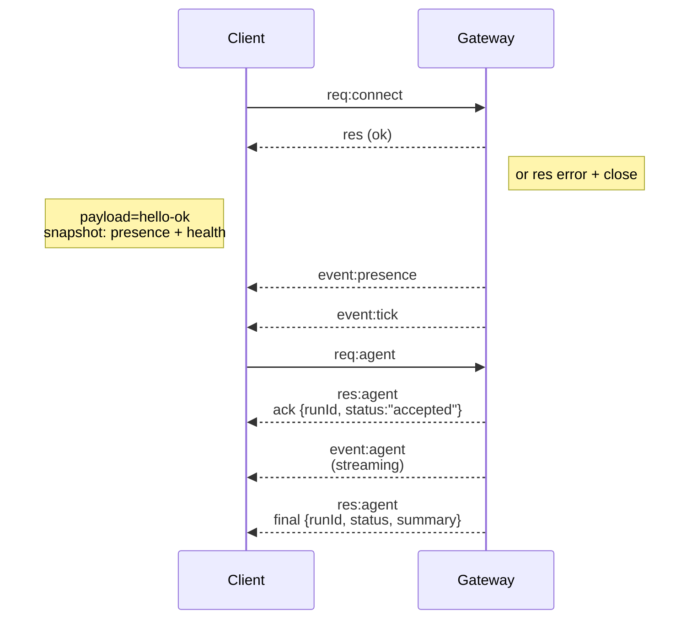

# 閘道架構

最後更新：2026-01-22

## 概覽

- 單一長期運行的 **Gateway (閘道)** 擁有所有訊息介面（透過 Baileys 的 WhatsApp、
  透過 grammY 的 Telegram、Slack、Discord、Signal、iMessage、WebChat）。
- 控制平面客戶端（macOS app、CLI、web UI、自動化工具）透過 **WebSocket** 連線至
  閘道，位於設定的 bind host（預設值為 `127.0.0.1:18789`）。
- **Nodes (節點)**（macOS/iOS/Android/headless）也透過 **WebSocket** 連線，但
  會以明確的 caps/commands 宣告 `role: node`。
- 每個主機一個 Gateway；它是開啟 WhatsApp 會話的唯一位置。
- **canvas host** 由 Gateway HTTP 伺服器提供於：
  - `/__openclaw__/canvas/` (agent-editable HTML/CSS/JS)
  - `/__openclaw__/a2ui/` (A2UI host)
    它使用與 Gateway 相同的連接埠（預設為 `18789`）。

## 元件與流程

### Gateway (daemon)

- 維護提供者連線。
- 公開具類型的 WS API（要求、回應、伺服器推送事件）。
- 根據 JSON Schema 驗證輸入框架。
- 發出事件，如 `agent`、`chat`、`presence`、`health`、`heartbeat`、`cron`。

### 客戶端 (mac app / CLI / web admin)

- 每個客戶端一個 WS 連線。
- 發送請求 (`health`、`status`、`send`、`agent`、`system-presence`)。
- 訂閱事件 (`tick`、`agent`、`presence`、`shutdown`)。

### Nodes (macOS / iOS / Android / headless)

- 使用 `role: node` 連線至 **相同的 WS server**。
- 在 `connect` 中提供裝置身分識別；配對是 **以裝置為基礎**（role 為 `node`）且
  核准資訊儲存於裝置配對存放區中。
- 公開指令，如 `canvas.*`、`camera.*`、`screen.record`、`location.get`。

協議詳情：

- [Gateway protocol](/zh-Hant/gateway/protocol)

### WebChat

- 使用 Gateway WS API 獲取聊天歷史記錄和發送訊息的靜態 UI。
- 在遠端設置中，透過與其他客戶端相同的 SSH/Tailscale 通道連線。

## 連接生命週期（單一客戶端）



## 傳輸協議（摘要）

- 傳輸層：WebSocket，帶有 JSON 載荷的文字訊框。
- 第一個影格 **必須** 是 `connect`。
- 握手後：
  - 請求：`{type:"req", id, method, params}` → `{type:"res", id, ok, payload|error}`
  - 事件：`{type:"event", event, payload, seq?, stateVersion?}`
- 如果設定了 `OPENCLAW_GATEWAY_TOKEN`（或 `--token`），`connect.params.auth.token`
  必須匹配，否則 socket 會關閉。
- 冪等性金鑰（Idempotency keys）是具有副作用的方法（`send`、`agent`）安全重試所必需的；
  伺服器會維護一個短暫的去重快取。
- 節點必須包含 `role: "node"` 以及 `connect` 中的 capabilities/commands/permissions。

## 配對 + 本機信任

- 所有 WS 用戶端（運算子 + 節點）都會在 `connect` 上包含**裝置識別碼**（device identity）。
- 新的裝置 ID 需要配對批准；Gateway 會發出一個**裝置權杖**（device token）
  供後續連線使用。
- **本地**連線（loopback 或 gateway 主機自己的 tailnet 位址）可以
  自動批准，以保持同主機的使用者體驗順暢。
- 所有連線都必須簽署 `connect.challenge` nonce。
- 簽署負載 `v3` 也會綁定 `platform` + `deviceFamily`；gateway
  會在重新連線時鎖定已配對的中繼資料，並要求修復配對以變更中繼資料。
- **非本機**連接仍然需要明確批准。
- Gateway 驗證（`gateway.auth.*`）仍然適用於**所有**連線，無論是本地或
  遠端。

詳細資訊：[Gateway 通訊協定](/zh-Hant/gateway/protocol)、[配對](/zh-Hant/channels/pairing)、
[安全性](/zh-Hant/gateway/security)。

## 協議型別與程式碼生成

- TypeBox schema 定義了協議。
- JSON Schema 是從這些 schema 生成而來的。
- Swift 模型是從 JSON Schema 生成的。

## 遠端存取

- 首選：Tailscale 或 VPN。
- 替代方案：SSH 通道

  ```bash
  ssh -N -L 18789:127.0.0.1:18789 user@host
  ```

- 相同的握手 + auth token 適用於通道連線。
- 在遠端設置中，可以為 WS 啟用 TLS + 可選的 pinning。

## 操作快照

- 啟動：`openclaw gateway`（前景模式，記錄輸出至 stdout）。
- 健康狀態：透過 WS 傳送 `health`（也包含在 `hello-ok` 中）。
- 監控：使用 launchd/systemd 進行自動重啟。

## 不變量

- 每台主機上只有一個 Gateway 控制單一 Baileys 會話。
- 握手是強制的；任何非 JSON 或非連線的第一幀都會導致強制關閉。
- 事件不會重播；客戶端必須在出現間隙時重新整理。

import footerZhHant from "/components/footer/zh-Hant.mdx";

<footerZhHant />
