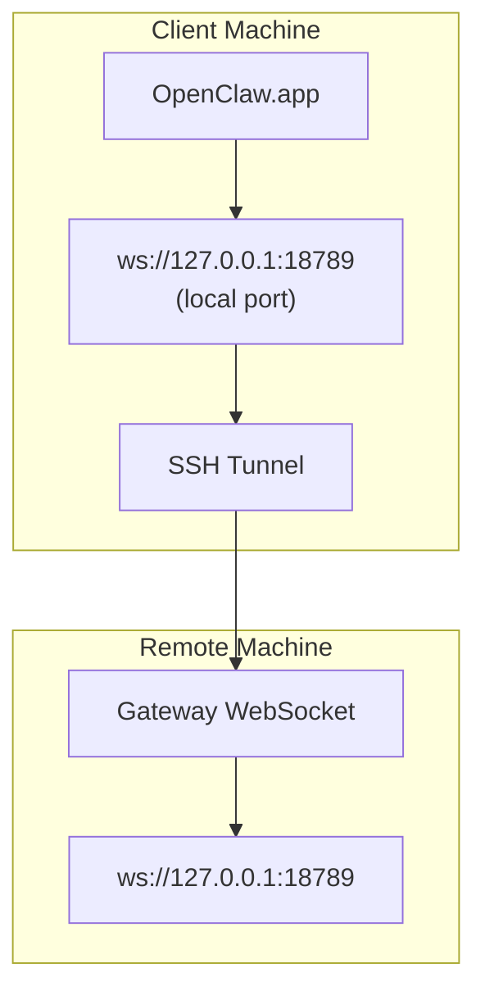

# Running OpenClaw.app with a Remote Gateway

OpenClaw.app uses SSH tunneling to connect to a remote gateway. This guide shows you how to set it up.

## Overview



## Quick Setup

### Step 1: Add SSH Config

Edit `~/.ssh/config` and add:

```ssh
Host remote-gateway
    HostName <REMOTE_IP>          # e.g., 172.27.187.184
    User <REMOTE_USER>            # e.g., jefferson
    LocalForward 18789 127.0.0.1:18789
    IdentityFile ~/.ssh/id_rsa
```

Replace `<REMOTE_IP>` and `<REMOTE_USER>` with your values.

### Step 2: Copy SSH Key

Copy your public key to the remote machine (enter password once):

```bash
ssh-copy-id -i ~/.ssh/id_rsa <REMOTE_USER>@<REMOTE_IP>
```

### Step 3: Set Gateway Token

```bash
launchctl setenv OPENCLAW_GATEWAY_TOKEN "<your-token>"
```

### Step 4: Start SSH Tunnel

```bash
ssh -N remote-gateway &
```

### Step 5: Restart OpenClaw.app

```bash
# Quit OpenClaw.app (⌘Q), then reopen:
open /path/to/OpenClaw.app
```

The app will now connect to the remote gateway through the SSH tunnel.

---

## 登入時自動啟動通道

若要在登入時自動啟動 SSH 通道，請建立一個 Launch Agent。

### 建立 PLIST 檔案

將此儲存為 `~/Library/LaunchAgents/ai.openclaw.ssh-tunnel.plist`：

```xml
<?xml version="1.0" encoding="UTF-8"?>
<!DOCTYPE plist PUBLIC "-//Apple//DTD PLIST 1.0//EN" "http://www.apple.com/DTDs/PropertyList-1.0.dtd">
<plist version="1.0">
<dict>
    <key>Label</key>
    <string>ai.openclaw.ssh-tunnel</string>
    <key>ProgramArguments</key>
    <array>
        <string>/usr/bin/ssh</string>
        <string>-N</string>
        <string>remote-gateway</string>
    </array>
    <key>KeepAlive</key>
    <true/>
    <key>RunAtLoad</key>
    <true/>
</dict>
</plist>
```

### 載入 Launch Agent

```bash
launchctl bootstrap gui/$UID ~/Library/LaunchAgents/ai.openclaw.ssh-tunnel.plist
```

該通道現在將會：

- 在您登入時自動啟動
- 如果崩潰則重新啟動
- 在背景中持續執行

舊版提示：如果存在任何殘留的 `com.openclaw.ssh-tunnel` LaunchAgent，請將其移除。

---

## 疑難排解

**檢查通道是否正在執行：**

```bash
ps aux | grep "ssh -N remote-gateway" | grep -v grep
lsof -i :18789
```

**重新啟動通道：**

```bash
launchctl kickstart -k gui/$UID/ai.openclaw.ssh-tunnel
```

**停止通道：**

```bash
launchctl bootout gui/$UID/ai.openclaw.ssh-tunnel
```

---

## 運作原理

| 元件                                 | 作用                                                 |
| ------------------------------------ | ---------------------------------------------------- |
| `LocalForward 18789 127.0.0.1:18789` | 將本地連接埠 18789 轉發到遠端連接埠 18789            |
| `ssh -N`                             | 在不執行遠端指令的情況下使用 SSH（僅進行連接埠轉發） |
| `KeepAlive`                          | 如果通道崩潰，會自動重新啟動                         |
| `RunAtLoad`                          | 當代理載入時啟動通道                                 |

OpenClaw.app 連接到您客戶端機器上的 `ws://127.0.0.1:18789`。SSH 隧道會將該連接轉發到執行 Gateway 的遠端機器上的連接埠 18789。

import footerZhHant from "/components/footer/zh-Hant.mdx";

<footerZhHant />
