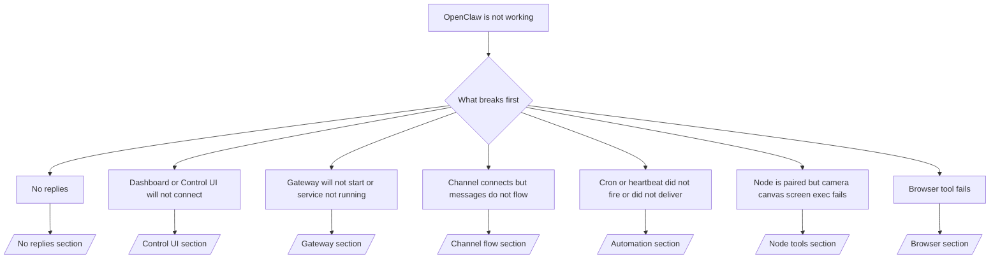

# 故障排除

如果您只有 2 分鐘，請將此頁面作為分診入口使用。

## 前 60 秒

按順序執行以下確切的步驟：

```bash
openclaw status
openclaw status --all
openclaw gateway probe
openclaw gateway status
openclaw doctor
openclaw channels status --probe
openclaw logs --follow
```

一行顯示的良好輸出：

- `openclaw status` → 顯示已配置的通道且無明顯的身份驗證錯誤。
- `openclaw status --all` → 完整報告已存在且可共用。
- `openclaw gateway probe` → 預期的網關目標可達 (`Reachable: yes`)。`RPC: limited - missing scope: operator.read` 表示診斷降級，而非連線失敗。
- `openclaw gateway status` → `Runtime: running` 和 `RPC probe: ok`。
- `openclaw doctor` → 無阻塞性配置/服務錯誤。
- `openclaw channels status --probe` → 通道回報 `connected` 或 `ready`。
- `openclaw logs --follow` → 活動穩定，無重複的致命錯誤。

## Anthropic 長上下文 429

如果您看到：
`HTTP 429: rate_limit_error: Extra usage is required for long context requests`，
請前往 [/gateway/troubleshooting#anthropic-429-extra-usage-required-for-long-context](/zh-Hant/gateway/troubleshooting#anthropic-429-extra-usage-required-for-long-context)。

## 外掛程式安裝因缺少 openclaw 擴充功能而失敗

如果安裝失敗並出現 `package.json missing openclaw.extensions`，則表示外掛程式套件
使用的是 OpenClaw 不再接受的舊格式。

在外掛程式套件中修復：

1. 將 `openclaw.extensions` 新增至 `package.json`。
2. 將項目指向建置後的執行時期檔案 (通常是 `./dist/index.js`)。
3. 重新發佈外掛程式並再次執行 `openclaw plugins install <npm-spec>`。

範例：

```json
{
  "name": "@openclaw/my-plugin",
  "version": "1.2.3",
  "openclaw": {
    "extensions": ["./dist/index.js"]
  }
}
```

參考資料：[/tools/plugin#distribution-npm](/zh-Hant/tools/plugin#distribution-npm)

## 決策樹



<AccordionGroup>
  <Accordion title="沒有回覆">
    ```bash
    openclaw status
    openclaw gateway status
    openclaw channels status --probe
    openclaw pairing list --channel <channel> [--account <id>]
    openclaw logs --follow
    ```

    良好的輸出如下所示：

    - `Runtime: running`
    - `RPC probe: ok`
    - 您的頻道在 `channels status --probe` 中顯示為已連線/就緒
    - 寄件者顯示為已批准（或 DM 政策為開放/白名單）

    常見的日誌特徵：

    - `drop guild message (mention required` → 提及閘門阻擋了 Discord 中的訊息。
    - `pairing request` → 寄件者未獲批准，正在等待 DM 配對批准。
    - 頻道日誌中的 `blocked` / `allowlist` → 寄件者、房間或群組已被過濾。

    深入頁面：

    - [/gateway/troubleshooting#no-replies](/zh-Hant/gateway/troubleshooting#no-replies)
    - [/channels/troubleshooting](/zh-Hant/channels/troubleshooting)
    - [/channels/pairing](/zh-Hant/channels/pairing)

  </Accordion>

  <Accordion title="儀表板或控制 UI 無法連線">
    ```bash
    openclaw status
    openclaw gateway status
    openclaw logs --follow
    openclaw doctor
    openclaw channels status --probe
    ```

    良好的輸出如下所示：

    - `Dashboard: http://...` 顯示於 `openclaw gateway status` 中
    - `RPC probe: ok`
    - 日誌中沒有驗證迴圈

    常見的日誌特徵：

    - `device identity required` → HTTP/非安全語境無法完成裝置驗證。
    - `AUTH_TOKEN_MISMATCH` 伴隨重試提示 (`canRetryWithDeviceToken=true`) → 可能會自動進行一次信任的裝置權杖重試。
    - 該次重試後重複出現 `unauthorized` → 錯誤的權杖/密碼、驗證模式不符，或過期的已配對裝置權杖。
    - `gateway connect failed:` → UI 目標指向錯誤的 URL/連接埠或無法連線的閘道。

    深入頁面：

    - [/gateway/troubleshooting#dashboard-control-ui-connectivity](/zh-Hant/gateway/troubleshooting#dashboard-control-ui-connectivity)
    - [/web/control-ui](/zh-Hant/web/control-ui)
    - [/gateway/authentication](/zh-Hant/gateway/authentication)

  </Accordion>

  <Accordion title="Gateway will not start or service installed but not running">
    ```bash
    openclaw status
    openclaw gateway status
    openclaw logs --follow
    openclaw doctor
    openclaw channels status --probe
    ```

    正常輸出如下所示：

    - `Service: ... (loaded)`
    - `Runtime: running`
    - `RPC probe: ok`

    常見日誌特徵：

    - `Gateway start blocked: set gateway.mode=local` → gateway mode is unset/remote.
    - `refusing to bind gateway ... without auth` → non-loopback bind without token/password.
    - `another gateway instance is already listening` 或 `EADDRINUSE` → port already taken.

    深入頁面：

    - [/gateway/troubleshooting#gateway-service-not-running](/zh-Hant/gateway/troubleshooting#gateway-service-not-running)
    - [/gateway/background-process](/zh-Hant/gateway/background-process)
    - [/gateway/configuration](/zh-Hant/gateway/configuration)

  </Accordion>

  <Accordion title="Channel connects but messages do not flow">
    ```bash
    openclaw status
    openclaw gateway status
    openclaw logs --follow
    openclaw doctor
    openclaw channels status --probe
    ```

    正常輸出如下所示：

    - Channel transport is connected.
    - Pairing/allowlist checks pass.
    - Mentions are detected where required.

    常見日誌特徵：

    - `mention required` → group mention gating blocked processing.
    - `pairing` / `pending` → DM sender is not approved yet.
    - `not_in_channel`, `missing_scope`, `Forbidden`, `401/403` → channel permission token issue.

    深入頁面：

    - [/gateway/troubleshooting#channel-connected-messages-not-flowing](/zh-Hant/gateway/troubleshooting#channel-connected-messages-not-flowing)
    - [/channels/troubleshooting](/zh-Hant/channels/troubleshooting)

  </Accordion>

  <Accordion title="Cron or heartbeat did not fire or did not deliver">
    ```bash
    openclaw status
    openclaw gateway status
    openclaw cron status
    openclaw cron list
    openclaw cron runs --id <jobId> --limit 20
    openclaw logs --follow
    ```

    良好的輸出如下所示：

    - `cron.status` 顯示已啟用且有下次喚醒時間。
    - `cron runs` 顯示最近的 `ok` 項目。
    - 心跳已啟用且未處於非啟用時段。

    常見日誌特徵：

    - `cron: scheduler disabled; jobs will not run automatically` → cron 已停用。
    - `heartbeat skipped` 搭配 `reason=quiet-hours` → 在設定的啟用時段之外。
    - `requests-in-flight` → 主通道忙碌；心跳喚醒已延遲。
    - `unknown accountId` → 心跳傳送目標帳戶不存在。

    深入頁面：

    - [/gateway/troubleshooting#cron-and-heartbeat-delivery](/zh-Hant/gateway/troubleshooting#cron-and-heartbeat-delivery)
    - [/automation/troubleshooting](/zh-Hant/automation/troubleshooting)
    - [/gateway/heartbeat](/zh-Hant/gateway/heartbeat)

  </Accordion>

  <Accordion title="Node is paired but tool fails camera canvas screen exec">
    ```bash
    openclaw status
    openclaw gateway status
    openclaw nodes status
    openclaw nodes describe --node <idOrNameOrIp>
    openclaw logs --follow
    ```

    良好的輸出如下所示：

    - 節點顯示為已連線，且已針對角色 `node` 完成配對。
    - 您正在叫用的指令具有對應功能。
    - 工具的權限狀態已授予。

    常見日誌特徵：

    - `NODE_BACKGROUND_UNAVAILABLE` → 將節點應用程式帶到前景。
    - `*_PERMISSION_REQUIRED` → OS 權限遭拒/遺失。
    - `SYSTEM_RUN_DENIED: approval required` → 執行認可待處理。
    - `SYSTEM_RUN_DENIED: allowlist miss` → 指令未在執行許可清單上。

    深入頁面：

    - [/gateway/troubleshooting#node-paired-tool-fails](/zh-Hant/gateway/troubleshooting#node-paired-tool-fails)
    - [/nodes/troubleshooting](/zh-Hant/nodes/troubleshooting)
    - [/tools/exec-approvals](/zh-Hant/tools/exec-approvals)

  </Accordion>

  <Accordion title="Browser tool fails">
    ```bash
    openclaw status
    openclaw gateway status
    openclaw browser status
    openclaw logs --follow
    openclaw doctor
    ```

    Good output looks like:

    - Browser status shows `running: true` and a chosen browser/profile.
    - `openclaw` starts, or `user` can see local Chrome tabs.

    Common log signatures:

    - `Failed to start Chrome CDP on port` → local browser launch failed.
    - `browser.executablePath not found` → configured binary path is wrong.
    - `No Chrome tabs found for profile="user"` → the Chrome MCP attach profile has no open local Chrome tabs.
    - `Browser attachOnly is enabled ... not reachable` → attach-only profile has no live CDP target.

    Deep pages:

    - [/gateway/troubleshooting#browser-tool-fails](/zh-Hant/gateway/troubleshooting#browser-tool-fails)
    - [/tools/browser-linux-troubleshooting](/zh-Hant/tools/browser-linux-troubleshooting)
    - [/tools/browser-wsl2-windows-remote-cdp-troubleshooting](/zh-Hant/tools/browser-wsl2-windows-remote-cdp-troubleshooting)

  </Accordion>
</AccordionGroup>

import footerZhHant from "/components/footer/zh-Hant.mdx";

<footerZhHant />
