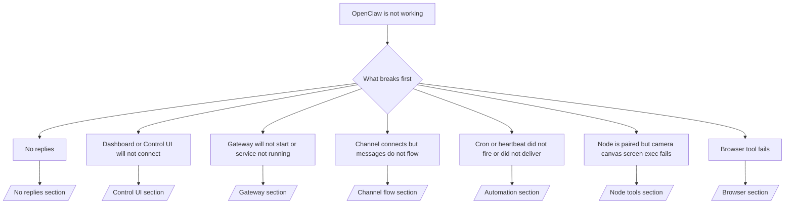

# 故障排除

如果您只有 2 分鐘，請將此頁面作為分類診斷的入口。

## 前 60 秒

請依序執行這個確切的檢查步驟：

```bash
openclaw status
openclaw status --all
openclaw gateway probe
openclaw gateway status
openclaw doctor
openclaw channels status --probe
openclaw logs --follow
```

一行指令的良好輸出結果：

- `openclaw status` → 顯示已設定的通道，且無明顯的驗證錯誤。
- `openclaw status --all` → 完整報告存在且可分享。
- `openclaw gateway probe` → 預期的閘道目標可連線 (`Reachable: yes`)。`RPC: limited - missing scope: operator.read` 表示診斷功能降級，並非連線失敗。
- `openclaw gateway status` → `Runtime: running` 和 `RPC probe: ok`。
- `openclaw doctor` → 無阻斷性的設定/服務錯誤。
- `openclaw channels status --probe` → 通道回報 `connected` 或 `ready`。
- `openclaw logs --follow` → 活動穩定，無重複的嚴重錯誤。

## Anthropic 長內文 429

如果您看到：
`HTTP 429: rate_limit_error: Extra usage is required for long context requests`，
請前往 [/gateway/troubleshooting#anthropic-429-extra-usage-required-for-long-context](/zh-Hant/gateway/troubleshooting#anthropic-429-extra-usage-required-for-long-context)。

## 外掛程式安裝因缺少 openclaw 擴充功能而失敗

如果安裝失敗並出現 `package.json missing openclaw.extensions`，表示外掛程式套件
使用的是 OpenClaw 不再接受的舊格式。

請在外掛程式套件中修復：

1. 將 `openclaw.extensions` 加入 `package.json`。
2. 將項目指向已建置的執行時期檔案 (通常是 `./dist/index.js`)。
3. 重新發佈外掛程式並再次執行 `openclaw plugins install <npm-spec>`。

範例：

```json
{
  "name": "@openclaw/my-plugin",
  "version": "1.2.3",
  "openclaw": {
    "extensions": ["./dist/index.js"]
  }
}
```

參考資料：[/tools/plugin#distribution-npm](/zh-Hant/tools/plugin#distribution-npm)

## 決策樹



<AccordionGroup>
  <Accordion title="No replies">
    ```bash
    openclaw status
    openclaw gateway status
    openclaw channels status --probe
    openclaw pairing list --channel <channel> [--account <id>]
    openclaw logs --follow
    ```

    Good output looks like:

    - `Runtime: running`
    - `RPC probe: ok`
    - Your channel shows connected/ready in `channels status --probe`
    - Sender appears approved (or DM policy is open/allowlist)

    Common log signatures:

    - `drop guild message (mention required` → mention gating blocked the message in Discord.
    - `pairing request` → sender is unapproved and waiting for DM pairing approval.
    - `blocked` / `allowlist` in channel logs → sender, room, or group is filtered.

    Deep pages:

    - [/gateway/troubleshooting#no-replies](/zh-Hant/gateway/troubleshooting#no-replies)
    - [/channels/troubleshooting](/zh-Hant/channels/troubleshooting)
    - [/channels/pairing](/zh-Hant/channels/pairing)

  </Accordion>

  <Accordion title="Dashboard or Control UI will not connect">
    ```bash
    openclaw status
    openclaw gateway status
    openclaw logs --follow
    openclaw doctor
    openclaw channels status --probe
    ```

    Good output looks like:

    - `Dashboard: http://...` is shown in `openclaw gateway status`
    - `RPC probe: ok`
    - No auth loop in logs

    Common log signatures:

    - `device identity required` → HTTP/non-secure context cannot complete device auth.
    - `AUTH_TOKEN_MISMATCH` with retry hints (`canRetryWithDeviceToken=true`) → one trusted device-token retry may occur automatically.
    - repeated `unauthorized` after that retry → wrong token/password, auth mode mismatch, or stale paired device token.
    - `gateway connect failed:` → UI is targeting the wrong URL/port or unreachable gateway.

    Deep pages:

    - [/gateway/troubleshooting#dashboard-control-ui-connectivity](/zh-Hant/gateway/troubleshooting#dashboard-control-ui-connectivity)
    - [/web/control-ui](/zh-Hant/web/control-ui)
    - [/gateway/authentication](/zh-Hant/gateway/authentication)

  </Accordion>

  <Accordion title="Gateway will not start or service installed but not running">
    ```bash
    openclaw status
    openclaw gateway status
    openclaw logs --follow
    openclaw doctor
    openclaw channels status --probe
    ```

    良好的輸出看起來像：

    - `Service: ... (loaded)`
    - `Runtime: running`
    - `RPC probe: ok`

    常見日誌特徵：

    - `Gateway start blocked: set gateway.mode=local` → 閘道模式未設定/遠端。
    - `refusing to bind gateway ... without auth` → 非迴路綁定且沒有 token/密碼。
    - `another gateway instance is already listening` 或 `EADDRINUSE` → 連接埠已被佔用。

    深度頁面：

    - [/gateway/troubleshooting#gateway-service-not-running](/zh-Hant/gateway/troubleshooting#gateway-service-not-running)
    - [/gateway/background-process](/zh-Hant/gateway/background-process)
    - [/gateway/configuration](/zh-Hant/gateway/configuration)

  </Accordion>

  <Accordion title="Channel connects but messages do not flow">
    ```bash
    openclaw status
    openclaw gateway status
    openclaw logs --follow
    openclaw doctor
    openclaw channels status --probe
    ```

    良好的輸出看起來像：

    - 頻道傳輸已連線。
    - 配對/允許清單檢查通過。
    - 在需要的地方檢測到提及。

    常見日誌特徵：

    - `mention required` → 群組提及閘門阻擋了處理。
    - `pairing` / `pending` → DM 傳送者尚未被核准。
    - `not_in_channel`, `missing_scope`, `Forbidden`, `401/403` → 頻道權限 token 問題。

    深度頁面：

    - [/gateway/troubleshooting#channel-connected-messages-not-flowing](/zh-Hant/gateway/troubleshooting#channel-connected-messages-not-flowing)
    - [/channels/troubleshooting](/zh-Hant/channels/troubleshooting)

  </Accordion>

  <Accordion title="Cron 或心跳未觸發或未傳送">
    ```bash
    openclaw status
    openclaw gateway status
    openclaw cron status
    openclaw cron list
    openclaw cron runs --id <jobId> --limit 20
    openclaw logs --follow
    ```

    正常的輸出看起來像：

    - `cron.status` 顯示已啟用並有下次喚醒時間。
    - `cron runs` 顯示最近的 `ok` 條目。
    - 心跳已啟用且未處於非活動時段。

    常見日誌特徵：

    - `cron: scheduler disabled; jobs will not run automatically` → cron 已停用。
    - `heartbeat skipped` 且含有 `reason=quiet-hours` → 在設定的活動時段之外。
    - `requests-in-flight` → 主線道忙碌；心跳喚醒已延遲。
    - `unknown accountId` → 心跳傳送目標帳戶不存在。

    深入頁面：

    - [/gateway/troubleshooting#cron-and-heartbeat-delivery](/zh-Hant/gateway/troubleshooting#cron-and-heartbeat-delivery)
    - [/automation/troubleshooting](/zh-Hant/automation/troubleshooting)
    - [/gateway/heartbeat](/zh-Hant/gateway/heartbeat)

  </Accordion>

  <Accordion title="Node 已配對但工具失敗 (相機、畫布、螢幕、執行)">
    ```bash
    openclaw status
    openclaw gateway status
    openclaw nodes status
    openclaw nodes describe --node <idOrNameOrIp>
    openclaw logs --follow
    ```

    正常的輸出看起來像：

    - Node 被列為已連線並已針對角色 `node` 進行配對。
    - 您正在叫用的指令存在能力。
    - 工具的權限狀態已授權。

    常見日誌特徵：

    - `NODE_BACKGROUND_UNAVAILABLE` → 將 node 應用程式帶到前景。
    - `*_PERMISSION_REQUIRED` → OS 權限被拒絕或遺失。
    - `SYSTEM_RUN_DENIED: approval required` → 執行審核待處理。
    - `SYSTEM_RUN_DENIED: allowlist miss` → 指令未在執行允許清單上。

    深入頁面：

    - [/gateway/troubleshooting#node-paired-tool-fails](/zh-Hant/gateway/troubleshooting#node-paired-tool-fails)
    - [/nodes/troubleshooting](/zh-Hant/nodes/troubleshooting)
    - [/tools/exec-approvals](/zh-Hant/tools/exec-approvals)

  </Accordion>

  <Accordion title="Browser tool fails">
    ```bash
    openclaw status
    openclaw gateway status
    openclaw browser status
    openclaw logs --follow
    openclaw doctor
    ```

    Good output looks like:

    - Browser status shows `running: true` and a chosen browser/profile.
    - `openclaw` starts, or `user` can see local Chrome tabs.

    Common log signatures:

    - `Failed to start Chrome CDP on port` → local browser launch failed.
    - `browser.executablePath not found` → configured binary path is wrong.
    - `No Chrome tabs found for profile="user"` → the Chrome MCP attach profile has no open local Chrome tabs.
    - `Browser attachOnly is enabled ... not reachable` → attach-only profile has no live CDP target.

    Deep pages:

    - [/gateway/troubleshooting#browser-tool-fails](/zh-Hant/gateway/troubleshooting#browser-tool-fails)
    - [/tools/browser-linux-troubleshooting](/zh-Hant/tools/browser-linux-troubleshooting)
    - [/tools/browser-wsl2-windows-remote-cdp-troubleshooting](/zh-Hant/tools/browser-wsl2-windows-remote-cdp-troubleshooting)

  </Accordion>
</AccordionGroup>

import en from "/components/footer/en.mdx";

<en />
