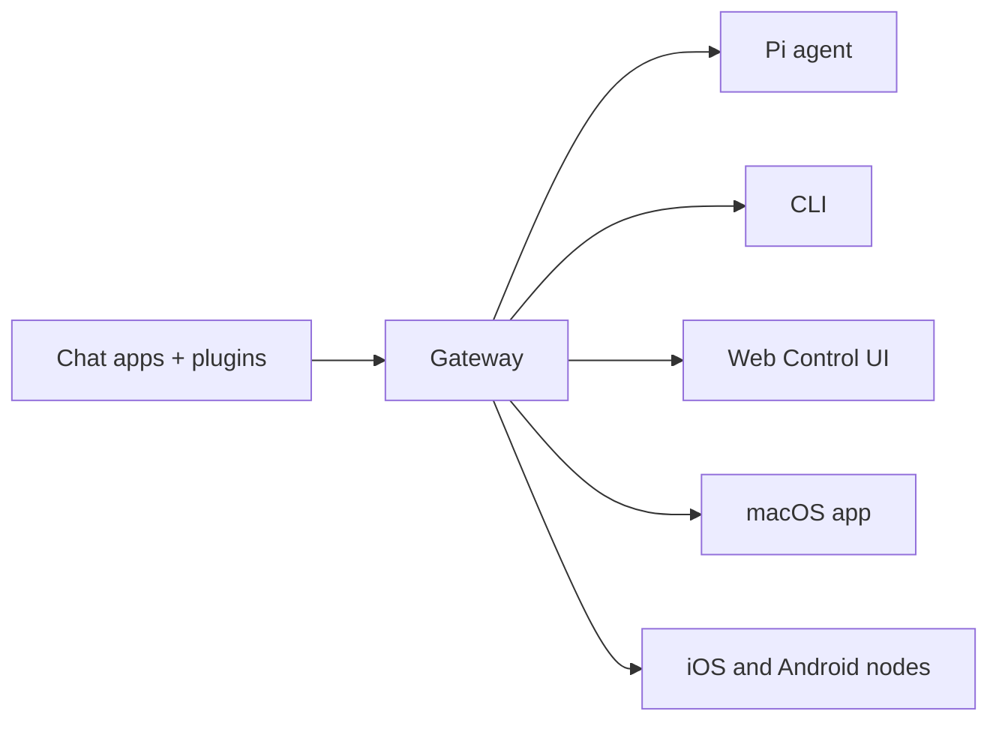

# OpenClaw 🦞

<p align="center">
  
  
</p>

> _「去角質！去角質！」_ — 也許是一隻太空龍蝦

<p align="center">
  <strong>
    適用於任何作業系統的 AI 智能體閘道，支援 WhatsApp、Telegram、Discord、iMessage 等平台。
  </strong>
  <br />
  發送訊息，隨時隨地在口袋裡獲得智能體回應。外掛程式還能增加 Mattermost 等更多支援。
</p>

<Columns>
  <Card title="開始使用" href="/zh-Hant/start/getting-started" icon="rocket">
    安裝 OpenClaw 並在幾分鐘內啟動閘道。
  </Card>
  <Card title="執行引導設定" href="/zh-Hant/start/wizard" icon="sparkles">
    使用 `openclaw onboard` 和配對流程進行引導式設定。
  </Card>
  <Card title="開啟控制介面" href="/zh-Hant/web/control-ui" icon="layout-dashboard">
    啟動瀏覽器儀表板以進行聊天、設定和會話管理。
  </Card>
</Columns>

## 什麼是 OpenClaw？

OpenClaw 是一個 **自我託管的閘道**，將您最喜愛的聊天應用程式 — WhatsApp、Telegram、Discord、iMessage 等 — 與像 Pi 這樣的 AI 編碼智能體連接起來。您在自己的機器（或伺服器）上運行單一閘道進程，它就成為您的訊息應用程式與隨時待命的 AI 助手之間的橋樑。

**適合誰使用？** 開發人員和進階用戶，他們想要一個可以從任何地方發送訊息的個人 AI 助手 — 而無需放棄資料控制權或依賴託管服務。

**它有什麼不同之處？**

- **自我託管**：在您的硬體上運行，由您制定規則
- **多通道**：一個閘道同時服務於 WhatsApp、Telegram、Discord 等多個平台
- **Agent-native**: 專為具有工具使用、會話、記憶和多代理路由功能的編碼代理而建構
- **開源**: MIT 授權，社群驅動

**您需要什麼？** Node 24（推薦），或用於相容性的 Node 22 LTS (`22.16+`)、來自您選擇的提供者的 API 金鑰，以及 5 分鐘時間。為了獲得最佳品質和安全性，請使用可用的最強大的最新世代模型。

## 運作方式



Gateway 是會話、路由和通道連接的單一真實來源。

## 關鍵功能

<Columns>
  <Card title="多通道閘道" icon="network">
    透過單一 Gateway 程序支援 WhatsApp、Telegram、Discord 和 iMessage。
  </Card>
  <Card title="外掛通道" icon="plug">
    透過擴充套件新增 Mattermost 和更多功能。
  </Card>
  <Card title="多代理路由" icon="route">
    按代理、工作區或發送者隔離會話。
  </Card>
  <Card title="媒體支援" icon="image">
    傳送和接收圖片、音訊和文件。
  </Card>
  <Card title="Web 控制介面" icon="monitor">
    用於聊天、設定、會話和節點的瀏覽器儀表板。
  </Card>
  <Card title="行動節點" icon="smartphone">
    配對 iOS 和 Android 節點以用於 Canvas、相機和啟用語音的工作流程。
  </Card>
</Columns>

## 快速開始

<Steps>
  <Step title="Install OpenClaw">```bash npm install -g openclaw@latest ```</Step>
  <Step title="Onboard and install the service">```bash openclaw onboard --install-daemon ```</Step>
  <Step title="Pair WhatsApp and start the Gateway">
    ```bash openclaw channels login openclaw gateway --port 18789 ```
  </Step>
</Steps>

需要完整的安裝和開發設定？請參閱 [快速開始](/en/start/quickstart)。

## 儀表板

在 Gateway 啟動後開啟瀏覽器控制介面。

- 本機預設值：[http://127.0.0.1:18789/](http://127.0.0.1:18789/)
- 遠端存取：[Web 介面](/en/web) 和 [Tailscale](/en/gateway/tailscale)

<p align="center">
  
</p>

## 設定（選用）

設定檔位於 `~/.openclaw/openclaw.json`。

- 如果您**什麼都不做**，OpenClaw 將在 RPC 模式下使用內建的 Pi 二進制檔案，並為每個發送者使用獨立 session。
- 如果您想要鎖定權限，請從 `channels.whatsapp.allowFrom` 開始，並（針對群組）設定提及規則。

範例：

```json5
{
  channels: {
    whatsapp: {
      allowFrom: ["+15555550123"],
      groups: { "*": { requireMention: true } },
    },
  },
  messages: { groupChat: { mentionPatterns: ["@openclaw"] } },
}
```

## 從這裡開始

<Columns>
  <Card title="Docs hubs" href="/en/start/hubs" icon="book-open">
    所有文件與指南，依使用情境分類。
  </Card>
  <Card title="Configuration" href="/en/gateway/configuration" icon="settings">
    核心閘道設定、權杖與提供者設定。
  </Card>
  <Card title="Remote access" href="/en/gateway/remote" icon="globe">
    SSH 與 tailnet 存取模式。
  </Card>
  <Card title="Channels" href="/en/channels/telegram" icon="message-square">
    WhatsApp、Telegram、Discord 等頻道的專屬設定。
  </Card>
  <Card title="Nodes" href="/en/nodes" icon="smartphone">
    支援配對、Canvas、相機與裝置操作的 iOS 與 Android 節點。
  </Card>
  <Card title="Help" href="/en/help" icon="life-buoy">
    常見修復方式與疑難排解入口。
  </Card>
</Columns>

## 深入瞭解

<Columns>
  <Card title="Full feature list" href="/en/concepts/features" icon="list">
    完整的頻道、路由與媒體功能。
  </Card>
  <Card title="Multi-agent routing" href="/en/concepts/multi-agent" icon="route">
    工作區隔離與每個代理程式的獨立 session。
  </Card>
  <Card title="Security" href="/en/gateway/security" icon="shield">
    權杖、允許清單與安全控制。
  </Card>
  <Card title="Troubleshooting" href="/en/gateway/troubleshooting" icon="wrench">
    閘道診斷與常見錯誤。
  </Card>
  <Card title="關於與鳴謝" href="/en/reference/credits" icon="info">
    專案起源、貢獻者與授權。
  </Card>
</Columns>

import footerZhHant from "/components/footer/zh-Hant.mdx";

<footerZhHant />
