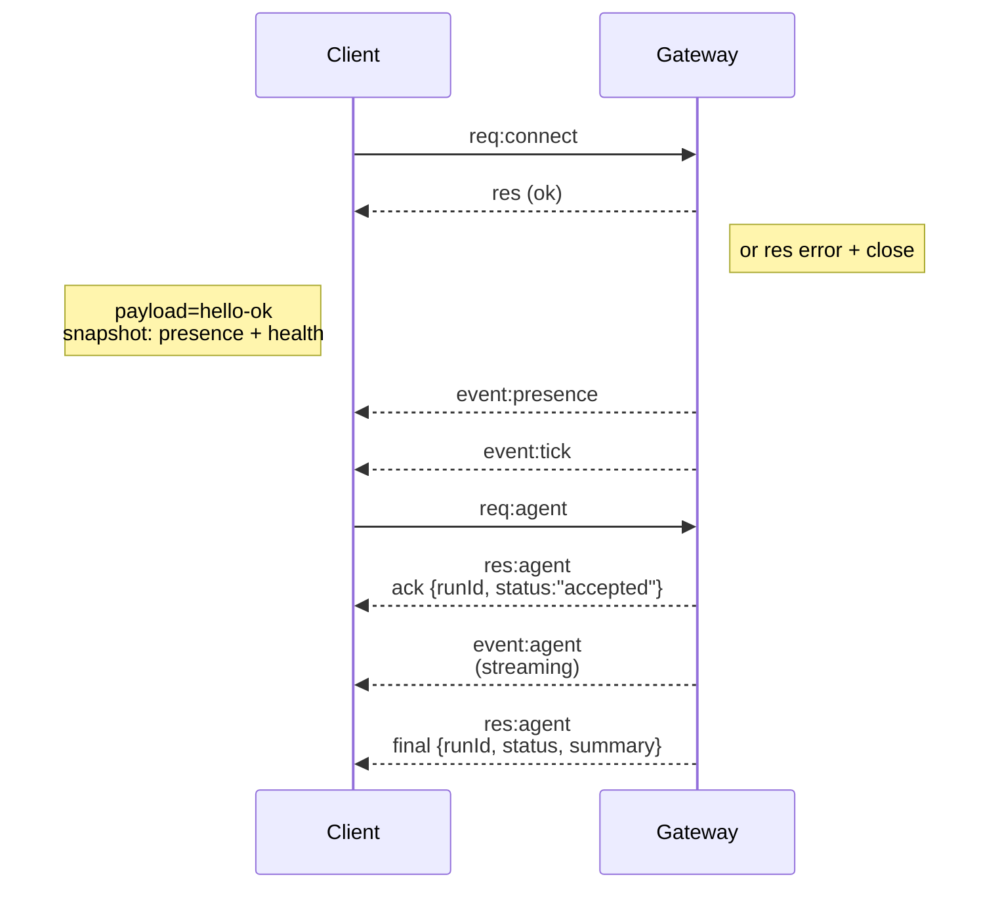

# Gateway 网关 架构

## 概述

- 单一的长生命周期 **Gateway(网关)** 拥有所有的消息传递表面（WhatsApp 通过
  Baileys，Telegram 通过 grammY，Slack，Discord，Signal，iMessage，WebChat）。
- 控制平面客户端（macOS 应用，CLI，Web UI，自动化工具）通过配置的绑定主机（默认
  `127.0.0.1:18789`）上的 **WebSocket** 连接到
  Gateway(网关)。
- **节点**（macOS/iOS/Android/无头模式）也通过 **WebSocket** 连接，但
  声明 `role: node` 并带有明确的 caps/commands。
- 每个主机一个 Gateway(网关)；它是打开 WhatsApp 会话的唯一位置。
- **Canvas 主机**由 Gateway(网关) HTTP 服务器提供，位于：
  - `/__openclaw__/canvas/`（代理可编辑的 HTML/CSS/JS）
  - `/__openclaw__/a2ui/`（A2UI 主机）
    它使用与 Gateway(网关) 相同的端口（默认 `18789`）。

## 组件和流程

### Gateway(网关)（守护进程）

- 维护提供商连接。
- 暴露一个类型化的 WS API（请求，响应，服务器推送事件）。
- 根据 JSON Schema 验证传入帧。
- 发出如 `agent`，`chat`，`presence`，`health`，`heartbeat`，`cron` 的事件。

### 客户端（Mac 应用 / CLI / Web 管理后台）

- 每个客户端一个 WS 连接。
- 发送请求（`health`，`status`，`send`，`agent`，`system-presence`）。
- 订阅事件（`tick`，`agent`，`presence`，`shutdown`）。

### 节点（macOS / iOS / Android / 无头模式）

- 使用 `role: node` 连接到**同一个 WS 服务器**。
- 在 `connect` 中提供设备身份；配对是**基于设备的**（角色 `node`），并且
  批准存储在设备配对存储中。
- 暴露如 `canvas.*`，`camera.*`，`screen.record`，`location.get` 的命令。

协议详细信息：

- [Gateway(网关) 协议](/zh/gateway/protocol)

### WebChat

- 使用 Gateway(网关) WS API 获取聊天历史记录和发送消息的静态 UI。
- 在远程设置中，通过与其他客户端相同的 SSH/Tailscale 隧道进行连接。

## 连接生命周期（单个客户端）



## 线路协议（摘要）

- 传输：WebSocket，带有 JSON 载荷的文本帧。
- 第一帧**必须**是 `connect`。
- 握手之后：
  - 请求：`{type:"req", id, method, params}` → `{type:"res", id, ok, payload|error}`
  - 事件：`{type:"event", event, payload, seq?, stateVersion?}`
- 如果设置了 `OPENCLAW_GATEWAY_TOKEN`（或 `--token`），`connect.params.auth.token`
  必须匹配，否则套接字将关闭。
- 具有副作用的方法（`send`、`agent`）需要幂等性密钥以便
  安全重试；服务器维护一个短期的去重缓存。
- 节点必须在 `connect` 中包含 `role: "node"` 以及 caps/commands/permissions。

## 配对 + 本地信任

- 所有 WS 客户端（操作员 + 节点）在 `connect` 上都包含一个**设备身份**。
- 新的设备 ID 需要配对批准；Gateway(网关) 会颁发一个**设备令牌**
  用于后续连接。
- 对于**本地**连接（回环或网关主机自己的 tailnet 地址），可以
  自动批准以保持同主机用户体验的流畅。
- 所有连接必须对 `connect.challenge` nonce 进行签名。
- 签名载荷 `v3` 还绑定了 `platform` + `deviceFamily`；网关
  在重新连接时会锁定已配对的元数据，如果元数据
  发生更改则要求修复配对。
- **非本地**连接仍然需要显式批准。
- Gateway(网关) 认证（`gateway.auth.*`）仍然适用于**所有**连接，无论是
  本地还是远程。

详情：[Gateway(网关) 协议](/zh/gateway/protocol)、[配对](/zh/channels/pairing)、
[安全性](/zh/gateway/security)。

## 协议类型和代码生成

- TypeBox schemas 定义了协议。
- JSON Schema 是根据这些 schemas 生成的。
- Swift 模型是根据 JSON Schema 生成的。

## 远程访问

- 首选：Tailscale 或 VPN。
- 备选：SSH 隧道

  ```bash
  ssh -N -L 18789:127.0.0.1:18789 user@host
  ```

- 通过隧道进行连接时，应用相同的握手 + 认证令牌。
- 在远程设置中，可以为 WS 启用 TLS + 可选的固定（pinning）。

## 运营快照

- 启动：`openclaw gateway`（前台，日志输出到 stdout）。
- 健康检查：通过 WS 进行 `health`（也包含在 `hello-ok` 中）。
- 监管：使用 launchd/systemd 实现自动重启。

## 不变量

- 每个主机上仅有一个 Gateway(网关) 控制单个 Baileys 会话。
- 握手是强制性的；任何非 JSON 或非连接的首帧都将导致强制关闭。
- 事件不会重放；客户端必须在出现缺口时进行刷新。

import zh from "/components/footer/zh.mdx";

<zh />
