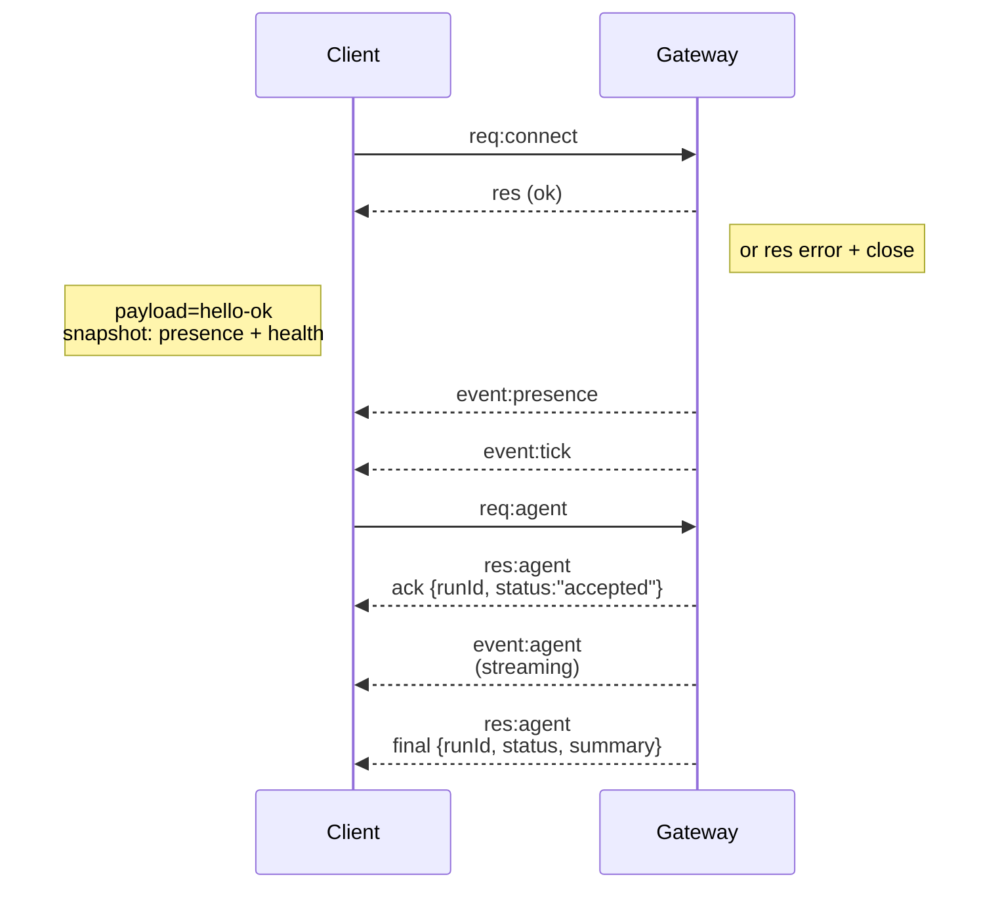

# 网关架构

最后更新时间：2026-01-22

## 概述

- 单一的长生命期 **Gateway（网关）** 拥有所有的消息传递表面（WhatsApp 通过
  Baileys、Telegram 通过 grammY、Slack、Discord、Signal、iMessage、WebChat）。
- 控制平面客户端（macOS 应用、CLI、Web UI、自动化）连接到
  配置的绑定主机上的 **Gateway（网关）**，通过 **WebSocket**（默认
  `127.0.0.1:18789`）。
- **Nodes（节点）**（macOS/iOS/Android/headless）也通过 **WebSocket** 连接，但
  声明 `role: node` 并附带明确的 capabilities/commands（能力/命令）。
- 每台主机一个 Gateway；它是唯一开启 WhatsApp 会话的地方。
- **Canvas 主机** 由 Gateway HTTP 服务器提供，位于：
  - `/__openclaw__/canvas/` (agent-editable HTML/CSS/JS)
  - `/__openclaw__/a2ui/` (A2UI host)
    它使用与 Gateway 相同的端口（默认 `18789`）。

## 组件和流程

### Gateway (daemon/守护进程)

- 维护提供程序连接。
- 暴露类型化的 WS API（请求、响应、服务器推送事件）。
- 根据 JSON Schema 验证传入帧。
- 发出诸如 `agent`、`chat`、`presence`、`health`、`heartbeat`、`cron` 的事件。

### 客户端 (mac app / CLI / web admin)

- 每个客户端一个 WS 连接。
- 发送请求 (`health`、`status`、`send`、`agent`、`system-presence`)。
- 订阅事件 (`tick`、`agent`、`presence`、`shutdown`)。

### Nodes (macOS / iOS / Android / headless)

- 使用 `role: node` 连接到**同一个 WS 服务器**。
- 在 `connect` 中提供设备身份；配对是**基于设备的**（角色 `node`）且
  批准存储在设备配对存储中。
- 暴露诸如 `canvas.*`、`camera.*`、`screen.record`、`location.get` 的命令。

协议详情：

- [Gateway protocol](/zh/en/gateway/protocol)

### WebChat

- 使用 Gateway WS API 获取聊天记录和发送消息的静态 UI。
- 在远程设置中，通过与其他客户端相同的 SSH/Tailscale 隧道进行连接
  客户端。

## 连接生命周期（单个客户端）



## 线协议（摘要）

- 传输方式：WebSocket，使用 JSON 载荷的文本帧。
- 第一帧 **必须** 是 `connect`。
- 握手之后：
  - 请求：`{type:"req", id, method, params}` → `{type:"res", id, ok, payload|error}`
  - 事件：`{type:"event", event, payload, seq?, stateVersion?}`
- 如果设置了 `OPENCLAW_GATEWAY_TOKEN`（或 `--token`），则 `connect.params.auth.token`
  必须匹配，否则套接字将关闭。
- 具有副作用的机制（`send`，`agent`）需要幂等性密钥以便
  安全重试；服务器会保存一个短期的去重缓存。
- 节点必须在 `connect` 中包含 `role: "node"` 以及能力/命令/权限。

## 配对 + 本地信任

- 所有 WS 客户端（操作员 + 节点）都在 `connect` 上包含 **设备身份**。
- 新的设备 ID 需要配对批准；网关会签发一个 **设备令牌**
  用于后续连接。
- **本地** 连接（回环或网关主机自己的 tailnet 地址）可以
  自动批准，以保持同机用户体验流畅。
- 所有连接必须对 `connect.challenge` nonce 进行签名。
- 签名载荷 `v3` 也会绑定 `platform` + `deviceFamily`；网关
  会在重连时固定已配对的元数据，并对元数据
  变更要求修复配对。
- **非本地** 连接仍需明确批准。
- 网关认证（`gateway.auth.*`）仍然适用于 **所有** 连接，无论是本地还是
  远程。

详情：[网关协议](/zh/en/gateway/protocol)，[配对](/zh/en/channels/pairing)，
[安全](/zh/en/gateway/security)。

## 协议类型和代码生成

- TypeBox 架构定义了该协议。
- JSON Schema 根据这些架构生成。
- Swift 模型根据 JSON Schema 生成。

## 远程访问

- 首选：Tailscale 或 VPN。
- 备选：SSH 隧道

  ```bash
  ssh -N -L 18789:127.0.0.1:18789 user@host
  ```

- 通过隧道进行连接时，使用相同的握手 + 认证令牌。
- 在远程设置中，可以为 WS 启用 TLS + 可选的证书锁定。

## 操作快照

- 启动：`openclaw gateway`（前台，日志输出至 stdout）。
- 健康状态：通过 WS 传输的 `health`（也包含在 `hello-ok` 中）。
- 监管：使用 launchd/systemd 进行自动重启。

## 不变量

- 每台主机上恰好有一个 Gateway 控制单个 Baileys 会话。
- 握手是强制性的；任何非 JSON 或非连接的首帧都将导致强制关闭。
- 事件不会重放；客户端必须在出现间隙时进行刷新。

import zh from '/components/footer/zh.mdx';

<zh />
