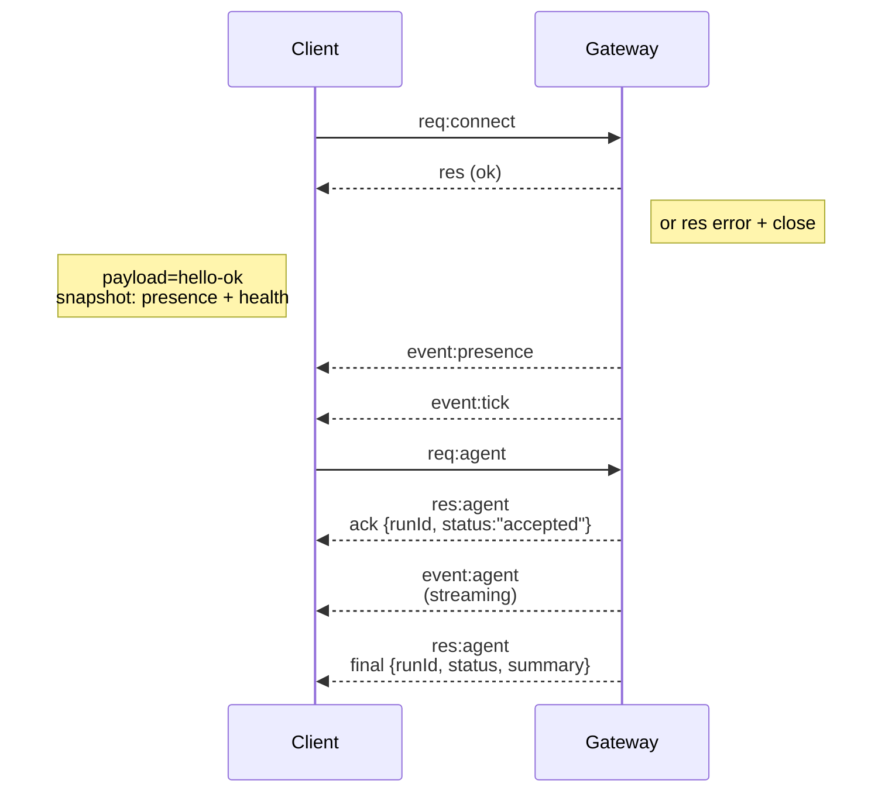

# Gateway 网关 架构

最后更新时间：2026-01-22

## 概述

- A single long‑lived **Gateway** owns all messaging surfaces (WhatsApp via
  Baileys, Telegram via grammY, Slack, Discord, Signal, iMessage, WebChat).
- Control-plane clients (macOS app, CLI, web UI, automations) connect to the
  Gateway over **WebSocket** on the configured bind host (default
  `127.0.0.1:18789`).
- **Nodes** (macOS/iOS/Android/headless) also connect over **WebSocket**, but
  declare `role: node` with explicit caps/commands.
- 每个主机一个 Gateway(网关)；它是唯一打开 WhatsApp 会话的地方。
- **canvas host** 由 Gateway(网关) HTTP 服务器提供，位于：
  - `/__openclaw__/canvas/` (agent-editable HTML/CSS/JS)
  - `/__openclaw__/a2ui/` (A2UI host)
    It uses the same port as the Gateway (default `18789`).

## 组件和流程

### Gateway(网关)（守护进程）

- 维护提供商连接。
- 公开类型化的 WS API（请求、响应、服务器推送事件）。
- 根据 JSON Schema 验证传入帧。
- Emits events like `agent`, `chat`, `presence`, `health`, `heartbeat`, `cron`.

### 客户端（mac 应用 / CLI / Web 管理后台）

- 每个客户端一个 WS 连接。
- Send requests (`health`, `status`, `send`, `agent`, `system-presence`).
- Subscribe to events (`tick`, `agent`, `presence`, `shutdown`).

### 节点（macOS / iOS / Android / 无头模式）

- Connect to the **same WS server** with `role: node`.
- Provide a device identity in `connect`; pairing is **device‑based** (role `node`) and
  approval lives in the device pairing store.
- Expose commands like `canvas.*`, `camera.*`, `screen.record`, `location.get`.

协议详情：

- [Gateway protocol](/zh/gateway/protocol)

### WebChat

- 使用 Gateway(网关) WS API 获取聊天记录和发送消息的静态 UI。
- In remote setups, connects through the same SSH/Tailscale tunnel as other
  clients.

## 连接生命周期（单个客户端）



## 线路协议（摘要）

- 传输方式：WebSocket，包含 JSON 负载的文本帧。
- First frame **must** be `connect`.
- 握手之后：
  - Requests: `{type:"req", id, method, params}` → `{type:"res", id, ok, payload|error}`
  - Events: `{type:"event", event, payload, seq?, stateVersion?}`
- 如果设置了 `OPENCLAW_GATEWAY_TOKEN`（或 `--token`），则 `connect.params.auth.token`
  必须匹配，否则套接字将关闭。
- 为了避免副作用方法（`send`、`agent`）安全重试，需要幂等键；服务器会保留一个短期的去重缓存。
- 节点必须在 `connect` 中包含 `role: "node"` 以及 caps/commands/permissions。

## 配对 + 本地信任

- 所有 WS 客户端（操作员 + 节点）都会在 `connect` 上包含一个 **设备身份**。
- 新的设备 ID 需要配对批准；Gateway 会为后续连接颁发一个 **设备令牌**。
- **本地**连接（环回或网关主机自己的 tailnet 地址）可以自动批准，以保持同主机体验的流畅。
- 所有连接必须对 `connect.challenge` nonce 进行签名。
- 签名载荷 `v3` 还绑定了 `platform` + `deviceFamily`；网关在重连时会固定已配对的元数据，如果元数据发生更改，则需要修复配对。
- 非本地连接仍需要显式批准。
- Gateway 认证（`gateway.auth.*`）仍然适用于 **所有** 连接，无论是本地还是远程。

详情：[Gateway 协议](/zh/gateway/protocol)、[配对](/zh/channels/pairing)、
[安全](/zh/gateway/security)。

## Protocol typing and codegen

- TypeBox 模式定义了该协议。
- JSON Schema 是从这些 schemas 生成的。
- Swift 模型是从 JSON Schema 生成的。

## Remote access

- 首选：Tailscale 或 VPN。
- 备选：SSH 隧道

  ```bash
  ssh -N -L 18789:127.0.0.1:18789 user@host
  ```

- 通过隧道应用相同的握手 + auth token。
- 在远程设置中，可以为 WS 启用 TLS + 可选的固定。

## Operations snapshot

- 启动：`openclaw gateway`（前台，日志输出到 stdout）。
- 健康检查：通过 WS 进行 `health`（也包含在 `hello-ok` 中）。
- 监控：使用 launchd/systemd 进行自动重启。

## Invariants

- 每个主机上仅有一个 Gateway(网关) 控制一个 Baileys 会话。
- 握手是强制性的；任何非 JSON 或非 connect 的第一帧都会导致强制关闭。
- 事件不会重放；客户端必须在出现间隙时进行刷新。

import en from "/components/footer/en.mdx";

<en />
