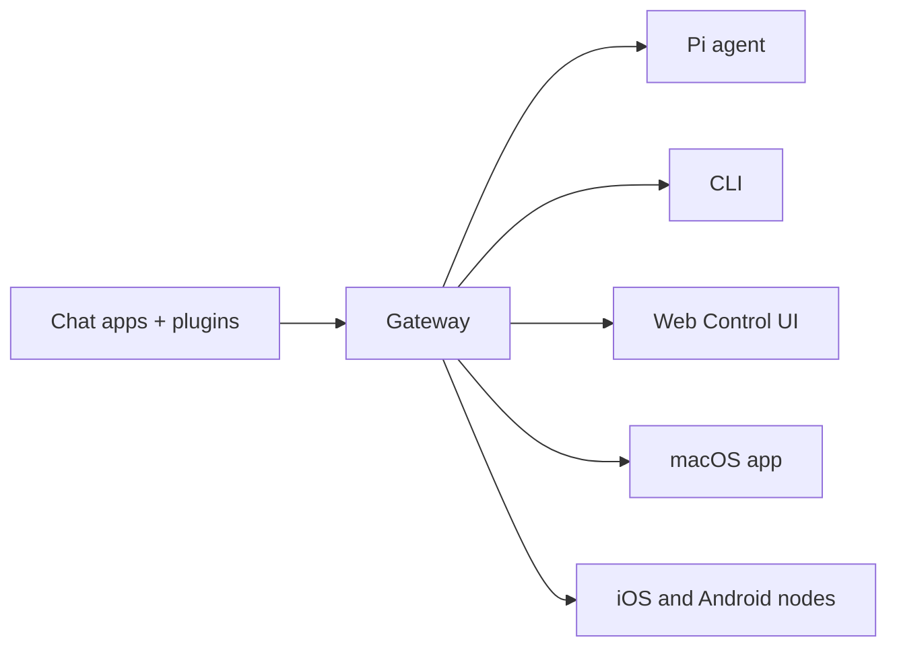

# OpenClaw 🦞

<p align="center">
    
    
</p>

> _"EXFOLIATE! EXFOLIATE!"_ — 一只太空龙虾，大概

<p align="center">
  <strong>适用于跨 WhatsApp、Telegram、Discord、iMessage 等的 AI 代理的任何操作系统Gateway。</strong><br />
  发送消息，从您的口袋中获取代理响应。插件添加 Mattermost 和更多功能。
</p>

<Columns>
  <Card title="开始使用" href="/zh/start/getting-started" icon="rocket">
    安装 OpenClaw 并在几分钟内启动 Gateway。
  </Card>
  <Card title="运行向导" href="/zh/start/wizard" icon="sparkles">
    使用 `openclaw onboard` 和配对流程进行引导式设置。
  </Card>
  <Card title="打开控制 UI" href="/zh/web/control-ui" icon="layout-dashboard">
    启动用于聊天、配置和会话的浏览器仪表板。
  </Card>
</Columns>

OpenClaw 通过单个 Gateway 进程将聊天应用程序连接到 Pi 等编码代理。它为 OpenClaw 助手提供支持，并支持本地或远程设置。

## 工作原理



Gateway 是会话、路由和频道连接的唯一真实来源。

## 主要功能

<Columns>
  <Card title="多频道Gateway" icon="network">
    使用单个 Gateway 进程支持 WhatsApp、Telegram、Discord 和 iMessage。
  </Card>
  <Card title="插件频道" icon="plug">
    使用扩展包添加 Mattermost 和更多功能。
  </Card>
  <Card title="多代理路由" icon="route">
    每个代理、工作区或发送者的隔离会话。
  </Card>
  <Card title="媒体支持" icon="image">
    发送和接收图像、音频和文档。
  </Card>
  <Card title="Web 控制 UI" icon="monitor">
    用于聊天、配置、会话和节点的浏览器仪表板。
  </Card>
  <Card title="移动节点" icon="smartphone">
    配对支持 Canvas 的 iOS 和 Android 节点。
  </Card>
</Columns>

## 快速开始

<Steps>
  <Step title="安装 OpenClaw">
    ```bash
    npm install -g openclaw@latest
    ```
  </Step>
  <Step title="入职并安装服务">
    ```bash
    openclaw onboard --install-daemon
    ```
  </Step>
  <Step title="配对 WhatsApp 并启动 Gateway">
    ```bash
    openclaw channels login
    openclaw gateway --port 18789
    ```
  </Step>
</Steps>

需要完整的安装和开发设置？请参阅 [Quick start](/zh/start/quickstart)。

## 仪表板

Gateway 启动后打开浏览器控制 UI。

- 本地默认：http://127.0.0.1:18789/
- 远程访问：[Web surfaces](/zh/web) 和 [Tailscale](/zh/gateway/tailscale)

<p align="center">
  
</p>

## 配置（可选）

配置文件位于 `~/.openclaw/openclaw.json`。

- 如果您**什么都不做**，OpenClaw 将在 RPC 模式下使用捆绑的 Pi 二进制文件，并使用每个发送者的会话。
- 如果您想锁定它，请从 `channels.whatsapp.allowFrom` 和（对于群组）提及规则开始。

示例：

```json5
{
  channels: {
    whatsapp: {
      allowFrom: ["+15555550123"],
      groups: { "*": { requireMention: true } },
    },
  },
  messages: { groupChat: { mentionPatterns: ["@openclaw"] } },
}
```

## 从这里开始

<Columns>
  <Card title="文档中心" href="/zh/start/hubs" icon="book-open">
    所有文档和指南，按用例组织。
  </Card>
  <Card title="配置" href="/zh/gateway/configuration" icon="settings">
    核心 Gateway 设置、令牌和提供商配置。
  </Card>
  <Card title="远程访问" href="/zh/gateway/remote" icon="globe">
    SSH 和 tailnet 访问模式。
  </Card>
  <Card title="频道" href="/zh/channels/telegram" icon="message-square">
    WhatsApp、Telegram、Discord 等的特定频道设置。
  </Card>
  <Card title="节点" href="/zh/nodes" icon="smartphone">
    带有配对和 Canvas 的 iOS 和 Android 节点。
  </Card>
  <Card title="帮助" href="/zh/help" icon="life-buoy">
    常见修复和故障排除入口点。
  </Card>
</Columns>

## 了解更多

<Columns>
  <Card title="完整功能列表" href="/zh/concepts/features" icon="list">
    完整的频道、路由和媒体功能。
  </Card>
  <Card title="多代理路由" href="/zh/concepts/multi-agent" icon="route">
    工作区隔离和每个代理的会话。
  </Card>
  <Card title="安全性" href="/zh/gateway/security" icon="shield">
    令牌、允许列表和安全控制。
  </Card>
  <Card title="故障排除" href="/zh/gateway/troubleshooting" icon="wrench">
    Gateway 诊断和常见错误。
  </Card>
  <Card title="关于和致谢" href="/zh/reference/credits" icon="info">
    项目起源、贡献者和许可证。
  </Card>
</Columns>
