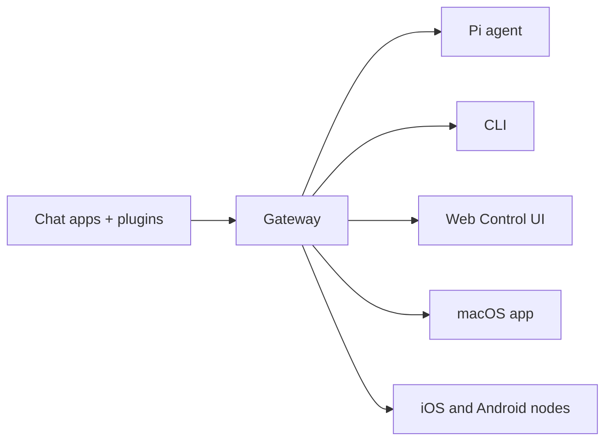

# OpenClaw 🦞

<p align="center">
    
    
</p>

> _"去壳！去壳！"_ — 一只太空龙虾，大概吧

<p align="center">
  <strong>适用于 WhatsApp、Telegram、Discord、iMessage 等平台的任意操作系统的 AI 智能体网关。</strong><br />
  发送一条消息，即可从你的口袋中获得智能体响应。插件支持 Mattermost 等更多平台。
</p>

<Columns>
  <Card title="Get Started" href="/zh/en/start/getting-started" icon="rocket">
    安装 OpenClaw 并在几分钟内启动网关。
  </Card>
  <Card title="Run the Wizard" href="/zh/en/start/wizard" icon="sparkles">
    使用 `openclaw onboard` 和配对流程进行引导式设置。
  </Card>
  <Card title="Open the Control UI" href="/zh/en/web/control-ui" icon="layout-dashboard">
    启动浏览器仪表板，用于聊天、配置和会话管理。
  </Card>
</Columns>

## 什么是 OpenClaw？

OpenClaw 是一个**自托管网关**，可将你最喜欢的聊天应用（如 WhatsApp、Telegram、Discord、iMessage 等）连接到像 Pi 这样的 AI 编码智能体。你可以在自己的机器（或服务器）上运行单个网关进程，它将成为你的消息应用与随时可用的 AI 助手之间的桥梁。

**适用对象是谁？** 希望拥有个人 AI 助手并能随时随地发消息的开发者和高级用户——无需放弃数据控制权或依赖托管服务。

**它有什么不同之处？**

- **自托管**：在你的硬件上运行，规则由你定
- **多通道**：一个网关同时支持 WhatsApp、Telegram、Discord 等多个平台
- **智能体原生**：专为编码智能体构建，支持工具使用、会话管理、记忆和多智能体路由
- **开源**：MIT 许可，社区驱动

**你需要什么？** Node 24（推荐），或者为了兼容性使用 Node 22 LTS (`22.16+`)，一个来自您所选提供商的 API 密钥，以及 5 分钟时间。为了获得最佳质量和安全性，请使用可用的最强的最新一代模型。

## 工作原理



网关是会话、路由和通道连接的唯一真实来源。

## 主要功能

<Columns>
  <Card title="多通道网关" icon="network">
    单个网关进程支持 WhatsApp、Telegram、Discord 和 iMessage。
  </Card>
  <Card title="插件通道" icon="plug">
    使用扩展包添加 Mattermost 等。
  </Card>
  <Card title="多智能体路由" icon="route">
    每个智能体、工作区或发送者的独立会话。
  </Card>
  <Card title="媒体支持" icon="image">
    发送和接收图像、音频和文档。
  </Card>
  <Card title="Web 控制界面" icon="monitor">
    用于聊天、配置、会话和节点的浏览器仪表板。
  </Card>
  <Card title="移动节点" icon="smartphone">
    配对 iOS 和 Android 节点以实现 Canvas、相机和语音工作流。
  </Card>
</Columns>

## 快速开始

<Steps>
  <Step title="安装 OpenClaw">
    ```bash
    npm install -g openclaw@latest
    ```
  </Step>
  <Step title="入职并安装服务">
    ```bash
    openclaw onboard --install-daemon
    ```
  </Step>
  <Step title="配对 WhatsApp and start the Gateway">
    ```bash
    openclaw channels login
    openclaw gateway --port 18789
    ```
  </Step>
</Steps>

需要完整的安装和开发设置？请参阅 [快速开始](/zh/en/start/quickstart)。

## 仪表板

网关启动后，打开浏览器控制界面。

- 本地默认值：[http://127.0.0.1:18789/](http://127.0.0.1:18789/)
- 远程访问：[Web 表面](/zh/en/web) 和 [Tailscale](/zh/en/gateway/tailscale)

<p align="center">
  
</p>

## 配置（可选）

配置文件位于 `~/.openclaw/openclaw.json`。

- 如果你**什么都不做**，OpenClaw 将使用内置的 Pi 二进制文件，并在 RPC 模式下运行，采用按发送者划分的会话。
- 如果您想锁定权限，请从 `channels.whatsapp.allowFrom` 开始，（对于群组）提及规则。

示例：

```json5
{
  channels: {
    whatsapp: {
      allowFrom: ["+15555550123"],
      groups: { "*": { requireMention: true } },
    },
  },
  messages: { groupChat: { mentionPatterns: ["@openclaw"] } },
}
```

## 从这里开始

<Columns>
  <Card title="文档中心" href="/zh/en/start/hubs" icon="book-open">
    所有文档和指南，按用例组织。
  </Card>
  <Card title="配置" href="/zh/en/gateway/configuration" icon="settings">
    核心网关设置、令牌和提供商配置。
  </Card>
  <Card title="远程访问" href="/zh/en/gateway/remote" icon="globe">
    SSH 和 tailnet 访问模式。
  </Card>
  <Card title="渠道" href="/zh/en/channels/telegram" icon="message-square">
    针对 WhatsApp、Telegram、Discord 等的特定渠道设置。
  </Card>
  <Card title="节点" href="/zh/en/nodes" icon="smartphone">
    支持配对、Canvas、相机和设备操作的 iOS 和 Android 节点。
  </Card>
  <Card title="帮助" href="/zh/en/help" icon="life-buoy">
    常见修复和故障排除入口。
  </Card>
</Columns>

## 了解更多

<Columns>
  <Card title="完整功能列表" href="/zh/en/concepts/features" icon="list">
    完整的渠道、路由和媒体功能。
  </Card>
  <Card title="多代理路由" href="/zh/en/concepts/multi-agent" icon="route">
    工作区隔离和每个代理的会话。
  </Card>
  <Card title="安全" href="/zh/en/gateway/security" icon="shield">
    令牌、白名单和安全控制。
  </Card>
  <Card title="故障排除" href="/zh/en/gateway/troubleshooting" icon="wrench">
    网关诊断和常见错误。
  </Card>
  <Card title="关于与致谢" href="/zh/en/reference/credits" icon="info">
    项目起源、贡献者和许可证。
  </Card>
</Columns>
