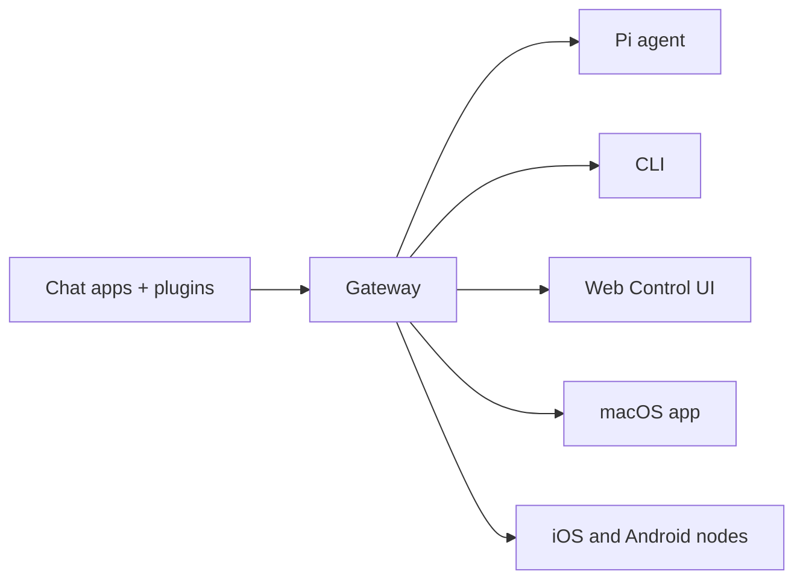

# OpenClaw 🦞

<p align="center">
    
    
</p>

> _"去壳！去壳！"_ — 这大概是一只太空龙虾

<p align="center">
  <strong>适用于任何操作系统的 AI 代理网关，支持 WhatsApp、Telegram、Discord、iMessage 等。</strong><br />
  发送一条消息，即可随时随地收到代理的回复。插件可以扩展支持 Mattermost 等更多平台。
</p>

<Columns>
  <Card title="快速开始" href="/start/getting-started" icon="rocket">
    安装 OpenClaw，几分钟内即可启动 Gateway。
  </Card>
  <Card title="运行引导程序" href="/start/wizard" icon="sparkles">
    使用 `openclaw onboard` 和配对流程进行引导式设置。
  </Card>
  <Card title="打开控制界面" href="/web/control-ui" icon="layout-dashboard">
    启动浏览器仪表盘进行聊天、配置和会话管理。
  </Card>
</Columns>

OpenClaw 通过单个 Gateway 进程将聊天应用连接到 Pi 等编码代理。它为 OpenClaw 助手提供支持，并支持本地或远程设置。

## 工作原理



Gateway 是会话、路由和通道连接的单一真实来源。

## 主要功能

<Columns>
  <Card title="多通道网关" icon="network">
    只需一个 Gateway 进程，即可连接 WhatsApp、Telegram、Discord 和 iMessage。
  </Card>
  <Card title="插件通道" icon="plug">
    通过扩展包添加对 Mattermost 等更多平台的支持。
  </Card>
  <Card title="多代理路由" icon="route">
    按代理、工作区或发送者隔离会话。
  </Card>
  <Card title="媒体支持" icon="image">
    支持发送和接收图片、音频和文档。
  </Card>
  <Card title="网页版控制台" icon="monitor">
    浏览器仪表盘，用于聊天、配置、会话和节点管理。
  </Card>
  <Card title="移动节点" icon="smartphone">
    支持 iOS 和 Android 节点配对，并可用 Canvas。
  </Card>
</Columns>

## 快速开始

<Steps>
  <Step title="安装 OpenClaw">
    ```bash
    npm install -g openclaw@latest
    ```
  </Step>
  <Step title="引导并安装服务">
    ```bash
    openclaw onboard --install-daemon
    ```
  </Step>
  <Step title="配对 WhatsApp 并启动网关">
    ```bash
    openclaw channels login
    openclaw gateway --port 18789
    ```
  </Step>
</Steps>

需要完整的安装和开发设置？参阅 [Quick start](/en/start/quickstart)。

## 仪表板

Gateway 启动后打开浏览器控制 UI。

- 本地默认：http://127.0.0.1:18789/
- 远程访问：[Web surfaces](/en/web) 和 [Tailscale](/en/gateway/tailscale)

<p align="center">
  
</p>

## 配置（可选）

Config lives at `~/.openclaw/openclaw.json`。

- 如果您**什么都不做**，OpenClaw 将使用捆绑的 Pi 二进制文件在 RPC 模式下运行，并为每个发送者提供会话。
- 如果您想锁定它，请从 `channels.whatsapp.allowFrom` 开始，并（对于群组）提及规则。

示例：

```json5
{
  channels: {
    whatsapp: {
      allowFrom: ["+15555550123"],
      groups: { "*": { requireMention: true } },
    },
  },
  messages: { groupChat: { mentionPatterns: ["@openclaw"] } },
}
```

## 从这里开始

<Columns>
  <Card title="文档中心" href="/start/hubs" icon="book-open">
    按使用场景分类的所有文档和指南。
  </Card>
  <Card title="配置" href="/gateway/configuration" icon="settings">
    核心 Gateway 设置、令牌和服务商配置。
  </Card>
  <Card title="远程访问" href="/gateway/remote" icon="globe">
    SSH 与 tailnet 的访问方式。
  </Card>
  <Card title="频道" href="/channels/telegram" icon="message-square">
    针对 WhatsApp、Telegram、Discord 等的专用频道设置。
  </Card>
  <Card title="节点" href="/nodes" icon="smartphone">
    支持配对与 Canvas 的 iOS 和 Android 节点。
  </Card>
  <Card title="帮助" href="/help" icon="life-buoy">
    常见问题和故障排查入口。
  </Card>
</Columns>

## 了解更多

<Columns>
  <Card title="功能总览" href="/concepts/features" icon="list">
    完整的频道、路由和媒体功能。
  </Card>
  <Card title="多代理路由" href="/concepts/multi-agent" icon="route">
    工作区隔离与每个代理独立会话。
  </Card>
  <Card title="安全" href="/gateway/security" icon="shield">
    令牌、白名单和安全控制。
  </Card>
  <Card title="故障排查" href="/gateway/troubleshooting" icon="wrench">
    Gateway 诊断与常见错误。
  </Card>
  <Card title="关于与致谢" href="/reference/credits" icon="info">
    项目起源、贡献者和许可协议。
  </Card>
</Columns>
