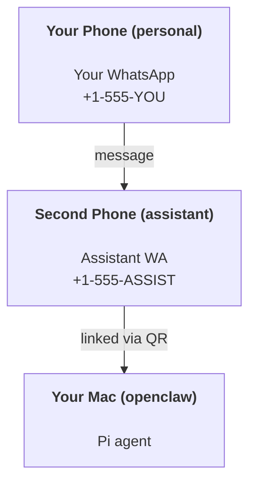

# 使用 OpenClaw 构建个人助手

OpenClaw 是一个面向 **Pi** 助手的 WhatsApp + Telegram + Discord + iMessage Gateway(网关)。插件可添加 Mattermost。本指南是“个人助手”设置：一个专用的 WhatsApp 号码，其行为类似于您全天候开启的助手。

## ⚠️ 安全第一

您正将助手置于一个可以：

- 在您的机器上运行命令（取决于您的 Pi 工具 设置）
- 在您的工作区中读/写文件
- 通过 WhatsApp/Telegram/Discord/Mattermost (插件) 发回消息

开始时保持保守：

- 始终设置 `channels.whatsapp.allowFrom`（切勿在您的个人 Mac 上面向全世界运行）。
- 为助手使用一个专用的 WhatsApp 号码。
- 心跳现在默认为每 30 分钟一次。通过设置 `agents.defaults.heartbeat.every: "0m"` 将其禁用，直到您信任该设置为止。

## 先决条件

- 已安装并完成 OpenClaw 新手引导 — 如果尚未完成，请参阅 [入门指南](/zh/start/getting-started)
- 用于助手的第二个电话号码 (SIM/eSIM/预付费)

## 双手机设置（推荐）

您需要这样：



如果您将您的个人 WhatsApp 链接到 OpenClaw，每一条发给您的消息都会变成“助手输入”。这通常不是您想要的。

## 5分钟快速入门

1. 配对 WhatsApp Web（显示二维码；使用助手手机扫描）：

```bash
openclaw channels login
```

2. 启动 Gateway(网关)（让其保持运行）：

```bash
openclaw gateway --port 18789
```

3. 在 `~/.openclaw/openclaw.json` 中放入最小配置：

```json5
{
  channels: { whatsapp: { allowFrom: ["+15555550123"] } },
}
```

现在，请从您列入白名单的手机向助手号码发送消息。

当新手引导完成时，我们会自动打开仪表盘并打印一个干净的（非令牌化）链接。如果提示进行身份验证，请将 `gateway.auth.token` 中的令牌粘贴到 Control UI 设置中。如需稍后重新打开：`openclaw dashboard`。

## 为助手提供一个工作区 (AGENTS)

OpenClaw 从其工作区目录读取操作指令和“记忆”。

默认情况下，OpenClaw 使用 `~/.openclaw/workspace` 作为代理工作区，并会在设置/首次运行代理时自动创建它（以及初始 `AGENTS.md`、`SOUL.md`、`TOOLS.md`、`IDENTITY.md`、`USER.md`、`HEARTBEAT.md`）。`BOOTSTRAP.md` 仅在工作区是全新时创建（删除后不应重新出现）。`MEMORY.md` 是可选的（不会自动创建）；如果存在，它会被加载到普通会话中。子代理会话仅注入 `AGENTS.md` 和 `TOOLS.md`。

提示：将此文件夹视为 OpenClaw 的“记忆”，并将其设为一个 git 仓库（最好是私有的），以便备份您的 `AGENTS.md` 和记忆文件。如果安装了 git，全新的工作区将自动初始化。

```bash
openclaw setup
```

完整的工作区布局 + 备份指南：[Agent workspace](/zh/concepts/agent-workspace)
记忆工作流：[Memory](/zh/concepts/memory)

可选：使用 `agents.defaults.workspace` 选择不同的工作区（支持 `~`）。

```json5
{
  agent: {
    workspace: "~/.openclaw/workspace",
  },
}
```

如果您已经从仓库提供自己的工作区文件，则可以完全禁用引导文件的创建：

```json5
{
  agent: {
    skipBootstrap: true,
  },
}
```

## 将其转变为“助手”的配置

OpenClaw 默认具有良好的助手设置，但您通常需要调整：

- `SOUL.md` 中的 persona/instructions
- thinking 默认值（如果需要）
- heartbeats（一旦您信任它）

示例：

```json5
{
  logging: { level: "info" },
  agent: {
    model: "anthropic/claude-opus-4-6",
    workspace: "~/.openclaw/workspace",
    thinkingDefault: "high",
    timeoutSeconds: 1800,
    // Start with 0; enable later.
    heartbeat: { every: "0m" },
  },
  channels: {
    whatsapp: {
      allowFrom: ["+15555550123"],
      groups: {
        "*": { requireMention: true },
      },
    },
  },
  routing: {
    groupChat: {
      mentionPatterns: ["@openclaw", "openclaw"],
    },
  },
  session: {
    scope: "per-sender",
    resetTriggers: ["/new", "/reset"],
    reset: {
      mode: "daily",
      atHour: 4,
      idleMinutes: 10080,
    },
  },
}
```

## 会话和记忆

- 会话文件：`~/.openclaw/agents/<agentId>/sessions/{{SessionId}}.jsonl`
- 会话元数据（令牌使用情况、上次路由等）：`~/.openclaw/agents/<agentId>/sessions/sessions.json`（旧版：`~/.openclaw/sessions/sessions.json`）
- `/new` 或 `/reset` 为该聊天启动一个新的会话（可通过 `resetTriggers` 配置）。如果单独发送，代理会回复简短的问候以确认重置。
- `/compact [instructions]` 压缩会话上下文并报告剩余的上下文预算。

## 心跳（主动模式）

默认情况下，OpenClaw 每 30 分钟运行一次心跳，提示为：
`Read HEARTBEAT.md if it exists (workspace context). Follow it strictly. Do not infer or repeat old tasks from prior chats. If nothing needs attention, reply HEARTBEAT_OK.`
设置 `agents.defaults.heartbeat.every: "0m"` 以禁用。

- 如果 `HEARTBEAT.md` 存在但实际上为空（仅包含空行和 markdown 标题，如 `# Heading`），OpenClaw 将跳过心跳运行以节省 API 调用。
- 如果文件缺失，心跳仍会运行，由模型决定要做什么。
- 如果代理回复 `HEARTBEAT_OK`（可选带有短填充；参见 `agents.defaults.heartbeat.ackMaxChars`），OpenClaw 将抑制该心跳的出站传递。
- 默认情况下，允许向私信风格的 `user:<id>` 目标进行心跳传递。设置 `agents.defaults.heartbeat.directPolicy: "block"` 可在保持心跳运行处于活动状态的同时抑制直接目标传递。
- 心跳运行完整的代理轮次 —— 间隔越短消耗的 token 越多。

```json5
{
  agent: {
    heartbeat: { every: "30m" },
  },
}
```

## 媒体输入和输出

入站附件（图片/音频/文档）可以通过模板展示给您的命令：

- `{{MediaPath}}`（本地临时文件路径）
- `{{MediaUrl}}`（伪 URL）
- `{{Transcript}}`（如果启用了音频转录）

来自代理的出站附件：在单独一行（无空格）包含 `MEDIA:<path-or-url>`。示例：

```
Here’s the screenshot.
MEDIA:https://example.com/screenshot.png
```

OpenClaw 提取这些内容，并将其作为媒体与文本一起发送。

## 操作检查清单

```bash
openclaw status          # local status (creds, sessions, queued events)
openclaw status --all    # full diagnosis (read-only, pasteable)
openclaw status --deep   # adds gateway health probes (Telegram + Discord)
openclaw health --json   # gateway health snapshot (WS)
```

日志位于 `/tmp/openclaw/` 下（默认：`openclaw-YYYY-MM-DD.log`）。

## 后续步骤

- WebChat：[WebChat](/zh/web/webchat)
- Gateway 运维：[Gateway runbook](/zh/gateway)
- Cron + 唤醒：[Cron jobs](/zh/automation/cron-jobs)
- macOS 菜单栏伴侣：[OpenClaw macOS app](/zh/platforms/macos)
- iOS 节点应用：[iOS app](/zh/platforms/ios)
- Android 节点应用：[Android app](/zh/platforms/android)
- Windows 状态：[Windows (WSL2)](/zh/platforms/windows)
- Linux 状态：[Linux app](/zh/platforms/linux)
- 安全：[Security](/zh/gateway/security)

import zh from "/components/footer/zh.mdx";

<zh />
